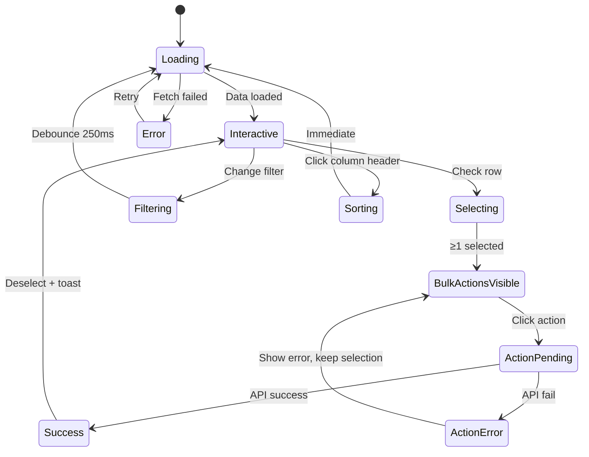
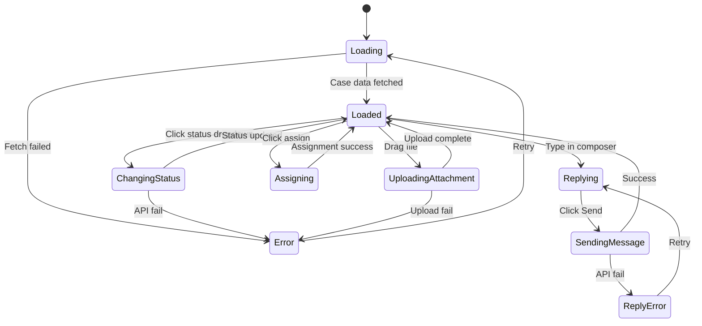
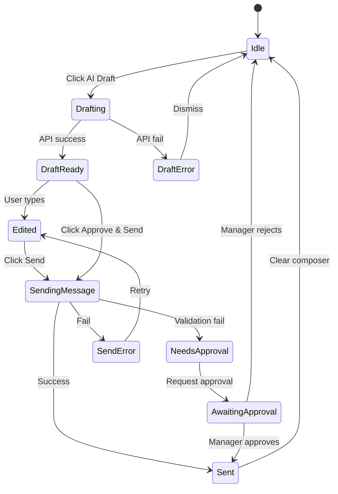
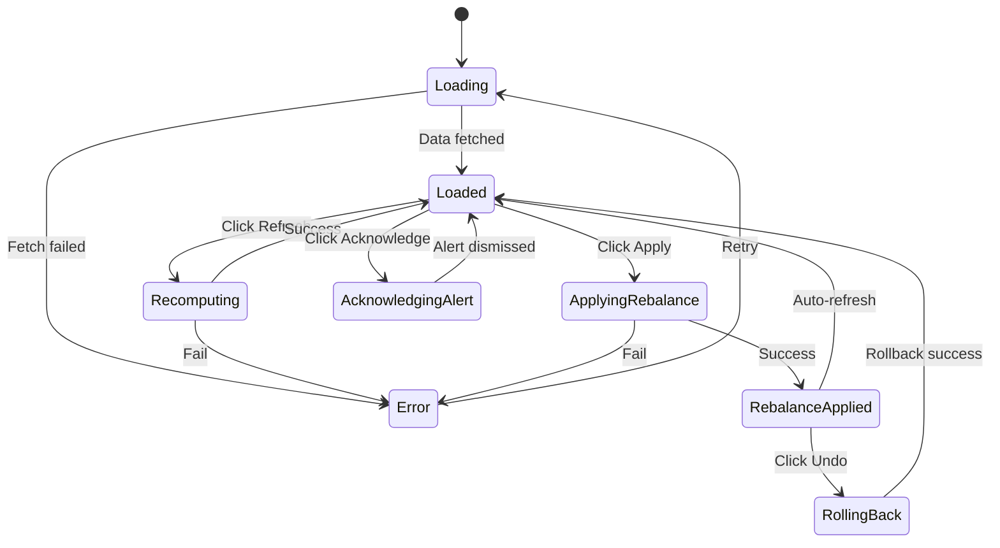

# University Operations AI Assistant
## Comprehensive PRD + Implementation Specification

**Version:** 1.0
**Last Updated:** 2025-10-30
**Status:** Draft for Implementation
**Target Stack:** Next.js 14 (App Router), TypeScript, Tailwind CSS, shadcn/ui, MSW (stub mode)

---

## Table of Contents

### Part 1: Foundation & Architecture
0. [Product North Star & Goals](#0-product-north-star--goals)
1. [Information Architecture](#1-information-architecture)
2. [App Routes Map](#2-app-routes-map)
3. [Design System](#3-design-system)
4. [Data Model](#4-data-model)

### Part 2: Student & Public Surface
5. Student Self-Service Pages
6. AI Chatbot Architecture
7. Forms & Validation
8. Mobile & Accessibility

### Part 3: Staff Workspace
9. Inbox & Queue Management
10. Case Workspace
11. AI Composer & Macros
12. Department-Specific Features

### Part 4: Manager & Admin
13. Manager Dashboards
14. Admin Configuration
15. Knowledge Management
16. Audit & Compliance

### Part 5: AI & Integration
17. AI Prompts & Models
18. Type Definitions
19. API Contracts (Stub)
20. MSW Handlers & Seeding

### Part 6: Delivery Artifacts
21. Test Plan
22. Demo Script
23. RBAC Matrix
24. UX Copy Deck
25. Mock Data Catalog

---

## 0. Product North Star & Goals

### Vision Statement
A campus-grade AI-first operations platform that deflects trivial questions, accelerates resolutions, predicts SLA risk, and coordinates cross-department responses from one unified console—competitive with Zendesk Suite Professional across ticketing, knowledge, analytics, automation, and admin tooling.

### Primary User Personas

| Persona | Needs | Success Metrics |
|---------|-------|----------------|
| **Student/Applicant** | Self-service answers, quick ticket creation, status tracking | Deflection rate >60%, CSAT >4.2/5 |
| **Staff Agent** | Unified inbox, AI drafting, student 360°, macros | Handle time <8min, First Reply <2h |
| **Manager** | SLA visibility, workload balance, quality monitoring | Breach rate <5%, utilization 70–85% |
| **Admin** | RBAC, form builder, workflow automation, branding | Zero-config onboarding, audit compliance |
| **Knowledge Manager** | Authoring, review workflow, freshness tracking | Article staleness <90 days, AI citation rate >40% |

### Departments in Scope
1. **Admissions** — Document review, status inquiries, deadline questions
2. **Finance** — Billing, refunds, payment plans, 1098-T, account holds
3. **Registrar** — Enrollment verification, transcripts, schedule changes, grades
4. **Housing** — Room assignments, meal plans, maintenance requests
5. **IT** — Password resets, Wi-Fi, software licensing, hardware support

### Non-Goals (Demo Scope)
- ❌ No production PII or real student data
- ❌ No actual SIS/payment gateway writes
- ❌ No telephony integration (calls simulated as channel type)
- ❌ No outbound email sending (SMTP mocked)
- ❌ No SAML/SSO (auth stubbed with role selector)

### Demo Success Criteria
- ✅ End-to-end student chat → AI escalation → staff case resolution with realistic data flow
- ✅ Manager sees cross-department SLA risk + performs mock rebalancing action
- ✅ Admin configures routing workflow; dry-run shows evaluation path
- ✅ Knowledge Manager publishes article; AI cites it with link in subsequent chat
- ✅ RTL (Arabic) student experience with proper layout mirroring

### Competitive Positioning

| Capability | Table Stakes (Zendesk-class) | Our Differentiators |
|------------|------------------------------|---------------------|
| Unified Inbox | ✓ Multi-channel views | ✓ + Cross-dept contextualization |
| AI Chatbot | ✓ Intent classification | ✓ + Policy-aware citations + cross-dept reasoning |
| Knowledge Base | ✓ Search & authoring | ✓ + Auto-draft from ticket patterns + freshness SLA |
| Macros | ✓ Canned responses | ✓ + AI tone-check + policy variable insertion |
| SLA Management | ✓ Breach alerts | ✓ + Predictive risk scoring + auto-rebalancing suggestions |
| Reporting | ✓ Agent metrics | ✓ + Deflection analytics + cross-queue insights |
| Workflows | ✓ Trigger-action rules | ✓ + Dry-run test bench with trace visualization |
| Multilingual | ✓ Translated UI | ✓ + RTL layout engine + locale-aware number/date formatting |

---

## 1. Information Architecture

### 1.1 Conceptual Model

```
University Operations Platform
├─ Students (external actors)
│  └─ submit Requests via Chat, Forms, or Email
├─ Cases (central work item)
│  ├─ routed to → Queues (by department + skills)
│  ├─ assigned to → Agents (staff members)
│  ├─ governed by → SLA Policies
│  └─ contain → Messages, Attachments, Internal Notes, Timeline Events
├─ Knowledge Base
│  ├─ Articles (searchable corpus for AI + humans)
│  └─ Citations (linked from AI responses)
├─ Service Catalog
│  ├─ Service Definitions (tied to dynamic forms)
│  └─ Form Schemas (JSON-driven, validated via Zod)
├─ Workflows
│  ├─ Triggers (new case, field change, time-based)
│  ├─ Conditions (IF department=Finance AND balance>1000)
│  └─ Actions (route, SLA override, request document, notify)
├─ Users
│  ├─ Roles (Student, Agent, Manager, Admin, KM)
│  └─ Departments (scope for agents)
└─ Audit Logs (immutable event stream)
```

### 1.2 Role Definitions

| Role | Scope | Key Permissions | UI Workspace |
|------|-------|----------------|--------------|
| **Student** | Self only | Create requests, view own cases, chat with AI | `/help`, `/chat`, `/requests` |
| **Agent** | Department(s) | View assigned/queue cases, reply, apply macros, add internal notes | `/inbox`, `/cases/:id`, `/knowledge` |
| **Manager** | Department(s) | All agent perms + reassign, view metrics, approve exceptions | `/manager/*`, `/inbox` (all dept) |
| **Admin** | Platform-wide | User management, form/workflow config, branding, audit access | `/admin/*` |
| **Knowledge Manager** | Platform-wide | Author/publish articles, manage review queue, view AI citation stats | `/km/*` |

### 1.3 Department & Queue Structure

Each department has:
- **Primary Queue** (default intake)
- **Priority Queue** (SLA < 2h, auto-escalated)
- **Approval Queue** (refunds >$500, grade changes, housing swaps)
- **WIP Limit** (configurable; triggers rebalancing alert)

**Skills taxonomy** (for routing):
```typescript
type Skill =
  // Admissions
  | "admissions:documents" | "admissions:decisions" | "admissions:transfers"
  // Finance
  | "finance:billing" | "finance:refunds" | "finance:payment_plans" | "finance:1098t"
  // Registrar
  | "registrar:enrollment" | "registrar:transcripts" | "registrar:grades"
  // Housing
  | "housing:assignments" | "housing:maintenance" | "housing:meal_plans"
  // IT
  | "it:accounts" | "it:network" | "it:software" | "it:hardware";
```

### 1.4 Entity Relationships (Logical)

```
Student (1) ──< (N) Cases
Case (1) ──< (N) Messages
Case (N) ──> (1) Queue
Case (N) ──> (0..1) Agent (assignee)
Case (N) ──< (N) Attachments
Case (1) ──< (N) TimelineEvents
Case (N) ──< (N) Tags

Agent (N) ──> (N) Departments
Agent (N) ──< (N) Skills

Article (1) ──< (N) ArticleVersions
Article (N) ──< (N) Citations (from AI responses)

Workflow (1) ──< (N) WorkflowNodes
WorkflowNode (trigger|condition|action) ──> references Queues, Departments, Skills

SLA_Policy (N) ──> (1) Department
SLA_Policy defines → firstResponseMinutes, resolutionMinutes, priorityMultiplier
```

### 1.5 Data Sovereignty & Audit

- **Audit Event** created for:
  - Case status transitions (New → In Progress → Waiting → Resolved → Closed)
  - Assignment/reassignment
  - Internal notes (who viewed, created)
  - Admin config changes (workflow publish, form schema update, role grant)
  - AI actions (draft generated, citation inserted, escalation)
- **PII Masking**: email, phone, SSN patterns redacted in UI for Agents; full access for Managers/Admins only with audit trail
- **Retention**: Cases soft-deleted after 7 years; audit logs immutable for 10 years (compliance theater for demo)

---

## 2. App Routes Map

### 2.1 Next.js App Router Structure

```
app/
├─ (public)/
│  ├─ layout.tsx                    # Public shell (no auth)
│  ├─ page.tsx                      # → /help (Help Center home)
│  ├─ help/
│  │  ├─ page.tsx                   # Help Center search
│  │  └─ [slug]/
│  │     └─ page.tsx                # Article detail
│  ├─ catalog/
│  │  └─ page.tsx                   # Service catalog tiles
│  ├─ request/
│  │  └─ [serviceId]/
│  │     └─ page.tsx                # Dynamic service request form
│  └─ chat/
│     └─ page.tsx                   # AI Student Assistant
│
├─ (authenticated)/
│  ├─ layout.tsx                    # Auth shell + sidebar nav
│  ├─ requests/
│  │  └─ page.tsx                   # My Requests (student view)
│  │
│  ├─ inbox/
│  │  └─ page.tsx                   # Unified Inbox (agent/manager)
│  ├─ cases/
│  │  └─ [id]/
│  │     └─ page.tsx                # Case workspace (3-pane)
│  ├─ queues/
│  │  └─ page.tsx                   # Queue board (kanban-style)
│  ├─ approvals/
│  │  └─ page.tsx                   # Approval center
│  ├─ knowledge/
│  │  └─ page.tsx                   # Agent KB search (side panel)
│  ├─ reports/
│  │  └─ agent/
│  │     └─ page.tsx                # Personal efficiency metrics
│  │
│  ├─ manager/
│  │  ├─ overview/
│  │  │  └─ page.tsx                # Live ops snapshot
│  │  ├─ queues/
│  │  │  └─ page.tsx                # Queue health heatmap
│  │  ├─ quality/
│  │  │  └─ page.tsx                # QA & coaching
│  │  ├─ trends/
│  │  │  └─ page.tsx                # Analytics & deflection
│  │  └─ alerts/
│  │     └─ page.tsx                # Surge/anomaly alerts
│  │
│  ├─ admin/
│  │  ├─ users/
│  │  │  └─ page.tsx                # User & role management
│  │  ├─ forms/
│  │  │  ├─ page.tsx                # Form list
│  │  │  └─ [id]/
│  │  │     └─ page.tsx             # Form builder (drag-drop JSON schema)
│  │  ├─ workflows/
│  │  │  ├─ page.tsx                # Workflow list
│  │  │  └─ [id]/
│  │  │     └─ page.tsx             # Workflow graph editor + dry-run
│  │  ├─ integrations/
│  │  │  └─ page.tsx                # Connector cards (OAuth mocked)
│  │  ├─ branding/
│  │  │  └─ page.tsx                # Logo, theme, domain config
│  │  ├─ audit/
│  │  │  └─ page.tsx                # Audit log viewer
│  │  └─ datalake/
│  │     └─ page.tsx                # Export scheduler
│  │
│  └─ km/
│     ├─ articles/
│     │  └─ page.tsx                # Article list (Draft/Review/Published)
│     ├─ editor/
│     │  └─ [id]/
│     │     └─ page.tsx             # Block-based article editor
│     ├─ reviews/
│     │  └─ page.tsx                # Review queue
│     └─ broadcasts/
│        └─ page.tsx                # Broadcast composer (announcements)
│
├─ api/
│  ├─ cases/
│  │  ├─ route.ts                   # GET (list), POST (create)
│  │  └─ [id]/
│  │     ├─ route.ts                # GET (detail), PATCH (update)
│  │     ├─ messages/route.ts       # POST (reply)
│  │     └─ assign/route.ts         # POST (assign agent)
│  ├─ inbox/
│  │  ├─ views/route.ts             # GET (saved filters)
│  │  └─ batch/route.ts             # POST (bulk actions)
│  ├─ queues/
│  │  ├─ route.ts                   # GET (all queues with counts)
│  │  └─ rebalance/route.ts         # POST (auto-assign logic)
│  ├─ manager/
│  │  ├─ overview/route.ts          # GET (snapshot metrics)
│  │  ├─ queues/route.ts            # GET (queue health)
│  │  ├─ trends/route.ts            # GET (time-series data)
│  │  └─ alerts/route.ts            # GET, PATCH (acknowledge)
│  ├─ admin/
│  │  ├─ forms/route.ts             # GET, POST (form schemas)
│  │  ├─ workflows/
│  │  │  ├─ route.ts                # GET, POST
│  │  │  └─ dryrun/route.ts         # POST (test eval)
│  │  ├─ users/route.ts             # GET, POST, PATCH
│  │  └─ audit/route.ts             # GET (log query)
│  ├─ km/
│  │  └─ articles/
│  │     ├─ route.ts                # GET, POST
│  │     └─ [id]/route.ts           # GET, PATCH, DELETE
│  ├─ ai/
│  │  ├─ chat/route.ts              # POST (student chatbot)
│  │  ├─ draft/route.ts             # POST (agent composer assist)
│  │  └─ classify/route.ts          # POST (intent + dept routing)
│  ├─ search/route.ts               # GET (global Cmd-K search)
│  └─ export/route.ts               # GET (CSV generation)
│
└─ globals.css
```

### 2.2 Navigation Structure

#### Public Navigation (unauthenticated)
```
┌─ Header ──────────────────────────────────┐
│ [Logo]  Help Center  |  Catalog  |  Chat │
│                          [Sign In Button] │
└───────────────────────────────────────────┘
```

#### Authenticated Navigation (Agent/Manager/Admin)
```
┌─ Sidebar ─────────┬─ Main Content ───────┐
│ [Logo]            │                       │
│                   │                       │
│ 🎫 Inbox          │  <Page Content>       │
│ 📋 Queues         │                       │
│ ✅ Approvals      │                       │
│ 📚 Knowledge      │                       │
│ 📊 My Reports     │                       │
│                   │                       │
│ ─────────────     │                       │
│ 👔 Manager        │ (if role=Manager)     │
│ ⚙️  Admin         │ (if role=Admin)       │
│ ✏️  Knowledge Mgmt│ (if role=KM)          │
│                   │                       │
│ ─────────────     │                       │
│ [Profile Menu]    │                       │
│ 🌙 Dark Mode      │                       │
│ 🌐 EN | AR        │                       │
└───────────────────┴───────────────────────┘
```

### 2.3 Route Guards & Redirects

| Route Pattern | Required Role | Redirect if Unauthorized |
|---------------|---------------|--------------------------|
| `/help/*`, `/catalog`, `/chat` | Public | — |
| `/requests` | Student | `/help` |
| `/inbox`, `/cases/*`, `/queues` | Agent, Manager, Admin | `/help` |
| `/manager/*` | Manager, Admin | `/inbox` |
| `/admin/*` | Admin | `/inbox` |
| `/km/*` | KM, Admin | `/inbox` |

**Protected route middleware** (middleware.ts):
```typescript
export function middleware(req: NextRequest) {
  const token = req.cookies.get('session')?.value;
  const role = parseRole(token); // stub: decode role from cookie

  if (req.nextUrl.pathname.startsWith('/manager') && !['Manager', 'Admin'].includes(role)) {
    return NextResponse.redirect(new URL('/inbox', req.url));
  }
  // ... repeat for /admin, /km
}
```

---

## 3. Design System

### 3.1 Design Tokens (Tailwind Config)

```javascript
// tailwind.config.ts excerpt
module.exports = {
  theme: {
    extend: {
      colors: {
        // CSS variables bound to light/dark themes
        border: "hsl(var(--border))",
        input: "hsl(var(--input))",
        ring: "hsl(var(--ring))",
        background: "hsl(var(--background))",
        foreground: "hsl(var(--foreground))",
        primary: {
          DEFAULT: "hsl(var(--primary))",
          foreground: "hsl(var(--primary-foreground))",
        },
        // Semantic status colors
        success: "hsl(142 76% 36%)",
        warning: "hsl(38 92% 50%)",
        error: "hsl(0 84% 60%)",
        info: "hsl(199 89% 48%)",
        // SLA risk levels
        sla: {
          green: "hsl(142 76% 36%)",
          yellow: "hsl(45 93% 47%)",
          red: "hsl(0 84% 60%)",
        },
        // Department brand colors (used in badges, queue headers)
        dept: {
          admissions: "hsl(262 83% 58%)",
          finance: "hsl(142 71% 45%)",
          registrar: "hsl(221 83% 53%)",
          housing: "hsl(24 95% 53%)",
          it: "hsl(199 89% 48%)",
        },
      },
      spacing: {
        // 4px base grid
        0.5: "2px",
        1: "4px",
        2: "8px",
        3: "12px",
        4: "16px",
        6: "24px",
        8: "32px",
        12: "48px",
        16: "64px",
      },
      borderRadius: {
        lg: "12px",
        md: "8px",
        sm: "4px",
      },
      fontSize: {
        xs: ["12px", { lineHeight: "16px" }],
        sm: ["14px", { lineHeight: "20px" }],
        base: ["16px", { lineHeight: "24px" }],
        lg: ["18px", { lineHeight: "28px" }],
        xl: ["20px", { lineHeight: "28px" }],
        "2xl": ["24px", { lineHeight: "32px" }],
        "3xl": ["30px", { lineHeight: "36px" }],
      },
      fontFamily: {
        sans: ["var(--font-inter)", "system-ui", "sans-serif"],
        mono: ["var(--font-jetbrains-mono)", "monospace"],
      },
    },
  },
};
```

### 3.2 Component Primitives (shadcn/ui)

All UI built on these shadcn components:

| Primitive | Use Cases | Key Props |
|-----------|-----------|-----------|
| **Button** | Actions, form submits | `variant`: default, destructive, outline, ghost, link |
| **Card** | Metric tiles, case cards | — |
| **Table** | Inbox, queues, audit logs | Sortable headers, row selection |
| **Tabs** | Case workspace (Thread/Notes/Timeline), Settings | — |
| **Sheet** | Side panels (student 360, knowledge search) | `side`: left, right |
| **Dialog** | Modals (assign agent, close case confirmation) | — |
| **DropdownMenu** | Bulk actions, profile menu | — |
| **Command** | Global search (Cmd-K) | Indexed routes + cases + articles |
| **Badge** | Status chips, SLA risk, department tags | `variant`: default, secondary, destructive, outline |
| **Tooltip** | Icon buttons, truncated text hover | — |
| **Toast** | Success/error notifications | Position: bottom-right |
| **Alert** | Inline warnings (SLA breach, missing info) | `variant`: default, destructive |
| **Separator** | Visual dividers | `orientation`: horizontal, vertical |
| **Input**, **Textarea** | Forms | — |
| **Checkbox**, **Switch** | Preferences, multi-select | — |
| **Select** | Dropdowns (assign agent, department filter) | — |
| **Form** | Wraps react-hook-form + Zod validation | — |
| **Skeleton** | Loading states | — |

### 3.3 Layout Grid & Spacing

- **Base unit**: 4px (Tailwind's `space-1`)
- **Container max-width**: 1440px (`max-w-screen-2xl`)
- **Sidebar width**: 240px (fixed on desktop; drawer on mobile)
- **Gutter**: 24px (`px-6`)
- **Card padding**: 16px (`p-4`)
- **Section spacing**: 32px (`space-y-8`)

**Responsive breakpoints**:
```typescript
const breakpoints = {
  sm: '640px',   // mobile landscape
  md: '768px',   // tablet
  lg: '1024px',  // laptop
  xl: '1280px',  // desktop
  '2xl': '1440px' // wide desktop
};
```

### 3.4 Motion & Transitions

**Framer Motion** for:
- Page transitions (fade + slide 200ms ease-out)
- Sheet/Dialog enter/exit (slide 150ms)
- Dropdown menus (scale + opacity 100ms)
- Toast notifications (slide-in-right 200ms, auto-dismiss 5s)

**CSS transitions** for:
- Hover states (150ms ease)
- Focus rings (100ms ease)
- Button active states (50ms ease)

**Reduced motion**:
```css
@media (prefers-reduced-motion: reduce) {
  * {
    animation-duration: 0.01ms !important;
    transition-duration: 0.01ms !important;
  }
}
```

### 3.5 Typography Scale

```css
:root {
  --font-inter: 'Inter', sans-serif; /* variable font */
  --font-jetbrains-mono: 'JetBrains Mono', monospace;
}

.text-display {
  font-size: 30px;
  font-weight: 600;
  letter-spacing: -0.02em;
}

.text-heading {
  font-size: 24px;
  font-weight: 600;
}

.text-subheading {
  font-size: 18px;
  font-weight: 500;
}

.text-body {
  font-size: 16px;
  font-weight: 400;
  line-height: 1.5;
}

.text-label {
  font-size: 14px;
  font-weight: 500;
  letter-spacing: 0.01em;
}

.text-caption {
  font-size: 12px;
  font-weight: 400;
  color: hsl(var(--muted-foreground));
}
```

### 3.6 Iconography

**Library**: `lucide-react` (tree-shakeable, 24×24 default)

**Conventions**:
- Status icons: CheckCircle2 (success), AlertCircle (warning), XCircle (error), Info (info)
- Navigation: Home, Inbox, LayoutGrid (queues), CheckSquare (approvals), BookOpen (KB), BarChart3 (reports), Settings (admin)
- Actions: Send, Edit3, Trash2, MoreHorizontal, RefreshCw, Download, Upload
- RTL mirroring: ArrowLeft ↔ ArrowRight, ChevronLeft ↔ ChevronRight (handled by CSS `transform: scaleX(-1)`)

### 3.7 Micro-Interactions

| Interaction | Pattern | Implementation |
|-------------|---------|----------------|
| **Optimistic Updates** | Add message to thread immediately; show spinner badge; remove on success | Zustand store + rollback on error |
| **Inline Edits** | Double-click text → contentEditable; Esc to cancel, Enter to save | `<EditableText>` component |
| **Drag-Drop** | Queue kanban cards; hover shows drop zone highlight | `@dnd-kit/core` + accessible fallback buttons |
| **Bulk Selection** | Checkbox column; sticky header row actions bar slides in | Table state in Zustand |
| **Toast Stacking** | Max 3 visible; queue older; auto-dismiss 5s unless error | shadcn Toast + Sonner library |
| **Skeleton Loading** | Replace content with skeleton matching layout (table rows, cards) | Suspend + Skeleton components |
| **Empty States** | Illustration + primary action button + secondary link | `<EmptyState>` component |

### 3.8 RTL (Right-to-Left) Support

**Directionality**:
```typescript
// app/layout.tsx
export default function RootLayout({ children }: { children: React.Node }) {
  const locale = useLocale(); // 'en' | 'ar'
  const dir = locale === 'ar' ? 'rtl' : 'ltr';

  return (
    <html lang={locale} dir={dir}>
      <body className={cn(inter.variable, dir === 'rtl' && 'font-arabic')}>
        {children}
      </body>
    </html>
  );
}
```

**CSS for RTL**:
```css
[dir="rtl"] {
  /* Flip layout */
  .sidebar { left: auto; right: 0; }
  .sheet-right { left: 0; right: auto; }

  /* Mirror icons */
  .icon-directional { transform: scaleX(-1); }

  /* Text alignment */
  text-align: right;
}

/* Logical properties (preferred) */
.card {
  padding-inline-start: 16px;
  padding-inline-end: 16px;
  margin-inline-start: auto;
}
```

**Number & Date Formatting**:
```typescript
const formatNumber = (num: number, locale: string) =>
  new Intl.NumberFormat(locale).format(num);

const formatDate = (date: Date, locale: string) =>
  new Intl.DateTimeFormat(locale, {
    dateStyle: 'medium',
    timeStyle: 'short'
  }).format(date);

// Arabic: ٢٠٢٥/١٠/٣٠ ٣:٤٥ م
// English: Oct 30, 2025, 3:45 PM
```

**Font stacks**:
```css
:root {
  --font-arabic: 'Noto Sans Arabic', 'Tajawal', sans-serif;
}
```

### 3.9 Accessibility (a11y) Standards

**WCAG 2.1 AA compliance** targets:

| Criterion | Implementation |
|-----------|----------------|
| **Color Contrast** | 4.5:1 for body text, 3:1 for large text; verified via `@axe-core/react` |
| **Keyboard Navigation** | All interactive elements focusable; Tab order logical; focus visible (2px ring) |
| **Focus Trapping** | Dialogs/Sheets trap focus; Esc to close |
| **Screen Readers** | Semantic HTML (`<nav>`, `<main>`, `<article>`); `aria-label` for icon buttons; `aria-live` for toasts/new messages |
| **Forms** | Labels explicitly bound (`htmlFor`); error messages linked via `aria-describedby` |
| **Images** | Alt text for all images; decorative images `alt=""` |
| **Tables** | `<th scope="col">` for headers; row selection announced |
| **Motion** | Respect `prefers-reduced-motion` |

**Keyboard shortcuts** (registered globally via `useHotkeys`):
- `Cmd/Ctrl-K`: Global search
- `Cmd/Ctrl-/`: Shortcut help dialog
- `Inbox`: `A` (assign), `M` (macro), `E` (escalate), `J/K` (next/prev row)
- `Case`: `Cmd-Enter` (send message), `Shift-Enter` (newline in composer), `I` (toggle internal note)

---

## 4. Data Model

### 4.1 Core Entities (Conceptual Schema)

#### User
```typescript
interface User {
  id: string;                    // UUID
  email: string;
  name: string;
  role: 'Student' | 'Agent' | 'Manager' | 'Admin' | 'KM';
  departments?: Department[];    // for Agents/Managers
  skills?: Skill[];              // for Agents
  locale: 'en' | 'ar';
  timezone: string;              // IANA tz
  avatarUrl?: string;
  createdAt: Date;
  lastLoginAt?: Date;
}
```

#### StudentProfile
```typescript
interface StudentProfile {
  id: string;                    // same as User.id
  studentId: string;             // e.g., "S2025001234"
  program: string;               // "Computer Science, BS"
  term: string;                  // "Fall 2025"
  status: 'Applicant' | 'Enrolled' | 'Graduated' | 'Withdrawn';
  holds: Hold[];
  balance: number;               // USD cents
  documents: Document[];
  applications: Application[];
}

interface Hold {
  type: 'Financial' | 'Academic' | 'Disciplinary' | 'Registration';
  reason: string;
  placedAt: Date;
  releasedAt?: Date;
}

interface Document {
  type: 'Transcript' | 'Tax Form' | 'ID' | 'Recommendation' | 'Other';
  status: 'Pending' | 'Received' | 'Verified' | 'Rejected';
  uploadedAt?: Date;
  reviewedAt?: Date;
}
```

#### Case
```typescript
interface Case {
  id: string;                    // "CASE-20251030-0042"
  studentId: string;
  department: Department;
  queue: QueueId;
  channel: 'Chat' | 'Email' | 'Phone' | 'Form' | 'Walk-in';
  priority: 'Low' | 'Normal' | 'High' | 'Urgent';
  status: 'New' | 'Open' | 'Waiting' | 'Resolved' | 'Closed';
  subject: string;               // auto-generated or user-entered
  summary?: string;              // AI-generated on creation
  assignee?: string;             // User.id
  tags: string[];
  sla: SLA;
  relatedEntities: RelatedEntity[]; // linked invoices, applications, etc.
  createdAt: Date;
  updatedAt: Date;
  firstReplyAt?: Date;
  resolvedAt?: Date;
  closedAt?: Date;
}

interface SLA {
  firstResponseDueAt: Date;
  resolutionDueAt: Date;
  riskLevel: 'green' | 'yellow' | 'red'; // <50%, 50-80%, >80% elapsed
  breached: boolean;
}

interface RelatedEntity {
  type: 'Invoice' | 'Application' | 'Transcript Request' | 'Housing Contract';
  id: string;
  label: string;                 // "Invoice #INV-2025-10-001"
}
```

#### Message
```typescript
interface Message {
  id: string;
  caseId: string;
  authorId: string;
  authorRole: 'Student' | 'Agent' | 'System';
  channel: Case['channel'];
  body: string;                  // markdown-formatted
  attachments: Attachment[];
  isInternalNote: boolean;       // only visible to Agent/Manager/Admin
  aiGenerated: boolean;          // flag for AI drafts
  citations?: Citation[];        // KB article links
  createdAt: Date;
}

interface Attachment {
  id: string;
  filename: string;
  mimeType: string;
  sizeBytes: number;
  url: string;                   // presigned S3 URL (mocked)
}

interface Citation {
  articleId: string;
  articleTitle: string;
  snippetText: string;
  url: string;                   // /help/[slug]#section
}
```

#### Queue
```typescript
interface Queue {
  id: string;                    // "admissions:primary"
  department: Department;
  name: string;                  // "Admissions - Primary Intake"
  type: 'Primary' | 'Priority' | 'Approval';
  skills: Skill[];
  wipLimit: number;              // triggers rebalancing alert
  slaPolicy: SLAPolicy;
  itemCount: number;             // real-time count
  oldestItemAge?: number;        // minutes
}

interface SLAPolicy {
  firstResponseMinutes: number;  // e.g., 120 (2h)
  resolutionMinutes: number;     // e.g., 1440 (24h)
  priorityMultiplier: number;    // 0.5 for urgent
}
```

#### Article (Knowledge Base)
```typescript
interface Article {
  id: string;
  slug: string;                  // URL-safe, e.g., "payment-plans-overview"
  title: string;
  locale: 'en' | 'ar';
  status: 'Draft' | 'Review' | 'Published' | 'Archived';
  blocks: ContentBlock[];        // rich content (headings, paragraphs, lists, callouts)
  tags: string[];
  department?: Department;
  authorId: string;
  reviewerId?: string;
  publishedAt?: Date;
  updatedAt: Date;
  viewCount: number;
  helpfulVotes: number;
  unhelpfulVotes: number;
  freshnessDeadline?: Date;      // SLA for review
}

interface ContentBlock {
  type: 'heading' | 'paragraph' | 'list' | 'callout' | 'code' | 'table';
  content: string | object;      // markdown or structured data
  id: string;                    // for anchor links
}
```

#### FormSchema
```typescript
interface FormSchema {
  id: string;
  serviceId: string;             // links to Service Catalog
  version: number;
  name: string;                  // "Payment Plan Request"
  department: Department;
  fields: FormField[];
  validations: ValidationRule[];
  visibilityRules: VisibilityRule[];
  createdAt: Date;
  publishedAt?: Date;
}

interface FormField {
  id: string;
  type: 'text' | 'email' | 'number' | 'date' | 'select' | 'textarea' | 'file';
  label: string;
  placeholder?: string;
  required: boolean;
  options?: { value: string; label: string }[]; // for select
  validation?: string;           // Zod schema snippet (JSON-serialized)
}

interface ValidationRule {
  fieldId: string;
  rule: 'required' | 'email' | 'min' | 'max' | 'regex';
  params?: any;
  message: string;
}

interface VisibilityRule {
  fieldId: string;               // target field to show/hide
  condition: {
    watchFieldId: string;
    operator: '==' | '!=' | '>' | '<';
    value: any;
  };
}
```

#### Workflow
```typescript
interface Workflow {
  id: string;
  name: string;
  description: string;
  enabled: boolean;
  version: number;
  trigger: TriggerNode;
  nodes: WorkflowNode[];
  edges: WorkflowEdge[];
  createdAt: Date;
  publishedAt?: Date;
}

type WorkflowNode =
  | TriggerNode
  | ConditionNode
  | ActionNode;

interface TriggerNode {
  type: 'trigger';
  event: 'case:created' | 'case:updated' | 'case:message_added' | 'scheduled';
  filters?: Record<string, any>; // e.g., { department: 'Finance' }
}

interface ConditionNode {
  type: 'condition';
  logic: 'AND' | 'OR';
  rules: {
    field: string;               // e.g., "case.balance"
    operator: '==' | '!=' | '>' | '<' | 'contains';
    value: any;
  }[];
}

interface ActionNode {
  type: 'action';
  action: 'route_to_queue' | 'assign_agent' | 'set_priority' | 'request_document' | 'send_macro' | 'notify_manager';
  params: Record<string, any>;
}

interface WorkflowEdge {
  from: string;                  // node ID
  to: string;
  condition?: 'true' | 'false';  // for condition branches
}
```

### 4.2 API Boundary Contracts (REST-ish)

All endpoints return:
```typescript
interface APIResponse<T> {
  data?: T;
  error?: { code: string; message: string; details?: any };
  meta?: { total?: number; page?: number; perPage?: number };
}
```

**Example: GET /api/cases**
```typescript
// Request
GET /api/cases?department=Finance&status=Open&page=1&perPage=50

// Response
{
  "data": Case[],
  "meta": { "total": 127, "page": 1, "perPage": 50 }
}
```

**Example: POST /api/cases**
```typescript
// Request
POST /api/cases
{
  "studentId": "S2025001234",
  "department": "Finance",
  "channel": "Chat",
  "subject": "Payment plan inquiry",
  "summary": "Student asking about 3-month payment plan eligibility for $2,400 balance.",
  "relatedEntities": [
    { "type": "Invoice", "id": "INV-2025-10-001", "label": "Fall 2025 Tuition" }
  ],
  "conversationTranscript": [...] // from AI chat
}

// Response
{
  "data": {
    "id": "CASE-20251030-0042",
    "status": "New",
    "sla": {
      "firstResponseDueAt": "2025-10-30T17:30:00Z",
      "resolutionDueAt": "2025-10-31T15:30:00Z",
      "riskLevel": "green",
      "breached": false
    },
    ...
  }
}
```

**Example: POST /api/ai/chat**
```typescript
// Request
POST /api/ai/chat
{
  "studentId": "S2025001234",
  "conversationHistory": [
    { "role": "user", "content": "أريد خطة دفع" },
    { "role": "assistant", "content": "..." }
  ],
  "message": "هل يمكنني تقسيم ٢٤٠٠ دولار على ٣ أشهر؟"
}

// Response (mocked)
{
  "data": {
    "reply": "نعم، يمكنك التقدم بطلب خطة دفع لمدة 3 أشهر. وفقًا لسياستنا...",
    "confidence": 0.92,
    "citations": [
      {
        "articleId": "art_payment_plans",
        "articleTitle": "Payment Plans Overview",
        "snippetText": "Students with balances over $1,000 may request...",
        "url": "/help/payment-plans-overview#eligibility"
      }
    ],
    "suggestedActions": [
      {
        "type": "start_payment_plan",
        "label": "Start Payment Plan Request",
        "params": { "balance": 2400, "months": 3 }
      }
    ],
    "escalate": false
  }
}
```

### 4.3 State Management (Zustand Stores)

**App-wide stores**:
- `useAuthStore`: current user, role, departments, logout
- `useUIStore`: sidebar collapsed, theme (light/dark), locale (en/ar), global search open
- `useCaseStore`: active case detail, optimistic message queue, draft state
- `useInboxStore`: filters, saved views, selected rows, bulk action state
- `useNotificationStore`: toast queue, unread counts

Example:
```typescript
// store/useAuthStore.ts
interface AuthState {
  user: User | null;
  role: Role | null;
  departments: Department[];
  login: (email: string, role: Role) => void; // stub
  logout: () => void;
}

export const useAuthStore = create<AuthState>((set) => ({
  user: null,
  role: null,
  departments: [],
  login: (email, role) => {
    // Mock: fetch user profile, set cookie
    set({ user: mockUsers.find(u => u.email === email), role });
  },
  logout: () => {
    set({ user: null, role: null, departments: [] });
  },
}));
```

---

## 5. Student/Public Surfaces

### 5.1 Pages & Routes

#### "/" - Help Center Landing
- **Purpose**: Entry point for student self-service
- **Components**:
  - Hero section with search bar (global KB search)
  - Top 6 popular articles (analytics-driven)
  - Quick links to service catalog
  - Language toggle (en/ar)
  - Recent announcements banner (max 3)
- **Route**: `/` (public)
- **Data**: `GET /kb?featured=true`, `GET /announcements?limit=3`

#### "/kb" - Knowledge Base Browse
- **Purpose**: Searchable, filterable article library
- **Components**:
  - Search input (debounced 300ms)
  - Filters: category, department, tags
  - Sort: relevance, date, views
  - Article grid/list toggle
  - Pagination (20/page)
- **Route**: `/kb` (public)
- **Data**: `GET /kb?q={query}&category={cat}&dept={dept}&page={n}`

#### "/kb/[articleId]" - Article Detail
- **Purpose**: Full article view with helpful/not-helpful feedback
- **Components**:
  - Article metadata (author, updated date, views)
  - Rich text content (supports images, videos, code blocks)
  - "Was this helpful?" Y/N buttons
  - Related articles (3-5)
  - Breadcrumb navigation
  - "Still need help?" → Service catalog CTA
- **Route**: `/kb/:articleId` (public)
- **Data**: `GET /kb/:articleId`, `POST /kb/:articleId/feedback`

#### "/catalog" - Service Catalog
- **Purpose**: Browse & submit service requests by department
- **Components**:
  - Department tabs (Admissions, Finance, Registrar, IT, Other)
  - Service cards with description & est. response time
  - Search within catalog
  - Request form modal/page (dynamic fields per service)
- **Route**: `/catalog` (public)
- **Data**: `GET /catalog?dept={dept}`

#### "/request/[id]" - Request Status Tracking
- **Purpose**: Track submitted request lifecycle
- **Components**:
  - Status timeline (Submitted → In Progress → Resolved)
  - Request details (read-only)
  - Agent notes (public-facing only)
  - Reopen button (if resolved <7 days)
  - Email confirmation link entry (for anonymous tracking)
- **Route**: `/request/:id?token={token}` (public with token)
- **Data**: `GET /request/:id`, `PATCH /request/:id/reopen`

#### "/chat" - Student Assistant (STUB)
- **Purpose**: PLACEHOLDER UI frame for future AI chatbot
- **Components**:
  - Chat bubble UI (greyed out / disabled input)
  - Placeholder message: "Chat assistant coming soon"
  - **Escalate to Ticket** button (active) → opens catalog form with pre-filled context
  - Disclaimer: "For immediate help, visit /kb or /catalog"
- **Route**: `/chat` (public)
- **Data**: `POST /chat/escalate` (creates ticket)
- **Note**: NO bot logic, NO message streaming—UI shell only

---

### 5.2 Core Flows

#### Flow A: Search → Read → Self-Solve
1. Student lands on `/` or `/kb`
2. Searches "how to pay tuition"
3. Clicks article "Tuition Payment Methods"
4. Reads content
5. Clicks "Helpful" → analytics event fired
6. Exits or browses related articles

#### Flow B: Browse → Catalog → Submit Request
1. Student visits `/catalog`
2. Selects "Finance" tab
3. Clicks "Tuition Payment Plan" service card
4. Fills dynamic form (name, email, student ID, reason, amount)
5. Submits → `POST /request` → receives ticket ID & email confirmation
6. Redirected to `/request/:id` status page

#### Flow C: Missing Info Request Loop
1. Agent marks ticket "Awaiting Student Info"
2. System sends email/SMS (placeholder stubs: log to console + MSW intercept)
3. Email contains link: `/request/:id?token={uuid}`
4. Student clicks link, sees form to add info
5. Submits → ticket status → "In Progress"
6. Agent receives notification (stub)

#### Flow D: Escalate from Chat Stub
1. Student visits `/chat`
2. Clicks "Escalate to Ticket" button
3. Modal opens with pre-filled context: "Student requested help via chat"
4. Student selects department & service, adds details
5. Submits → `POST /chat/escalate` → creates ticket
6. Redirected to `/request/:id`

---

### 5.3 Validation & Forms

#### Reusable Form Field Patterns
```typescript
// Schema-driven validation (Zod)
export const StudentRequestSchema = z.object({
  name: z.string().min(2, "Name required").max(100),
  email: z.string().email("Invalid email"),
  studentId: z.string().regex(/^S\d{7}$/, "Format: S1234567").optional(),
  department: z.enum(["Admissions", "Finance", "Registrar", "IT", "Other"]),
  serviceId: z.string().uuid(),
  description: z.string().min(10, "Min 10 chars").max(2000),
  attachments: z.array(z.instanceof(File)).max(3, "Max 3 files"),
  consent: z.boolean().refine(val => val === true, "Consent required")
});
```

#### Department-Specific Templates
- **Admissions**: name, email, program, term, transcript (file)
- **Finance**: name, email, studentId, amount, paymentMethod, reason
- **Registrar**: name, email, studentId, courseCode, semester, requestType
- **Other**: name, email, category (dropdown), description

---

### 5.4 Accessibility & Mobile

#### A11y Rules
- All interactive elements: `aria-label` or visible text
- Form fields: associated `<label>` or `aria-labelledby`
- Color contrast ratio ≥ 4.5:1 (WCAG AA)
- Focus visible: `ring-2 ring-offset-2 ring-blue-500`
- Keyboard nav: Tab order logical, Enter/Space activate buttons
- Screen reader: semantic HTML (`<main>`, `<nav>`, `<article>`)
- Skip to main content link (visually hidden, keyboard visible)

#### Mobile Breakpoints
- **sm**: 640px (single column, larger touch targets 44×44px)
- **md**: 768px (2-col grid for articles/services)
- **lg**: 1024px (3-col, sidebar filters)
- Hamburger menu for nav <768px
- Fixed bottom CTA bar on mobile catalog

---

### 5.5 i18n & RTL

#### Language Toggle
- Dropdown in header: English | العربية
- Sets cookie `locale=en|ar`
- Reloads page or updates context (Next.js i18n routing)

#### RTL Layout Rules
```css
/* Tailwind RTL plugin */
html[dir="rtl"] .text-left { text-align: right; }
html[dir="rtl"] .ml-4 { margin-right: 1rem; margin-left: 0; }
/* Use logical properties where possible */
.padding-inline-start { /* auto-flips */ }
```

#### Sample i18n Keys (en)
```json
{
  "nav.home": "Home",
  "nav.kb": "Knowledge Base",
  "nav.catalog": "Service Catalog",
  "search.placeholder": "Search for help...",
  "article.helpful": "Was this helpful?",
  "form.submit": "Submit Request",
  "form.required": "Required field",
  "ticket.status.submitted": "Submitted",
  "ticket.status.inProgress": "In Progress",
  "ticket.status.resolved": "Resolved",
  "chat.placeholder": "Chat assistant coming soon",
  "chat.escalate": "Create Ticket Instead",
  "error.network": "Network error. Please try again.",
  "success.submitted": "Request submitted successfully!",
  "catalog.dept.admissions": "Admissions",
  "catalog.dept.finance": "Finance",
  "catalog.dept.registrar": "Registrar",
  "catalog.dept.it": "IT Support",
  "catalog.dept.other": "Other"
}
```

#### Sample i18n Keys (ar) - Representative Only
```json
{
  "nav.home": "الرئيسية",
  "nav.kb": "قاعدة المعرفة",
  "nav.catalog": "كتالوج الخدمات",
  "search.placeholder": "ابحث عن مساعدة...",
  "article.helpful": "هل كان هذا مفيداً؟",
  "form.submit": "إرسال الطلب",
  "form.required": "حقل مطلوب",
  "ticket.status.submitted": "تم الإرسال",
  "ticket.status.inProgress": "قيد المعالجة",
  "ticket.status.resolved": "تم الحل"
}
```

---

### 5.6 Acceptance Criteria

#### "/" - Help Center Landing
- [ ] Search bar visible, functional (debounced, hits `GET /kb`)
- [ ] Top 6 featured articles display with titles, summaries
- [ ] Language toggle switches between en/ar, updates UI
- [ ] Announcements banner shows max 3 items
- [ ] Mobile: single column, touch-friendly targets

#### "/kb" - Knowledge Base
- [ ] Search returns filtered results within 500ms (MSW delay)
- [ ] Filters (category, dept) update results without page reload
- [ ] Pagination works, shows "Page X of Y"
- [ ] Article cards clickable → navigate to `/kb/:id`
- [ ] Keyboard navigable, screen reader announces result count

#### "/kb/[articleId]" - Article Detail
- [ ] Article content renders (headings, lists, images)
- [ ] "Helpful" buttons fire analytics event (console log)
- [ ] Related articles display (3-5)
- [ ] Breadcrumb shows Home > KB > Category > Article
- [ ] CTA "Still need help?" links to `/catalog`

#### "/catalog" - Service Catalog
- [ ] Department tabs switch content without reload
- [ ] Service cards show title, description, est. time
- [ ] Clicking service opens request form (modal or page)
- [ ] Form validates (Zod schema), shows inline errors
- [ ] Submit creates ticket, redirects to `/request/:id`

#### "/request/[id]" - Status Tracking
- [ ] Timeline shows current status with visual indicator
- [ ] Request details display (read-only)
- [ ] Reopen button visible if status=Resolved & <7 days
- [ ] Token-based access works (no auth required)
- [ ] Mobile: vertical timeline, collapsible details

#### "/chat" - Assistant Stub
- [ ] UI frame renders (chat bubbles, input disabled)
- [ ] Placeholder message displays
- [ ] "Escalate to Ticket" button opens catalog form
- [ ] Form pre-fills context: "Escalated from chat"
- [ ] Submit creates ticket via `POST /chat/escalate`

---

## 9. Inbox & Queue Management

### 9.1 Layout Blueprint

**Screen zones** (desktop, 1440px viewport):

```
┌─ Saved Views (32px height) ──────────────────────────────────────┐
│ [All Cases] [My Open] [SLA Reds] [+ New View]          [Search] │
├─ Filter Bar (48px height) ───────────────────────────────────────┤
│ Dept: [All ▾] Status: [Open ▾] Priority: [All ▾] SLA: [All ▾]   │
│ Channel: [All ▾] Tags: [Filter...] Owner: [Me ▾] Date: [7d ▾]   │
├─ Table Header (40px) ─────────────────────────────────────────────┤
│ [☐] Dept | Subject | Student | Priority | SLA Due | Status | ... │
├─ Table Body (virtualized, ~700px) ───────────────────────────────┤
│ [☐] FIN | Payment plan req... | Ahmed Ali | High | 2h 15m | ... │
│ [☐] ADM | Transcript missing | Sara K. | Normal | 1d 3h | ...   │
│ ... (50 rows per page, virtualized if >200 visible)              │
├─ Pagination (48px) ───────────────────────────────────────────────┤
│ Showing 1-50 of 2,143        [< Prev] Page 1 of 43 [Next >]     │
└───────────────────────────────────────────────────────────────────┘

[Bulk Action Bar - slides up when rows selected] (56px height, sticky bottom)
│ 3 selected   [Assign] [Set Status] [Set Priority] [Add Tag] [Merge] [More ▾] │
```

**Components**:
- `<Table>` (shadcn/ui) with `role="table"`, sortable headers
- `<Badge>` for dept chips (dept colors from §3), status, priority, SLA risk
- `<Checkbox>` column for bulk selection (`aria-label="Select case {ticketNumber}"`)
- `<DropdownMenu>` row overflow (3-dot icon, right-aligned)
- `<Sheet>` for filter panel (mobile) or inline filter bar (desktop)
- `<Command>` for saved view switcher (Cmd-K style)
- `<Tooltip>` on SLA badges showing policy details

**Density**: Compact (32px row height), comfortable (40px), spacious (48px) - user preference saved to Zustand.

**Columns** (configurable, user can hide/reorder):
1. Select (32px) - checkbox
2. Dept (64px) - badge with icon
3. Subject (300px) - truncate with tooltip
4. Student (120px) - name, hover shows email
5. Priority (80px) - badge with icon
6. SLA Due (100px) - countdown + risk color
7. Status (100px) - badge
8. Assignee (100px) - avatar + name or "Unassigned"
9. Updated (100px) - relative time (e.g., "2h ago")
10. Actions (40px) - overflow menu

---

### 9.2 Filters & Saved Views

#### Query Serialization
URL search params encode active filters:
```
/inbox?dept=Finance&status=Open&priority=High&sla=red&owner=me&page=1
```

**Zod schema**:
```typescript
const InboxFiltersSchema = z.object({
  dept: z.enum(["All", "Admissions", "Finance", "Registrar", "Housing", "IT"]).default("All"),
  status: z.enum(["All", "New", "Open", "Waiting", "Resolved", "Closed"]).default("All"),
  priority: z.enum(["All", "Low", "Normal", "High", "Urgent"]).default("All"),
  slaRisk: z.enum(["All", "green", "yellow", "red"]).default("All"),
  channel: z.enum(["All", "Chat", "Email", "Phone", "Form", "Walk-in"]).default("All"),
  tags: z.array(z.string()).default([]),
  owner: z.enum(["All", "me", "unassigned"]).or(z.string()).default("All"), // user ID
  dateRange: z.enum(["7d", "30d", "90d", "all"]).default("7d"),
  page: z.number().int().positive().default(1),
  sort: z.enum(["sla_asc", "updated_desc", "priority_desc"]).default("sla_asc")
});
```

#### Saved View Schema
```typescript
interface SavedView {
  id: string;
  name: string;
  filters: z.infer<typeof InboxFiltersSchema>;
  columns: string[]; // column IDs to show
  isDefault: boolean;
  userId: string;
  createdAt: string;
}
```

**Default views per role**:
- Agent: "My Open Cases" (owner=me, status=Open), "Today's SLA Reds" (slaRisk=red, dateRange=7d)
- Manager: "Dept Overview" (dept=myDept, status!=Closed), "Unassigned High Priority" (owner=unassigned, priority=High|Urgent)

**CRUD**:
- Create: Click "+ New View", modal captures name + saves current filters
- Update: Edit icon on view chip → modal
- Delete: Trash icon (confirm dialog if default)
- Set default: Star icon (one per user)

**Example views**:
```typescript
const exampleViews: SavedView[] = [
  {
    id: "view-001",
    name: "Today's SLA Reds",
    filters: { slaRisk: "red", status: "Open", dateRange: "7d", page: 1, sort: "sla_asc" },
    columns: ["dept", "subject", "student", "sla", "assignee"],
    isDefault: false,
    userId: "agent-001",
    createdAt: "2025-01-20T10:00:00Z"
  },
  {
    id: "view-002",
    name: "Admissions: Docs Pending",
    filters: { dept: "Admissions", tags: ["documents_pending"], status: "Waiting", page: 1 },
    columns: ["subject", "student", "updated", "assignee"],
    isDefault: true,
    userId: "agent-002",
    createdAt: "2025-01-18T09:00:00Z"
  }
];
```

---

### 9.3 Bulk Actions

**Available actions** (shown when ≥1 row selected):
1. **Assign** → modal with agent dropdown (filtered by dept + skills), shows current workload
2. **Set Status** → dropdown (New/Open/Waiting/Resolved/Closed), if "Waiting" requires reason input
3. **Set Priority** → dropdown (Low/Normal/High/Urgent)
4. **Add Tag** → tag input (autocomplete from existing tags)
5. **Merge Cases** → multi-step wizard (select source of truth, preview consolidated timeline)
6. **Split Thread** → select message range → creates new case
7. **Request Missing Info** → macro dropdown, sends template email

**Optimistic updates**:
- UI immediately reflects changes (status badge color, assignee avatar)
- Show spinner badge on affected rows
- On success: toast "3 cases updated"
- On error: rollback + toast "Failed to update 3 cases. Retry?"

**Permissions**:
- Agents: can assign to self or dept peers; cannot set Closed status
- Managers: can assign to any agent; can override SLA
- Admins: unrestricted

**State transitions** (bulk):
```
Idle → BulkSelected (≥1 row checked)
BulkSelected → ActionPending (API call in flight)
ActionPending → Success (toast, deselect) | Error (rollback, show errors)
```

---

### 9.4 Merge / Split Semantics

#### Merge Cases
**Use case**: Student submitted duplicate requests (e.g., two payment plan tickets)

**Flow**:
1. Select 2+ cases → click "Merge" → wizard opens
2. Step 1: Choose source of truth (primary case) - others become children
3. Step 2: Preview consolidated timeline (all messages + events in chronological order)
4. Step 3: Confirm → API merges

**Source of truth rules**:
- Primary case retains ID, ticket number, created date
- Child cases marked `status: "Merged"`, `mergedInto: primaryCaseId`
- Timeline: all messages from children appended with header `[From TKT-20250042]`
- Tags: union of all tags
- Assignee: primary case assignee preserved
- SLA: recalculate from primary case creation (most conservative)

**Audit events generated**:
```typescript
{
  type: "case.merged",
  caseId: "CASE-001",
  mergedCases: ["CASE-042", "CASE-043"],
  performedBy: "agent-005",
  timestamp: "2025-01-30T14:00:00Z"
}
```

**Rollback strategy**:
- Undo button in toast (30s window)
- Restores child cases to prior status
- Removes merged timeline entries
- Logs `case.merge_undone` audit event

#### Split Thread
**Use case**: Case contains two unrelated topics (e.g., payment plan + transcript request)

**Flow**:
1. Open case → Timeline tab → select message range (checkboxes on left)
2. Click "Split to New Case" → modal
3. Choose department for new case → auto-subject from first message
4. Confirm → creates new case, moves selected messages, links cases as "Related"

**Linking rules**:
- Original case: add timeline event `Messages 3-5 split to TKT-20250099`
- New case: add timeline event `Split from TKT-20250001`
- Both cases show in Related sidebar

**No rollback** (warn user in confirmation dialog)

---

### 9.5 SLA Visuals

**SLA Badge** (shown in table + case header):
```tsx
<Badge variant={slaRiskColor} className="font-mono">
  <Clock className="h-3 w-3" />
  {countdown} {/* e.g., "2h 15m" or "OVERDUE 3h" */}
</Badge>
```

**Risk levels** (from §3 design tokens):
- `green`: <50% elapsed (bg-sla-green)
- `yellow`: 50-80% elapsed (bg-sla-yellow, pulse animation)
- `red`: >80% elapsed or breached (bg-sla-red, urgent pulse)

**Tooltip content**:
```
First Response Due: Jan 30, 2025 5:30 PM
Resolution Due: Jan 31, 2025 5:30 PM
Policy: Finance Standard (2h / 24h)
Risk: HIGH (87% elapsed)
```

**At-risk prediction column** (optional, ML stub):
- Boolean pill: "At Risk" (orange) if predicted to breach based on queue depth + agent velocity
- Tooltip: "Predicted breach in 4h based on current queue load"

**SLA actions** (overflow menu):
- Pause SLA (sets status to "Waiting", requires reason)
- Resume SLA (recalculates due time)
- Override SLA (Manager/Admin only, extends deadline, logs audit event)

---

### 9.6 Keyboard Map

**Navigation**:
- `J` / `K` - Next / Previous row (highlights, scrolls into view)
- `G` then `G` - Go to top
- `Shift-G` - Go to bottom
- `Enter` - Open selected case in new tab
- `G` - Open selected case in current tab

**Selection**:
- `X` - Toggle checkbox on highlighted row
- `Shift-X` - Select range from last selected to current
- `Ctrl-A` - Select all visible rows
- `Esc` - Deselect all

**Actions** (require ≥1 selection):
- `A` - Assign modal
- `M` - Macro dropdown (bulk)
- `E` - Escalate (set priority to Urgent)
- `S` - Set status dropdown
- `T` - Add tag input

**Other**:
- `/` - Focus search input
- `?` - Show keyboard shortcuts help dialog
- `R` - Refresh table (re-fetches)

**Conflict resolution**:
- `J/K` disabled when modal/dropdown open
- `Enter` in search input triggers search, not case open
- Cmd/Ctrl modifiers for browser defaults preserved

---

### 9.7 State Machine



**State storage** (Zustand):
```typescript
interface InboxState {
  filters: InboxFilters;
  selectedRows: Set<string>; // case IDs
  highlightedRow: string | null;
  bulkActionPending: boolean;
  lastAction: { type: string; caseIds: string[] } | null; // for undo
  density: "compact" | "comfortable" | "spacious";
  visibleColumns: string[];
}
```

---

### 9.8 Pagination & Performance

**Server-side pagination**:
- Default: 50 rows per page
- Max: 100 rows per page
- Response includes `meta: { total, page, pages }`

**Client virtualization**:
- Use `@tanstack/react-virtual` when >200 visible rows
- Render only visible rows + 10 overscan
- Row height fixed per density setting (32/40/48px)

**Filter debounce**:
- Text inputs: 250ms
- Dropdowns: immediate
- URL updates on debounce end (allows back button)

**Optimizations**:
- Memoize row components with `React.memo`
- Virtualize checkbox column separately (common re-render hotspot)
- Prefetch next page on scroll to 80% (cache in React Query)

---

### 9.9 Error / Empty / Skeleton States

**Loading skeleton**:
```tsx
<Table>
  <TableHeader>...</TableHeader>
  <TableBody>
    {[...Array(10)].map((_, i) => (
      <TableRow key={i}>
        <TableCell><Skeleton className="h-4 w-4" /></TableCell>
        <TableCell><Skeleton className="h-5 w-12" /></TableCell>
        <TableCell><Skeleton className="h-4 w-48" /></TableCell>
        ...
      </TableRow>
    ))}
  </TableBody>
</Table>
```

**Empty states**:
- No cases match filters:
  ```
  Icon: 🔍
  Heading: "No cases found"
  Body: "Try adjusting your filters or search terms."
  CTA: [Clear Filters]
  ```
- No cases at all (new agent):
  ```
  Icon: 📥
  Heading: "Your inbox is empty"
  Body: "New cases will appear here when assigned to you or your queues."
  ```

**Error state**:
```
Icon: ⚠️
Heading: "Failed to load cases"
Body: "Network error. Please check your connection and try again."
CTA: [Retry]
```

---

### 9.10 Data & MSW

#### API Endpoint
**GET /api/inbox**

Request:
```
GET /api/inbox?dept=Finance&status=Open&slaRisk=red&page=1&limit=50&sort=sla_asc
```

Response:
```json
{
  "data": [
    {
      "id": "CASE-20250001",
      "ticketNumber": "TKT-20250001",
      "department": "Finance",
      "subject": "Payment plan request for $2,400 balance",
      "studentId": "S1234567",
      "studentName": "Ahmed Ali",
      "studentEmail": "ahmed.ali@university.edu",
      "priority": "High",
      "status": "Open",
      "channel": "Chat",
      "sla": {
        "firstResponseDueAt": "2025-01-30T17:30:00Z",
        "resolutionDueAt": "2025-01-31T17:30:00Z",
        "riskLevel": "red",
        "breached": false,
        "percentElapsed": 87
      },
      "assignee": {
        "id": "agent-002",
        "name": "Sarah Johnson",
        "avatarUrl": "/avatars/agent-002.jpg"
      },
      "tags": ["payment_plan", "financial_hardship"],
      "createdAt": "2025-01-30T09:15:00Z",
      "updatedAt": "2025-01-30T14:22:00Z"
    }
    // ... 49 more cases
  ],
  "meta": {
    "total": 2143,
    "page": 1,
    "pages": 43,
    "perPage": 50
  }
}
```

#### MSW Seed Recipe

**Total cases**: ~2,000 (deterministic seed)

**Distribution**:
- Admissions: 25% (500)
- Finance: 30% (600)
- Registrar: 20% (400)
- Housing: 15% (300)
- IT: 10% (200)

**Priority skew**:
- Low: 10%
- Normal: 60%
- High: 25%
- Urgent: 5%

**SLA risk distribution**:
- Green: 70%
- Yellow: 18%
- Red: 12% (240 cases)

**Seasonal spike** (for demo):
- August: +40% cases (fall enrollment)
- January: +35% cases (spring enrollment)
- Seed data assumes "current date" = Jan 30, 2025

**Duplicates** (for merge demo):
- 5% cases (100) have duplicate flag
- Seed 10 pairs of exact duplicates (same student, similar subject, <24h apart)

**Special views**:
- "Waiting for Student": 150 cases with `status: "Waiting"`, `tags: ["awaiting_student_info"]`
- "Breached SLA": 50 cases with `sla.breached: true`

**MSW Handler**:
```typescript
export const getInboxHandler = http.get('/api/inbox', async ({ request }) => {
  await delay(300);

  const url = new URL(request.url);
  const filters = parseInboxFilters(url.searchParams);

  let filtered = allCases.filter(matchesFilters(filters));
  filtered = sortCases(filtered, filters.sort);

  const paginated = paginateResults(filtered, filters.page, filters.limit);

  return HttpResponse.json({
    data: paginated,
    meta: {
      total: filtered.length,
      page: filters.page,
      pages: Math.ceil(filtered.length / filters.limit),
      perPage: filters.limit
    }
  });
});
```

**First 5 seed cases** (examples):
```typescript
const seedCases = [
  {
    id: "CASE-20250001",
    ticketNumber: "TKT-20250001",
    department: "Finance",
    subject: "Payment plan request for $2,400 balance",
    studentId: "S1234567",
    studentName: "Ahmed Ali",
    priority: "High",
    status: "Open",
    sla: { riskLevel: "red", percentElapsed: 87, breached: false },
    assignee: { id: "agent-002", name: "Sarah Johnson" },
    tags: ["payment_plan"],
    createdAt: "2025-01-30T09:15:00Z",
    updatedAt: "2025-01-30T14:22:00Z"
  },
  {
    id: "CASE-20250002",
    ticketNumber: "TKT-20250002",
    department: "Admissions",
    subject: "Missing high school transcript",
    studentId: "S2345678",
    studentName: "Sara Khalil",
    priority: "Normal",
    status: "Waiting",
    sla: { riskLevel: "yellow", percentElapsed: 65, breached: false },
    assignee: null,
    tags: ["documents_pending", "transcript"],
    createdAt: "2025-01-29T11:00:00Z",
    updatedAt: "2025-01-30T10:15:00Z"
  },
  {
    id: "CASE-20250003",
    ticketNumber: "TKT-20250003",
    department: "Registrar",
    subject: "Enrollment verification letter request",
    studentId: "S3456789",
    studentName: "Mohammed Hassan",
    priority: "Normal",
    status: "Open",
    sla: { riskLevel: "green", percentElapsed: 30, breached: false },
    assignee: { id: "agent-003", name: "David Lee" },
    tags: ["verification"],
    createdAt: "2025-01-30T08:00:00Z",
    updatedAt: "2025-01-30T08:00:00Z"
  },
  {
    id: "CASE-20250004",
    ticketNumber: "TKT-20250004",
    department: "IT",
    subject: "Cannot access student portal - password reset",
    studentId: "S4567890",
    studentName: "Layla Ibrahim",
    priority: "Urgent",
    status: "Open",
    sla: { riskLevel: "yellow", percentElapsed: 55, breached: false },
    assignee: { id: "agent-004", name: "Emily Chen" },
    tags: ["password", "portal_access"],
    createdAt: "2025-01-30T13:00:00Z",
    updatedAt: "2025-01-30T13:45:00Z"
  },
  {
    id: "CASE-20250005",
    ticketNumber: "TKT-20250005",
    department: "Finance",
    subject: "Refund request for dropped course BIO 201",
    studentId: "S5678901",
    studentName: "Omar Farid",
    priority: "Normal",
    status: "Resolved",
    sla: { riskLevel: "green", percentElapsed: 45, breached: false },
    assignee: { id: "agent-002", name: "Sarah Johnson" },
    tags: ["refund", "course_drop"],
    createdAt: "2025-01-28T10:00:00Z",
    updatedAt: "2025-01-29T16:30:00Z"
  }
];
```

---

### 9.11 Telemetry

**Event naming**: `reops.inbox.<action>`

**Events**:
```typescript
// Filter changes
{
  event: "reops.inbox.filter_applied",
  props: {
    filter_type: "department" | "status" | "priority" | "sla" | "tags" | "owner" | "date",
    filter_value: string,
    result_count: number
  }
}

// Saved view
{
  event: "reops.inbox.view_saved",
  props: {
    view_name: string,
    filter_count: number,
    is_default: boolean
  }
}

// Bulk actions
{
  event: "reops.inbox.bulk_assign",
  props: {
    case_count: number,
    assignee_id: string,
    from_status: string[]
  }
}

{
  event: "reops.inbox.bulk_status_change",
  props: {
    case_count: number,
    new_status: string,
    previous_statuses: string[]
  }
}

// Merge
{
  event: "reops.inbox.merge_success",
  props: {
    primary_case_id: string,
    merged_case_ids: string[],
    merged_count: number
  }
}

{
  event: "reops.inbox.merge_undo",
  props: {
    primary_case_id: string,
    restored_case_ids: string[]
  }
}

// Keyboard usage
{
  event: "reops.inbox.keyboard_shortcut_used",
  props: {
    shortcut: "j" | "k" | "x" | "a" | "m" | "e" | "g",
    context: "table" | "modal"
  }
}
```

**Where events fire**:
- Filter changes: on debounce end (after 250ms)
- Bulk actions: on API success
- Merge: on confirm + on undo
- Keyboard: on keydown (debounced per shortcut)

---

### 9.12 i18n Keys

**English**:
```json
{
  "inbox.title": "Inbox",
  "inbox.search.placeholder": "Search cases...",
  "inbox.filter.department": "Department",
  "inbox.filter.status": "Status",
  "inbox.filter.priority": "Priority",
  "inbox.filter.sla": "SLA Risk",
  "inbox.filter.channel": "Channel",
  "inbox.filter.tags": "Tags",
  "inbox.filter.owner": "Owner",
  "inbox.filter.dateRange": "Date Range",
  "inbox.filter.clear": "Clear Filters",
  "inbox.view.new": "New View",
  "inbox.view.save": "Save Current View",
  "inbox.view.delete": "Delete View",
  "inbox.view.setDefault": "Set as Default",
  "inbox.bulk.selected": "{count} selected",
  "inbox.bulk.assign": "Assign",
  "inbox.bulk.setStatus": "Set Status",
  "inbox.bulk.setPriority": "Set Priority",
  "inbox.bulk.addTag": "Add Tag",
  "inbox.bulk.merge": "Merge Cases",
  "inbox.bulk.split": "Split Thread",
  "inbox.bulk.requestInfo": "Request Missing Info",
  "inbox.table.dept": "Dept",
  "inbox.table.subject": "Subject",
  "inbox.table.student": "Student",
  "inbox.table.priority": "Priority",
  "inbox.table.slaDue": "SLA Due",
  "inbox.table.status": "Status",
  "inbox.table.assignee": "Assignee",
  "inbox.table.updated": "Updated",
  "inbox.empty.title": "No cases found",
  "inbox.empty.description": "Try adjusting your filters or search terms.",
  "inbox.empty.clearFilters": "Clear Filters",
  "inbox.error.title": "Failed to load cases",
  "inbox.error.retry": "Retry",
  "inbox.sla.overdue": "OVERDUE",
  "inbox.sla.atRisk": "At Risk",
  "inbox.pagination.showing": "Showing {start}-{end} of {total}",
  "inbox.keyboard.help": "Keyboard Shortcuts"
}
```

**Arabic**:
```json
{
  "inbox.title": "صندوق الوارد",
  "inbox.search.placeholder": "البحث في الحالات...",
  "inbox.filter.department": "القسم",
  "inbox.filter.status": "الحالة",
  "inbox.filter.priority": "الأولوية",
  "inbox.filter.sla": "مخاطر اتفاقية مستوى الخدمة",
  "inbox.filter.clear": "مسح الفلاتر",
  "inbox.bulk.selected": "{count} محدد",
  "inbox.bulk.assign": "تعيين",
  "inbox.bulk.merge": "دمج الحالات",
  "inbox.table.subject": "الموضوع",
  "inbox.table.student": "الطالب",
  "inbox.table.priority": "الأولوية",
  "inbox.table.status": "الحالة",
  "inbox.empty.title": "لم يتم العثور على حالات",
  "inbox.empty.clearFilters": "مسح الفلاتر",
  "inbox.sla.overdue": "متأخر"
}
```

---

### 9.13 Acceptance Criteria

- [ ] Table loads with default filters (dept=All, status=Open, 50 rows)
- [ ] Filters update URL search params and persist on page reload
- [ ] Debounced search triggers after 250ms of typing
- [ ] Saved view can be created, set as default, edited, deleted
- [ ] Default view loads on initial page visit
- [ ] Selecting rows shows bulk action bar with correct button states
- [ ] Bulk assign opens modal with agent list filtered by department
- [ ] Bulk status change validates transitions (cannot set Closed without Manager role)
- [ ] Merge wizard shows consolidated timeline preview before confirm
- [ ] Merge creates audit events and shows undo toast for 30s
- [ ] Undo merge restores child cases and removes merged timeline entries
- [ ] SLA badge shows correct risk color (green/yellow/red) based on percentElapsed
- [ ] SLA countdown updates every minute (client-side timer)
- [ ] SLA tooltip shows policy details and predicted breach time
- [ ] Keyboard shortcuts work: J/K navigate, X toggles selection, A opens assign modal
- [ ] Keyboard shortcuts disabled when modal is open
- [ ] Pagination shows correct page numbers and total count
- [ ] Virtualization activates when >200 rows visible (check DevTools for render count)
- [ ] Empty state shows when no cases match filters with "Clear Filters" CTA
- [ ] Error state shows retry button and successfully refetches on click
- [ ] Loading skeleton matches table structure (same column count)
- [ ] Telemetry events fire on filter change, bulk action, merge (check console logs)
- [ ] Arabic locale flips table direction (RTL) and translates column headers
- [ ] Row overflow menu shows context-appropriate actions (e.g., no "Merge" for single selection)

---

## 10. Case Workspace

### 10.1 Layout Blueprint

**3-pane layout** (desktop, 1440px viewport):

```
┌─ Header (56px) ──────────────────────────────────────────────────┐
│ [← Back to Inbox]  TKT-20250001 | Finance | High Priority        │
│                                  [Assign] [Status ▾] [More ▾]    │
├─ Left Pane (320px, Sheet) ───┬─ Center Pane (flex) ──┬─ Right Pane (360px) ─┐
│ Case Meta                     │ Tabs:                 │ Knowledge Panel       │
│ ┌─────────────────────────┐   │ [Thread] [Notes] [Timeline] │                       │
│ │ Status: Open            │   │                       │ 🔍 Search KB...       │
│ │ Priority: High          │   │ Messages (scrollable) │                       │
│ │ SLA: 2h 15m ⚠️         │   │ ┌───────────────────┐ │ Suggested Articles:   │
│ │ Created: 2h ago         │   │ │ Student: Ahmed    │ │ • Payment Plans       │
│ │ Updated: 15m ago        │   │ │ 2h ago            │ │ • Refund Policy       │
│ └─────────────────────────┘   │ │ I need payment... │ │                       │
│                               │ └───────────────────┘ │ ───────────────────   │
│ Student 360                   │ ┌───────────────────┐ │ Macros                │
│ ┌─────────────────────────┐   │ │ Agent: Sarah      │ │ ▸ Payment Plan Approval│
│ │ Ahmed Ali                │   │ │ 1h ago           │ │ ▸ Request Documents   │
│ │ S1234567                 │   │ │ We can offer...   │ │ ▸ Escalate to Manager │
│ │ CS, Fall 2025            │   │ └───────────────────┘ │                       │
│ │ ⚠️ Hold: Financial      │   │                       │ ───────────────────   │
│ │ Balance: $2,400          │   │ Composer              │ Similar Cases         │
│ └─────────────────────────┘   │ ┌───────────────────┐ │ • TKT-20250099        │
│                               │ │ [AI Draft] [Tone] │ │ • TKT-20249887        │
│ Related Entities              │ │ Type message...   │ │                       │
│ • Invoice INV-2025-001        │ │ [📎] [🔗] [Send]  │ │                       │
│ • Application APP-2024-567    │ └───────────────────┘ │                       │
└───────────────────────────────┴───────────────────────┴───────────────────────┘
```

**Components**:
- Left pane: `<Sheet>` (collapsible on mobile, fixed on desktop)
  - `<Card>` for case meta, student 360, related entities
  - `<Badge>` for status, priority, dept, holds
  - `<Progress>` bar for SLA visual
- Center pane:
  - `<Tabs>` (Thread, Internal Notes, Timeline)
  - `<ScrollArea>` for messages
  - `<Separator>` between messages
  - `<Textarea>` composer with `<Toolbar>` (AI draft, tone, formatting)
  - `<Button>` send (Cmd-Enter)
- Right pane: `<Sheet>` (collapsible)
  - `<Command>` for KB search
  - `<Accordion>` for macros, similar cases
  - `<Card>` for article previews

**Mobile** (<768px):
- Stack vertically: header → center → bottom sheet (student 360)
- Right pane accessed via floating action button
- Tabs sticky at top of center pane

---

### 10.2 Status & SLA Interactions

#### Status Dropdown
**Available statuses** (from §4 Data Model):
- New → Open (auto on first agent reply)
- Open → Waiting (requires reason: "Awaiting student info", "Waiting on other dept", "Manager review")
- Waiting → Open (resume)
- Open → Resolved (requires resolution note)
- Resolved → Closed (auto after 7 days or manual)
- Resolved → Open (reopen, within 7 days)

**Validation**:
- Cannot skip statuses (e.g., New → Resolved requires Open first)
- Agents cannot set Closed (Manager/Admin only)
- Waiting requires reason input (dropdown + optional note)

**SLA pause/resume rules**:
- `status: "Waiting"` → SLA clock pauses
- `status: "Open"` (from Waiting) → SLA clock resumes with recalculated deadline
  - Formula: `newDueAt = now + (originalDueAt - pausedAt)`
- Breach check runs on resume; if already breached, stays breached

**Breach banner**:
```tsx
{case.sla.breached && (
  <Alert variant="destructive" className="mb-4">
    <AlertCircle className="h-4 w-4" />
    <AlertTitle>SLA Breached</AlertTitle>
    <AlertDescription>
      This case exceeded the response deadline {formatDistanceToNow(case.sla.firstResponseDueAt)} ago.
      <Button variant="link" onClick={handleEscalate}>Escalate to Manager</Button>
    </AlertDescription>
  </Alert>
)}
```

**One-click escalate**:
- Sets `priority: "Urgent"`
- Notifies manager (stub: console log)
- Logs audit event

---

### 10.3 Assign & Roles

**Assign dropdown**:
- Filtered by case department + agent skills
- Shows current workload: `Sarah Johnson (12 open cases)`
- Self-assign shortcut: "Assign to Me" button
- Unassign option (returns to queue)

**Skills hints**:
- Agents with matching skills highlighted (green indicator)
- Tooltip: "Has skill: finance:payment_plans"

**Workload count**:
- Real-time from `/api/agents/:id/workload`
- Shows open + in-progress cases only

**Permission rules**:
- Agents: can assign to self or dept peers
- Managers: can assign to any agent in their departments
- Admins: unrestricted

**State change**:
```typescript
// Optimistic update
setCaseAssignee(newAgent);
setAuditEvent({ type: "case.assigned", assignee: newAgent.id });

// API call
await patchCase(caseId, { assigneeId: newAgent.id });

// On error: rollback
if (error) {
  setCaseAssignee(previousAgent);
  removeAuditEvent();
  toast.error("Failed to assign. Please try again.");
}
```

---

### 10.4 Attachments

**Upload flow**:
1. Drag-drop file or click 📎 icon → file input
2. Validate: max 10MB, allowed types (pdf, jpg, png, docx, xlsx)
3. Virus scan stub (mock 2s delay, always passes)
4. Upload to mock S3 (MSW returns presigned URL)
5. Add attachment to message or case

**UI during upload**:
```tsx
<div className="flex items-center gap-2 p-2 border rounded">
  <FileIcon className="h-4 w-4" />
  <span className="flex-1 truncate">{file.name}</span>
  <Progress value={uploadProgress} className="w-20" />
  <Button variant="ghost" size="sm" onClick={cancelUpload}>✕</Button>
</div>
```

**Image preview**:
- Thumbnails in message thread
- Click → lightbox modal with zoom

**Download**:
- Click filename → triggers download
- Logs audit event: `attachment.downloaded` with `{ attachmentId, userId, caseId }`

**Max files per case**: 20 (enforced by API)

---

### 10.5 Internal Notes Permissions

**Visibility**:
- **Agents**: can create, view own + team notes
- **Managers**: can view all notes in their departments
- **Admins**: unrestricted
- **Students**: never visible

**UI indicator**:
```tsx
<div className="bg-yellow-50 border-l-4 border-yellow-400 p-3">
  <div className="flex items-center gap-2">
    <Lock className="h-4 w-4 text-yellow-700" />
    <span className="text-sm font-medium text-yellow-700">Internal Note</span>
  </div>
  <p className="text-sm text-yellow-900 mt-1">
    This is only visible to staff. Student will not see this.
  </p>
</div>
```

**Composer toggle**:
- Checkbox "Mark as Internal Note" above composer
- Keyboard shortcut: `I`
- Default: unchecked (external message)

**Redaction in exports**:
- When student requests case transcript (future feature), internal notes excluded
- Audit log shows redaction event

---

### 10.6 Timeline Events

**System-generated events** (auto-logged):
```typescript
type TimelineEvent =
  | { type: "case.created"; createdBy: string; channel: string }
  | { type: "case.status_changed"; from: Status; to: Status; reason?: string }
  | { type: "case.assigned"; assignee: string; previousAssignee?: string }
  | { type: "case.priority_changed"; from: Priority; to: Priority }
  | { type: "case.sla_paused"; reason: string }
  | { type: "case.sla_resumed"; newDueAt: string }
  | { type: "case.sla_breached"; breachType: "firstResponse" | "resolution" }
  | { type: "case.ai_draft_applied"; draftId: string; citations: string[] }
  | { type: "case.macro_sent"; macroId: string; macroName: string }
  | { type: "case.document_requested"; documentType: string }
  | { type: "case.merged_into"; targetCaseId: string }
  | { type: "case.split_from"; sourceCaseId: string; messageIds: string[] };
```

**Rendering**:
```tsx
<div className="flex gap-3 text-sm">
  <div className="flex flex-col items-center">
    <div className="h-8 w-8 rounded-full bg-muted flex items-center justify-center">
      <Icon className="h-4 w-4" />
    </div>
    <div className="flex-1 w-0.5 bg-border" />
  </div>
  <div className="flex-1 pb-4">
    <p className="font-medium">{event.title}</p>
    <p className="text-muted-foreground">{event.description}</p>
    <span className="text-xs text-muted-foreground">{formatRelativeTime(event.timestamp)}</span>
  </div>
</div>
```

**Example timeline** (Finance payment plan case):
```
🎫 Case created via Chat | 2h ago
   Student: Ahmed Ali submitted payment plan request

👤 Assigned to Sarah Johnson | 2h ago
   Auto-assigned based on Finance queue rules

🤖 AI draft generated | 1h ago
   Draft included 1 citation from "Payment Plans Overview"

📤 Agent replied to student | 1h ago
   Sarah: "We can offer you a 6-month plan..."

⏸️ Status changed to Waiting | 30m ago
   Reason: Awaiting student confirmation

▶️ Status changed to Open | 15m ago
   Student responded confirming acceptance

✅ Status changed to Resolved | 5m ago
   Resolution: Payment plan approved
```

---

### 10.7 Keyboard Map

**Composer**:
- `Cmd/Ctrl-Enter` - Send message
- `Shift-Enter` - New line (don't send)
- `Cmd/Ctrl-B` - Bold selected text
- `Cmd/Ctrl-I` - Italic selected text
- `Cmd/Ctrl-K` - Insert link modal
- `I` (outside composer) - Toggle internal note checkbox

**Navigation**:
- `Cmd/Ctrl-Shift-K` - Open knowledge panel search
- `Cmd/Ctrl-Shift-M` - Open macros dropdown
- `Esc` - Close modals/dropdowns

**Tabs**:
- `Cmd/Ctrl-1` - Switch to Thread tab
- `Cmd/Ctrl-2` - Switch to Internal Notes tab
- `Cmd/Ctrl-3` - Switch to Timeline tab

**Actions**:
- `A` - Assign modal
- `S` - Status dropdown
- `P` - Priority dropdown

**Conflict resolution**:
- When composer focused, only composer shortcuts active
- When modal open, all background shortcuts disabled
- Browser shortcuts (Cmd-T, Cmd-W) preserved

---

### 10.8 State Machine



**State storage** (Zustand):
```typescript
interface CaseState {
  case: Case | null;
  messages: Message[];
  timeline: TimelineEvent[];
  draftMessage: string;
  isInternalNote: boolean;
  selectedTab: "thread" | "notes" | "timeline";
  uploadingFiles: { id: string; name: string; progress: number }[];
  optimisticUpdates: {
    status?: Status;
    assignee?: Agent;
    messages?: Message[];
  };
}
```

**Optimistic update example**:
```typescript
// User clicks Send
const optimisticMessage = {
  id: `temp-${Date.now()}`,
  caseId: case.id,
  authorId: currentUser.id,
  body: draftMessage,
  isInternalNote,
  createdAt: new Date().toISOString(),
  pending: true
};

// Add to UI immediately
addMessage(optimisticMessage);
clearDraft();

// API call
try {
  const savedMessage = await postMessage(case.id, { body: draftMessage, isInternalNote });
  replaceMessage(optimisticMessage.id, savedMessage);
} catch (error) {
  removeMessage(optimisticMessage.id);
  restoreDraft(draftMessage);
  toast.error("Failed to send message. Please try again.");
}
```

---

### 10.9 Error / Empty / Skeleton States

**Loading skeleton**:
```tsx
<div className="space-y-4">
  {/* Header skeleton */}
  <div className="flex items-center justify-between">
    <Skeleton className="h-8 w-48" />
    <Skeleton className="h-8 w-32" />
  </div>

  {/* Thread skeleton */}
  {[...Array(3)].map((_, i) => (
    <div key={i} className="flex gap-3">
      <Skeleton className="h-10 w-10 rounded-full" />
      <div className="flex-1 space-y-2">
        <Skeleton className="h-4 w-32" />
        <Skeleton className="h-20 w-full" />
      </div>
    </div>
  ))}
</div>
```

**Empty states**:
- No messages yet:
  ```
  Icon: 💬
  Heading: "No messages"
  Body: "Be the first to reply to this case."
  ```
- No knowledge articles found:
  ```
  Icon: 📚
  Heading: "No articles found"
  Body: "Try different search terms or browse the knowledge base."
  CTA: [Browse KB]
  ```
- No similar cases:
  ```
  Body: "No similar cases found."
  ```

**Error states**:
- Case not found (404):
  ```
  Icon: 🔍
  Heading: "Case not found"
  Body: "This case may have been deleted or you don't have permission to view it."
  CTA: [Back to Inbox]
  ```
- Attachment upload failed:
  ```
  Toast: "Failed to upload {filename}. File may be too large or an unsupported type."
  CTA: [Retry]
  ```

---

### 10.10 Data & MSW

#### API Endpoints

**GET /api/cases/:id**

Response:
```json
{
  "data": {
    "id": "CASE-20250001",
    "ticketNumber": "TKT-20250001",
    "department": "Finance",
    "subject": "Payment plan request for $2,400 balance",
    "status": "Open",
    "priority": "High",
    "channel": "Chat",
    "studentId": "S1234567",
    "assignee": {
      "id": "agent-002",
      "name": "Sarah Johnson",
      "email": "sarah.johnson@university.edu",
      "avatarUrl": "/avatars/agent-002.jpg"
    },
    "tags": ["payment_plan", "financial_hardship"],
    "sla": {
      "firstResponseDueAt": "2025-01-30T17:30:00Z",
      "resolutionDueAt": "2025-01-31T17:30:00Z",
      "riskLevel": "red",
      "breached": false,
      "percentElapsed": 87,
      "pausedAt": null
    },
    "createdAt": "2025-01-30T09:15:00Z",
    "updatedAt": "2025-01-30T14:22:00Z",
    "resolvedAt": null,
    "closedAt": null,
    "messages": [
      {
        "id": "msg-001",
        "authorId": "S1234567",
        "authorRole": "Student",
        "authorName": "Ahmed Ali",
        "body": "I need help setting up a payment plan for my $2,400 balance. Can I pay over 6 months?",
        "isInternalNote": false,
        "aiGenerated": false,
        "attachments": [],
        "createdAt": "2025-01-30T09:15:00Z"
      },
      {
        "id": "msg-002",
        "authorId": "agent-002",
        "authorRole": "Agent",
        "authorName": "Sarah Johnson",
        "body": "Hi Ahmed, yes we can offer you a 6-month payment plan. Based on your balance of $2,400, your monthly installment would be $400. I'll need to verify your account has no holds before I can process this. Let me check...",
        "isInternalNote": false,
        "aiGenerated": true,
        "citations": [
          {
            "articleId": "kb-002",
            "articleTitle": "Payment Plan Eligibility",
            "snippetText": "Students with balances over $1,000 may request...",
            "url": "/kb/payment-plan-eligibility"
          }
        ],
        "attachments": [],
        "createdAt": "2025-01-30T10:30:00Z"
      }
    ],
    "timeline": [
      {
        "type": "case.created",
        "createdBy": "S1234567",
        "channel": "Chat",
        "timestamp": "2025-01-30T09:15:00Z"
      },
      {
        "type": "case.assigned",
        "assignee": "agent-002",
        "assigneeName": "Sarah Johnson",
        "previousAssignee": null,
        "timestamp": "2025-01-30T09:16:00Z"
      },
      {
        "type": "case.ai_draft_applied",
        "draftId": "draft-001",
        "citations": ["kb-002"],
        "timestamp": "2025-01-30T10:28:00Z"
      }
    ],
    "studentProfile": {
      "id": "S1234567",
      "name": "Ahmed Ali",
      "email": "ahmed.ali@university.edu",
      "phone": "+1-555-0123",
      "program": "Computer Science, BS",
      "term": "Fall 2025",
      "status": "Enrolled",
      "holds": [
        {
          "type": "Financial",
          "reason": "Outstanding balance",
          "placedAt": "2025-01-15T00:00:00Z"
        }
      ],
      "balance": 2400
    },
    "relatedEntities": [
      {
        "type": "Invoice",
        "id": "INV-2025-10-001",
        "label": "Fall 2025 Tuition",
        "amount": 2400,
        "dueDate": "2025-02-01"
      }
    ]
  }
}
```

**POST /api/cases/:id/messages**

Request:
```json
{
  "body": "Your payment plan has been approved. You'll receive an email with the installment schedule.",
  "isInternalNote": false,
  "attachments": []
}
```

Response:
```json
{
  "data": {
    "id": "msg-003",
    "caseId": "CASE-20250001",
    "authorId": "agent-002",
    "authorRole": "Agent",
    "authorName": "Sarah Johnson",
    "body": "Your payment plan has been approved...",
    "isInternalNote": false,
    "aiGenerated": false,
    "citations": [],
    "attachments": [],
    "createdAt": "2025-01-30T14:45:00Z"
  }
}
```

**PATCH /api/cases/:id**

Request:
```json
{
  "status": "Resolved",
  "resolutionNote": "Payment plan approved for 6 months at $400/month"
}
```

Response: (full updated case object)

#### MSW Seed Recipes

**Seed case 1: Finance payment plan** (detailed above)

**Seed case 2: Admissions missing transcript**
```typescript
{
  id: "CASE-20250002",
  ticketNumber: "TKT-20250002",
  department: "Admissions",
  subject: "Missing high school transcript for application review",
  status: "Waiting",
  priority: "Normal",
  studentId: "S2345678",
  studentProfile: {
    name: "Sara Khalil",
    program: "Biology, BS",
    term: "Fall 2025",
    status: "Applicant",
    documents: [
      { type: "Transcript", status: "Pending", uploadedAt: null },
      { type: "ID", status: "Verified", uploadedAt: "2025-01-10T10:00:00Z" },
      { type: "Recommendation", status: "Received", uploadedAt: "2025-01-12T14:00:00Z" }
    ]
  },
  messages: [
    {
      id: "msg-004",
      authorRole: "Student",
      authorName: "Sara Khalil",
      body: "When will my application be reviewed? I submitted everything last week.",
      createdAt: "2025-01-29T11:00:00Z"
    },
    {
      id: "msg-005",
      authorRole: "Agent",
      authorName: "David Lee",
      body: "Hi Sara, we're still waiting for your official high school transcript. Please have your school send it directly to admissions@university.edu.",
      isInternalNote: false,
      createdAt: "2025-01-29T13:30:00Z"
    }
  ],
  timeline: [
    { type: "case.created", channel: "Email", timestamp: "2025-01-29T11:00:00Z" },
    { type: "case.assigned", assignee: "agent-003", timestamp: "2025-01-29T11:05:00Z" },
    { type: "case.status_changed", from: "New", to: "Waiting", reason: "Awaiting student document", timestamp: "2025-01-29T13:30:00Z" },
    { type: "case.document_requested", documentType: "Transcript", timestamp: "2025-01-29T13:30:00Z" }
  ],
  sla: { riskLevel: "yellow", percentElapsed: 65, breached: false }
}
```

**Seed case 3: Registrar enrollment verification**
```typescript
{
  id: "CASE-20250003",
  ticketNumber: "TKT-20250003",
  department: "Registrar",
  subject: "Enrollment verification letter for loan deferment",
  status: "Open",
  priority: "Normal",
  studentId: "S3456789",
  studentProfile: {
    name: "Mohammed Hassan",
    program: "Engineering, BS",
    term: "Spring 2025",
    status: "Enrolled"
  },
  messages: [
    {
      authorRole: "Student",
      body: "I need an enrollment verification letter for my student loan deferment. Can you send it to mybank@loans.com?",
      createdAt: "2025-01-30T08:00:00Z"
    }
  ],
  timeline: [
    { type: "case.created", channel: "Form", timestamp: "2025-01-30T08:00:00Z" },
    { type: "case.assigned", assignee: "agent-003", timestamp: "2025-01-30T08:01:00Z" }
  ],
  sla: { riskLevel: "green", percentElapsed: 30, breached: false }
}
```

**Seed case 4: Breached SLA example**
```typescript
{
  id: "CASE-20249999",
  ticketNumber: "TKT-20249999",
  department: "IT",
  subject: "Cannot access email - urgent",
  status: "Open",
  priority: "Urgent",
  sla: {
    firstResponseDueAt: "2025-01-29T10:00:00Z",
    resolutionDueAt: "2025-01-29T14:00:00Z",
    riskLevel: "red",
    breached: true,
    percentElapsed: 120 // 20% over
  },
  createdAt: "2025-01-29T09:00:00Z",
  messages: [
    {
      authorRole: "Student",
      body: "My email hasn't worked for 2 days. I have an important deadline today!",
      createdAt: "2025-01-29T09:00:00Z"
    }
  ],
  timeline: [
    { type: "case.created", channel: "Phone", timestamp: "2025-01-29T09:00:00Z" },
    { type: "case.sla_breached", breachType: "firstResponse", timestamp: "2025-01-29T10:00:00Z" }
  ]
}
```

---

### 10.11 Telemetry

```typescript
// Message sent
{
  event: "reops.case.reply_sent",
  props: {
    case_id: string,
    dept: string,
    has_ai_citations: boolean,
    is_internal_note: boolean,
    message_length: number,
    attachments_count: number
  }
}

// Status changed
{
  event: "reops.case.status_changed",
  props: {
    case_id: string,
    from_status: string,
    to_status: string,
    sla_risk_before: "green" | "yellow" | "red",
    sla_risk_after: "green" | "yellow" | "red",
    sla_paused: boolean
  }
}

// Assignment
{
  event: "reops.case.assigned",
  props: {
    case_id: string,
    assignee_id: string,
    previous_assignee_id: string | null,
    assignee_workload: number
  }
}

// Attachment uploaded
{
  event: "reops.case.attachment_uploaded",
  props: {
    case_id: string,
    file_type: string,
    file_size_kb: number
  }
}

// Tab switched
{
  event: "reops.case.tab_switched",
  props: {
    case_id: string,
    from_tab: "thread" | "notes" | "timeline",
    to_tab: "thread" | "notes" | "timeline"
  }
}

// Knowledge article clicked
{
  event: "reops.case.kb_article_clicked",
  props: {
    case_id: string,
    article_id: string,
    source: "suggested" | "search" | "citation"
  }
}
```

---

### 10.12 i18n Keys

**English**:
```json
{
  "case.header.backToInbox": "Back to Inbox",
  "case.status.new": "New",
  "case.status.open": "Open",
  "case.status.waiting": "Waiting",
  "case.status.resolved": "Resolved",
  "case.status.closed": "Closed",
  "case.status.waitingReason": "Reason for waiting",
  "case.priority.low": "Low",
  "case.priority.normal": "Normal",
  "case.priority.high": "High",
  "case.priority.urgent": "Urgent",
  "case.sla.due": "Due",
  "case.sla.overdue": "OVERDUE",
  "case.sla.breached": "SLA Breached",
  "case.sla.pause": "Pause SLA",
  "case.sla.resume": "Resume SLA",
  "case.assign.title": "Assign Case",
  "case.assign.toMe": "Assign to Me",
  "case.assign.unassign": "Unassign",
  "case.tabs.thread": "Thread",
  "case.tabs.notes": "Internal Notes",
  "case.tabs.timeline": "Timeline",
  "case.composer.placeholder": "Type your message...",
  "case.composer.internalNote": "Mark as Internal Note",
  "case.composer.send": "Send",
  "case.composer.aiDraft": "AI Draft",
  "case.composer.attachFile": "Attach File",
  "case.composer.insertLink": "Insert Link",
  "case.student.holds": "Holds",
  "case.student.balance": "Balance",
  "case.student.program": "Program",
  "case.student.term": "Term",
  "case.related.title": "Related Entities",
  "case.knowledge.title": "Knowledge",
  "case.knowledge.search": "Search knowledge base...",
  "case.knowledge.suggested": "Suggested Articles",
  "case.macros.title": "Macros",
  "case.similar.title": "Similar Cases",
  "case.timeline.created": "Case created via {channel}",
  "case.timeline.assigned": "Assigned to {assignee}",
  "case.timeline.statusChanged": "Status changed from {from} to {to}",
  "case.timeline.aiDraftApplied": "AI draft applied with {count} citations",
  "case.timeline.macroSent": "Macro '{macroName}' sent",
  "case.timeline.documentRequested": "Document requested: {documentType}",
  "case.timeline.slaPaused": "SLA paused: {reason}",
  "case.timeline.slaResumed": "SLA resumed",
  "case.timeline.slaBreached": "SLA breached ({breachType})",
  "case.error.notFound": "Case not found",
  "case.error.uploadFailed": "Failed to upload {filename}"
}
```

**Arabic**:
```json
{
  "case.header.backToInbox": "العودة إلى صندوق الوارد",
  "case.status.open": "مفتوح",
  "case.status.waiting": "في انتظار",
  "case.status.resolved": "تم الحل",
  "case.status.waitingReason": "سبب الانتظار",
  "case.priority.high": "عالية",
  "case.priority.urgent": "عاجل",
  "case.sla.overdue": "متأخر",
  "case.sla.breached": "تم تجاوز اتفاقية مستوى الخدمة",
  "case.assign.title": "تعيين الحالة",
  "case.assign.toMe": "تعيين لي",
  "case.tabs.thread": "المحادثة",
  "case.tabs.notes": "ملاحظات داخلية",
  "case.tabs.timeline": "الجدول الزمني",
  "case.composer.placeholder": "اكتب رسالتك...",
  "case.composer.send": "إرسال",
  "case.student.balance": "الرصيد",
  "case.knowledge.title": "المعرفة",
  "case.timeline.created": "تم إنشاء الحالة عبر {channel}"
}
```

---

### 10.13 Acceptance Criteria

- [ ] Case loads with full data (meta, student 360, messages, timeline)
- [ ] Status dropdown shows only valid transitions for current status
- [ ] Setting status to "Waiting" requires reason selection
- [ ] Status change from "Waiting" to "Open" recalculates SLA due time
- [ ] SLA badge shows correct risk color and countdown
- [ ] SLA breach banner appears when `sla.breached === true`
- [ ] Clicking "Escalate to Manager" sets priority to Urgent and logs event
- [ ] Assign dropdown filters agents by department and shows workload count
- [ ] "Assign to Me" button assigns current user and updates UI immediately
- [ ] Sending message adds optimistic message to thread with pending indicator
- [ ] Failed message send removes optimistic message and restores draft
- [ ] Internal note checkbox toggles background color of composer
- [ ] Internal notes show lock icon and "Internal Note" label
- [ ] Attachments can be drag-dropped onto composer
- [ ] Attachment upload shows progress bar and cancels on click
- [ ] Image attachments show thumbnails in thread
- [ ] Timeline shows all events in chronological order with icons
- [ ] Timeline event for "AI draft applied" shows citation count
- [ ] Keyboard shortcut Cmd-Enter sends message from composer
- [ ] Keyboard shortcut I toggles internal note checkbox
- [ ] Keyboard shortcut Cmd-1/2/3 switches between tabs
- [ ] Related entities show clickable links (stub: console log on click)
- [ ] Knowledge panel search returns suggested articles (MSW stub)
- [ ] Clicking suggested article opens in new tab
- [ ] Similar cases show 2-3 tickets with same tags or student
- [ ] Telemetry events fire on reply sent, status changed, assignment
- [ ] Arabic locale flips pane layout (right-to-left)

---

## 11. AI Composer & Macros

### 11.1 Composer UI

**Layout** (within case workspace center pane):

```
┌─ Composer Toolbar (40px) ─────────────────────────────────────┐
│ [AI Draft] [Tone: Neutral ▾] [Insert Variable ▾] [Cite KB]   │
│                                        [Bold] [Link] [Lang ▾] │
├─ Textarea (auto-expand, min 120px) ──────────────────────────┤
│ Type your message...                                          │
│                                                               │
│                                                               │
├─ Footer (48px) ───────────────────────────────────────────────┤
│ [📎 Attach] [☑ Internal Note]          [Cancel] [Send]       │
│ ✨ AI confidence: 0.89 | 1 citation                          │
└───────────────────────────────────────────────────────────────┘
```

**Components**:
- `<Toolbar>` with `<Button>` group
- `<Textarea>` with auto-resize (min 3 rows, max 20)
- `<Badge>` for confidence score
- `<Popover>` for tone selector, variable picker
- `<Dialog>` for KB citation search

**AI Draft button flow**:
1. Click "AI Draft" → loading spinner (2s)
2. Draft appears in textarea with highlight border
3. Footer shows: `✨ AI confidence: 0.89 | 1 citation`
4. Citations rendered as chips above textarea
5. Agent can edit before sending

**Draft vs. Send**:
- **AI Draft**: populates textarea, does NOT send
- **Approve & Send**: validates, posts message immediately (only shown if confidence ≥ 0.8)
- **Send**: regular send (manual or edited draft)

**Confidence indicator**:
```tsx
{aiDraft && (
  <div className="flex items-center gap-2 text-sm text-muted-foreground">
    <Sparkles className="h-4 w-4" />
    <span>AI confidence: {(aiDraft.confidence * 100).toFixed(0)}%</span>
    {aiDraft.citations.length > 0 && (
      <span>| {aiDraft.citations.length} citation{aiDraft.citations.length > 1 ? 's' : ''}</span>
    )}
  </div>
)}
```

**Citation chips**:
```tsx
{aiDraft?.citations.map((cite) => (
  <Badge key={cite.articleId} variant="secondary" className="gap-1">
    <BookOpen className="h-3 w-3" />
    <a href={cite.url} target="_blank" className="hover:underline">
      {cite.articleTitle}
    </a>
  </Badge>
))}
```

---

### 11.2 Macros Library

**UI**: Searchable dropdown (accessible via toolbar or keyboard `M`)

```
┌─ Macros Dropdown ──────────────────┐
│ 🔍 Search macros...                │
├────────────────────────────────────┤
│ Payment Plan Approval              │
│ Request Missing Documents          │
│ Escalate to Manager                │
│ ─────────────────────────          │
│ [+ Create New Macro]               │
└────────────────────────────────────┘
```

**Macro structure**:
```typescript
interface Macro {
  id: string;
  name: string;
  department: string | "shared"; // dept-scoped or global
  body: string; // supports {{placeholders}}
  variables: string[]; // e.g., ["student_name", "balance"]
  tags: string[];
  usageCount: number;
  createdBy: string;
  createdAt: string;
}
```

**Placeholders** (auto-populated from case data):
- `{{student_name}}` → `Ahmed Ali`
- `{{student_email}}` → `ahmed.ali@university.edu`
- `{{student_id}}` → `S1234567`
- `{{balance}}` → `$2,400`
- `{{case_number}}` → `TKT-20250001`
- `{{agent_name}}` → `Sarah Johnson`

**Variable validation**:
- Check if placeholder exists in case data before inserting
- Show warning if missing: "Cannot insert {{balance}} - student profile incomplete"

**Preview before apply**:
```tsx
<Dialog>
  <DialogHeader>
    <DialogTitle>Preview: Payment Plan Approval</DialogTitle>
  </DialogHeader>
  <DialogContent>
    <div className="prose prose-sm">
      <p>Hi {{student_name}},</p>
      <p>Your payment plan request has been approved...</p>
    </div>
    <div className="mt-4 p-3 bg-muted rounded">
      <p className="text-sm font-medium">Will be rendered as:</p>
      <p className="text-sm mt-2">Hi Ahmed Ali,</p>
      <p className="text-sm">Your payment plan request has been approved...</p>
    </div>
  </DialogContent>
  <DialogFooter>
    <Button variant="outline" onClick={closeDialog}>Cancel</Button>
    <Button onClick={applyMacro}>Insert Macro</Button>
  </DialogFooter>
</Dialog>
```

**Example macros**:
```typescript
const exampleMacros: Macro[] = [
  {
    id: "macro-001",
    name: "Payment Plan Approval",
    department: "Finance",
    body: "Hi {{student_name}},\n\nYour payment plan request has been approved for {{plan_months}} months at {{monthly_amount}}/month. You'll receive an email with the full schedule and payment instructions.\n\nIf you have questions, please reply to this message.\n\nBest regards,\n{{agent_name}}",
    variables: ["student_name", "plan_months", "monthly_amount", "agent_name"],
    tags: ["payment_plan", "approval"],
    usageCount: 47,
    createdBy: "agent-002",
    createdAt: "2024-11-01T10:00:00Z"
  },
  {
    id: "macro-002",
    name: "Request Missing Documents",
    department: "Admissions",
    body: "Hi {{student_name}},\n\nTo complete your application review, we need the following documents:\n\n{{document_list}}\n\nPlease upload them to your application portal or have them sent directly to admissions@university.edu.\n\nThank you,\n{{agent_name}}",
    variables: ["student_name", "document_list", "agent_name"],
    tags: ["documents", "admissions"],
    usageCount: 32,
    createdBy: "agent-001",
    createdAt: "2024-10-15T09:00:00Z"
  },
  {
    id: "macro-003",
    name: "Escalate to Manager",
    department: "shared",
    body: "Hi {{student_name}},\n\nI've escalated your request to my manager for review. You should receive a response within 24 hours.\n\nThank you for your patience,\n{{agent_name}}",
    variables: ["student_name", "agent_name"],
    tags: ["escalation"],
    usageCount: 18,
    createdBy: "admin-001",
    createdAt: "2024-09-01T08:00:00Z"
  }
];
```

---

### 11.3 Policy Variables

**Use case**: Insert immutable department policy snippets into messages

**UI**: Special variable type shown in `[Insert Variable ▾]` dropdown

```
┌─ Insert Variable Dropdown ─────────┐
│ Student Info                       │
│ ─ {{student_name}}                 │
│ ─ {{student_email}}                │
│ ─ {{balance}}                      │
│                                    │
│ Department Policies                │
│ ─ Payment Plan Eligibility         │
│ ─ Refund Policy                    │
│ ─ Transcript Request Fee           │
└────────────────────────────────────┘
```

**Rendering** (in message):
```tsx
<Callout variant="info" className="my-2 border-l-4 border-blue-500">
  <InfoIcon className="h-4 w-4" />
  <div>
    <p className="font-medium">Payment Plan Eligibility (Policy v2.1)</p>
    <p className="text-sm">Students with balances over $1,000 and no account holds may request payment plans for 3, 6, or 12 months.</p>
  </div>
</Callout>
```

**Policy versioning**:
- Each policy snippet has version number (e.g., `v2.1`)
- When policy updates, old messages still show original version
- New messages insert latest version
- References KB article ID for full text

**Example policy variables**:
```typescript
const policyVariables = [
  {
    id: "policy-finance-payment-plan",
    name: "Payment Plan Eligibility",
    version: "2.1",
    department: "Finance",
    body: "Students with balances over $1,000 and no account holds may request payment plans for 3, 6, or 12 months.",
    articleId: "kb-002",
    articleUrl: "/kb/payment-plan-eligibility",
    updatedAt: "2025-01-15T00:00:00Z"
  },
  {
    id: "policy-finance-refund",
    name: "Refund Policy",
    version: "1.3",
    department: "Finance",
    body: "Refunds for dropped courses are processed within 5-7 business days if dropped before the add/drop deadline.",
    articleId: "kb-004",
    articleUrl: "/kb/request-refund",
    updatedAt: "2024-12-10T00:00:00Z"
  }
];
```

---

### 11.4 Approval Gates

**When approval required**:
- AI confidence < 0.7
- Message contains restricted terms (stub list: "guarantee", "waive", "exception")
- Refund amount > $500
- Grade change request
- SLA override

**UI flow**:
1. Agent clicks "Send"
2. Validation detects approval needed
3. Modal appears:
   ```
   ⚠️ Manager Approval Required

   This message requires manager approval because:
   • Contains restricted term: "guarantee"
   • Refund amount exceeds $500 threshold

   A notification will be sent to your manager. The message will be queued until approved.

   [Cancel] [Request Approval]
   ```
4. On confirm: message saved as draft, manager notified (stub: console log)
5. Case status → "Waiting" with reason "Pending manager approval"

**Manager approval UI** (stub, shown in manager workspace):
```tsx
<Card>
  <CardHeader>
    <CardTitle>Pending Approval: TKT-20250001</CardTitle>
    <CardDescription>Sarah Johnson requested approval to send</CardDescription>
  </CardHeader>
  <CardContent>
    <div className="prose prose-sm border-l-4 border-yellow-500 pl-3">
      <p>{draftMessage.body}</p>
    </div>
    <div className="mt-2 text-sm text-muted-foreground">
      Reason: Contains restricted term "guarantee" | Refund amount: $600
    </div>
  </CardContent>
  <CardFooter className="gap-2">
    <Button variant="destructive" onClick={handleReject}>Reject</Button>
    <Button variant="default" onClick={handleApprove}>Approve & Send</Button>
  </CardFooter>
</Card>
```

**Restricted terms** (demo list):
```typescript
const restrictedTerms = [
  "guarantee",
  "promise",
  "waive",
  "exception",
  "special case",
  "bend the rules"
];
```

---

### 11.5 Tone Control

**Available tones**:
- **Brief**: Short, direct (e.g., "Approved. Check email for details.")
- **Neutral**: Professional, balanced (default)
- **Warm**: Friendly, empathetic (e.g., "Hi Ahmed! Great news - your request is approved...")

**UI**: Dropdown in toolbar

```
┌─ Tone Selector ────────┐
│ ○ Brief                │
│ ● Neutral (selected)   │
│ ○ Warm                 │
└────────────────────────┘
```

**Behavior**:
- Switching tone RE-GENERATES AI draft (new API call)
- Shows loading state: "Regenerating in {tone} tone..."
- Replaces textarea content with new draft
- Preserves citations (may add/remove based on tone)

**MSW variants** (deterministic):
```typescript
const draftVariants = {
  brief: {
    body: "Payment plan approved for 6 months at $400/month. Details sent via email.",
    confidence: 0.91,
    citations: []
  },
  neutral: {
    body: "Hi Ahmed,\n\nYour payment plan request has been approved for 6 months at $400/month. You'll receive an email with the full schedule and payment instructions.\n\nIf you have questions, please reply to this message.\n\nBest regards,\nSarah",
    confidence: 0.89,
    citations: [{ articleId: "kb-002", articleTitle: "Payment Plan Eligibility" }]
  },
  warm: {
    body: "Hi Ahmed!\n\nGreat news - your payment plan request has been approved! 🎉\n\nWe've set you up with a 6-month plan at $400/month, which should make things much more manageable. You'll get an email shortly with all the details and payment instructions.\n\nFeel free to reach out if you have any questions - we're here to help!\n\nWarm regards,\nSarah",
    confidence: 0.85,
    citations: [{ articleId: "kb-002", articleTitle: "Payment Plan Eligibility" }]
  }
};
```

---

### 11.6 Multilingual

**Language detection**:
- Auto-detect student locale from profile (`preferredLanguage: "en" | "ar"`)
- Agent can override with language dropdown in toolbar

**RTL composer mode**:
- When `lang=ar`, textarea direction switches to RTL
- Toolbar buttons flip (left ↔ right)
- Formatting (bold, link) still works

**KB citation localization**:
- If Arabic article version exists, cite Arabic article
- If not, cite English article with note: "(English only)"

**Example**:
```typescript
// Student locale: ar
const aiDraftRequest = {
  caseId: "CASE-20250001",
  studentLocale: "ar",
  context: "Payment plan request for $2,400"
};

// MSW response
const aiDraftResponse = {
  body: "مرحباً أحمد،\n\nتمت الموافقة على طلب خطة الدفع الخاصة بك لمدة 6 أشهر بمبلغ 400 دولار شهريًا. ستتلقى بريدًا إلكترونيًا يحتوي على الجدول الكامل وتعليمات الدفع.\n\nإذا كان لديك أسئلة، يرجى الرد على هذه الرسالة.\n\nمع تحياتي،\nسارة",
  confidence: 0.87,
  citations: [
    {
      articleId: "kb-002-ar",
      articleTitle: "أهلية خطة الدفع",
      url: "/kb/payment-plan-eligibility?lang=ar"
    }
  ],
  language: "ar"
};
```

---

### 11.7 Safety Rails

**PII masking preview**:
- Before sending external message, scan for PII patterns
- Show warning modal if detected:
  ```
  ⚠️ Potential PII Detected

  We found what looks like sensitive information:
  • Social Security Number: ***-**-1234
  • Credit Card: ****-****-****-5678

  Please review before sending.

  [Cancel] [Send Anyway]
  ```

**PII patterns** (regex stubs):
```typescript
const piiPatterns = [
  { type: "SSN", regex: /\d{3}-\d{2}-\d{4}/, mask: "***-**-####" },
  { type: "Credit Card", regex: /\d{4}[\s-]?\d{4}[\s-]?\d{4}[\s-]?\d{4}/, mask: "****-****-****-####" },
  { type: "Phone", regex: /\d{3}[\s.-]?\d{3}[\s.-]?\d{4}/, mask: "***-***-####" }
];
```

**Forbidden phrases** (stub list):
```typescript
const forbiddenPhrases = [
  "I promise",
  "I guarantee",
  "You definitely qualify",
  "This is a special exception just for you"
];
```

**Escalation trigger**:
- If AI confidence < 0.5 on 2+ consecutive drafts
- Auto-suggest: "This case may require manager review. [Escalate]"

---

### 11.8 State Machine



**State storage**:
```typescript
interface ComposerState {
  mode: "idle" | "drafting" | "draftReady" | "edited" | "sending" | "needsApproval";
  draftText: string;
  aiDraft: {
    body: string;
    confidence: number;
    citations: Citation[];
    tone: "brief" | "neutral" | "warm";
  } | null;
  isInternalNote: boolean;
  validationErrors: string[];
}
```

---

### 11.9 Data & MSW

#### API Endpoint

**POST /api/ai/draft**

Request:
```json
{
  "caseId": "CASE-20250001",
  "context": {
    "studentName": "Ahmed Ali",
    "studentLocale": "en",
    "balance": 2400,
    "requestedMonths": 6
  },
  "tone": "neutral",
  "language": "en"
}
```

Response:
```json
{
  "data": {
    "id": "draft-001",
    "body": "Hi Ahmed,\n\nYour payment plan request has been approved for 6 months at $400/month. You'll receive an email with the full schedule and payment instructions.\n\nIf you have questions, please reply to this message.\n\nBest regards,\nSarah",
    "confidence": 0.89,
    "citations": [
      {
        "articleId": "kb-002",
        "articleTitle": "Payment Plan Eligibility",
        "snippetText": "Students with balances over $1,000 may request...",
        "url": "/kb/payment-plan-eligibility"
      }
    ],
    "tone": "neutral",
    "language": "en",
    "suggestedActions": [
      {
        "type": "set_status",
        "value": "Resolved",
        "label": "Mark as Resolved"
      }
    ]
  }
}
```

**MSW Handler**:
```typescript
export const aiDraftHandler = http.post('/api/ai/draft', async ({ request }) => {
  await delay(2000); // Simulate AI processing

  const body = await request.json();
  const { tone, language, context } = body;

  // Deterministic response based on tone
  const variant = draftVariants[tone] || draftVariants.neutral;

  return HttpResponse.json({
    data: {
      id: `draft-${Date.now()}`,
      ...variant,
      language
    }
  });
});
```

**Seed deterministic drafts**: First AI draft always includes Finance policy citation

---

### 11.10 Telemetry

```typescript
{
  event: "reops.ai.draft_clicked",
  props: {
    case_id: string,
    dept: string,
    tone: string,
    student_locale: string
  }
}

{
  event: "reops.ai.draft_inserted",
  props: {
    case_id: string,
    confidence: number,
    citation_count: number,
    tone: string,
    edited_before_send: boolean
  }
}

{
  event: "reops.ai.tone_changed",
  props: {
    case_id: string,
    from_tone: string,
    to_tone: string
  }
}

{
  event: "reops.macro.applied",
  props: {
    case_id: string,
    macro_id: string,
    macro_name: string,
    variable_count: number
  }
}

{
  event: "reops.approval.requested",
  props: {
    case_id: string,
    reason: string, // "low_confidence" | "restricted_term" | "high_value"
    assignee_id: string,
    manager_id: string
  }
}

{
  event: "reops.approval.resolved",
  props: {
    case_id: string,
    outcome: "approved" | "rejected",
    manager_id: string
  }
}
```

---

### 11.11 i18n Keys

**English**:
```json
{
  "composer.aiDraft": "AI Draft",
  "composer.tone": "Tone",
  "composer.tone.brief": "Brief",
  "composer.tone.neutral": "Neutral",
  "composer.tone.warm": "Warm",
  "composer.insertVariable": "Insert Variable",
  "composer.citeKB": "Cite KB",
  "composer.approveAndSend": "Approve & Send",
  "composer.send": "Send",
  "composer.cancel": "Cancel",
  "composer.internalNote": "Mark as Internal Note",
  "composer.confidence": "AI confidence: {percent}%",
  "composer.citations": "{count} citation(s)",
  "composer.drafting": "Generating draft...",
  "composer.regenerating": "Regenerating in {tone} tone...",
  "macro.preview": "Preview Macro",
  "macro.insert": "Insert Macro",
  "macro.search": "Search macros...",
  "macro.createNew": "Create New Macro",
  "policy.version": "Policy v{version}",
  "approval.required": "Manager Approval Required",
  "approval.reason.lowConfidence": "AI confidence below threshold",
  "approval.reason.restrictedTerm": "Contains restricted term: \"{term}\"",
  "approval.reason.highValue": "Amount exceeds approval threshold",
  "approval.request": "Request Approval",
  "approval.pending": "Pending manager approval",
  "pii.detected": "Potential PII Detected",
  "pii.warning": "Please review sensitive information before sending.",
  "pii.sendAnyway": "Send Anyway"
}
```

**Arabic**:
```json
{
  "composer.aiDraft": "مسودة AI",
  "composer.tone": "النبرة",
  "composer.tone.neutral": "محايد",
  "composer.tone.warm": "ودي",
  "composer.send": "إرسال",
  "composer.cancel": "إلغاء",
  "composer.confidence": "ثقة AI: {percent}%",
  "macro.preview": "معاينة الماكرو",
  "macro.insert": "إدراج الماكرو",
  "approval.required": "مطلوب موافقة المدير",
  "approval.request": "طلب الموافقة"
}
```

---

### 11.12 Acceptance Criteria

- [ ] Clicking "AI Draft" button shows loading state for 2s
- [ ] AI draft populates textarea with generated text
- [ ] Confidence score displays below composer (0-100%)
- [ ] Citations render as clickable badges above composer
- [ ] Clicking citation badge opens KB article in new tab
- [ ] Changing tone dropdown re-generates draft with new tone
- [ ] Tone regeneration shows "Regenerating..." loading state
- [ ] Macros dropdown shows searchable list filtered by department
- [ ] Selecting macro shows preview modal with placeholder values filled
- [ ] Inserting macro replaces composer text with rendered macro
- [ ] Missing placeholder values show warning before insert
- [ ] Policy variables insert as immutable callout blocks
- [ ] Callout shows policy version number and KB article link
- [ ] Message with confidence <0.7 triggers approval gate modal
- [ ] Message with restricted term triggers approval gate modal
- [ ] Approval request sets case status to "Waiting" with reason
- [ ] PII masking preview detects SSN, credit card patterns
- [ ] PII warning modal shows masked values with option to send anyway
- [ ] Arabic locale switches composer to RTL mode
- [ ] Arabic draft cites Arabic KB article when available
- [ ] Telemetry fires on draft_clicked, draft_inserted, tone_changed, macro_applied

---

## 12. Department-Specific Features

### 12.1 Finance

#### Approval Queue
**Use case**: Refunds >$500, payment plan exceptions require manager approval

**Filter** (inbox view):
```
/inbox?dept=Finance&queue=approval
```

**Approval card** (shown in manager workspace):
```tsx
<Card data-testid="approval-card">
  <CardHeader>
    <div className="flex items-center justify-between">
      <Badge variant="outline" className="bg-dept-finance">Finance</Badge>
      <Badge variant="destructive">Requires Approval</Badge>
    </div>
    <CardTitle className="text-lg">Refund Request: $650</CardTitle>
    <CardDescription>
      Student: Omar Farid (S5678901) | Requested by: Sarah Johnson
    </CardDescription>
  </CardHeader>
  <CardContent>
    <div className="space-y-2 text-sm">
      <div>
        <span className="font-medium">Amount:</span> $650.00
      </div>
      <div>
        <span className="font-medium">Reason:</span> Medical withdrawal from 2 courses
      </div>
      <div>
        <span className="font-medium">Justification:</span> Student provided hospital documentation. Withdrawal submitted before 50% deadline.
      </div>
    </div>
  </CardContent>
  <CardFooter className="gap-2">
    <Button variant="destructive" onClick={() => handleReject("REQ-001")}>
      Reject
    </Button>
    <Button variant="default" onClick={() => handleApprove("REQ-001")}>
      Approve Refund
    </Button>
  </CardFooter>
</Card>
```

**Approval threshold**:
```typescript
const approvalThresholds = {
  refund: 500, // USD
  payment_plan_months: 12, // >12 months needs approval
  late_fee_waiver: 50 // any waiver needs approval
};
```

**Document request macro**:
- Macro: "Request Proof of Payment"
- Creates sub-task in case timeline
- Sub-task status: "Awaiting Document"
- When document uploaded, sub-task auto-resolves

**Sub-task rendering**:
```tsx
<div className="ml-8 border-l-2 border-muted pl-4">
  <div className="flex items-center gap-2 text-sm">
    <Checkbox checked={subtask.status === "complete"} disabled />
    <span className={subtask.status === "complete" ? "line-through text-muted-foreground" : ""}>
      {subtask.title}
    </span>
    {subtask.status === "pending" && (
      <Badge variant="secondary">Awaiting Document</Badge>
    )}
  </div>
</div>
```

#### Calculated Fields
**Payment plan calculator** (shown in case sidebar):

```tsx
<Card>
  <CardHeader>
    <CardTitle className="text-sm">Payment Plan Calculator</CardTitle>
  </CardHeader>
  <CardContent className="space-y-2 text-sm">
    <div className="flex justify-between">
      <span>Balance:</span>
      <span className="font-mono">${balance.toFixed(2)}</span>
    </div>
    <div className="flex justify-between">
      <span>Plan Duration:</span>
      <Select value={planMonths} onValueChange={setPlanMonths}>
        <SelectTrigger className="w-20">
          <SelectValue />
        </SelectTrigger>
        <SelectContent>
          <SelectItem value="3">3 mo</SelectItem>
          <SelectItem value="6">6 mo</SelectItem>
          <SelectItem value="12">12 mo</SelectItem>
        </SelectContent>
      </Select>
    </div>
    <Separator />
    <div className="flex justify-between font-medium">
      <span>Monthly Payment:</span>
      <span className="font-mono text-lg">${(balance / planMonths).toFixed(2)}</span>
    </div>
  </CardContent>
</Card>
```

#### Acceptance Criteria
- [ ] Refund request >$500 triggers approval workflow
- [ ] Approval card shows in manager `/manager/approvals` queue
- [ ] Approving refund sets case status to "Resolved" and logs audit event
- [ ] Rejecting refund adds manager note and returns case to agent
- [ ] "Request Proof of Payment" macro creates sub-task in timeline
- [ ] Sub-task shows checkbox and "Awaiting Document" badge
- [ ] Uploading document to case auto-completes sub-task
- [ ] Payment plan calculator updates monthly amount when duration changes
- [ ] Calculator validates balance >$1,000 before showing plan options

---

### 12.2 Admissions

#### Document Checklist
**Rendering** (in Student 360 sidebar):

```tsx
<Card>
  <CardHeader>
    <CardTitle className="text-sm">Application Documents</CardTitle>
  </CardHeader>
  <CardContent>
    <div className="space-y-2">
      {documents.map((doc) => (
        <div key={doc.type} className="flex items-center justify-between text-sm">
          <div className="flex items-center gap-2">
            {doc.status === "Verified" && <CheckCircle2 className="h-4 w-4 text-success" />}
            {doc.status === "Received" && <Clock className="h-4 w-4 text-warning" />}
            {doc.status === "Pending" && <Circle className="h-4 w-4 text-muted-foreground" />}
            <span>{doc.type}</span>
          </div>
          <Badge variant={
            doc.status === "Verified" ? "success" :
            doc.status === "Received" ? "secondary" :
            "outline"
          }>
            {doc.status}
          </Badge>
        </div>
      ))}
    </div>
  </CardContent>
</Card>
```

**Document types**:
```typescript
type DocumentType = "Transcript" | "ID" | "Recommendation" | "Test Scores" | "Essay";
type DocumentStatus = "Pending" | "Received" | "Verified" | "Rejected";

interface ApplicationDocument {
  type: DocumentType;
  status: DocumentStatus;
  uploadedAt?: string;
  reviewedAt?: string;
  reviewedBy?: string;
  notes?: string;
}
```

#### Deadline Awareness
**Deadline chip** (shown in case header when <7 days):

```tsx
{nearestDeadline && isWithin7Days(nearestDeadline.date) && (
  <Alert variant="warning" className="mb-4">
    <AlertTriangle className="h-4 w-4" />
    <AlertTitle>Upcoming Deadline</AlertTitle>
    <AlertDescription>
      {nearestDeadline.name} is in {formatDistanceToNow(nearestDeadline.date)}
      ({format(nearestDeadline.date, "MMM dd, yyyy")})
    </AlertDescription>
  </Alert>
)}
```

**SLA adjustment**:
- If deadline <7 days: SLA firstResponse reduced to 1h (from 2h)
- If deadline <48h: Priority auto-elevated to "High"
- Timeline event logged: `deadline_sla_adjusted`

**Example deadlines**:
```typescript
const admissionsDeadlines = [
  { name: "Early Decision", date: "2025-11-01", department: "Admissions" },
  { name: "Regular Decision", date: "2025-02-01", department: "Admissions" },
  { name: "Transfer Application", date: "2025-03-15", department: "Admissions" },
  { name: "Financial Aid Priority", date: "2025-03-01", department: "Finance" }
];
```

#### Acceptance Criteria
- [ ] Document checklist shows all required documents with status icons
- [ ] Verified documents show green checkmark and "Verified" badge
- [ ] Pending documents show gray circle and "Pending" badge
- [ ] Clicking document opens upload modal (stub)
- [ ] Deadline chip appears when deadline <7 days
- [ ] Deadline chip shows relative time (e.g., "in 3 days")
- [ ] Case with deadline <7 days has SLA firstResponse = 1h
- [ ] Case with deadline <48h auto-elevates to High priority
- [ ] Timeline shows `deadline_sla_adjusted` event with reason

---

### 12.3 Registrar

#### Verification Letter Generator
**UI** (shown in case actions dropdown):

```tsx
<DropdownMenuItem onClick={handleGenerateVerificationLetter}>
  <FileText className="h-4 w-4 mr-2" />
  Generate Verification Letter
</DropdownMenuItem>
```

**Generation flow**:
1. Click action → modal opens
2. Select recipient (dropdown): "Student", "Third Party (email)", "Download PDF"
3. Letter type (dropdown): "Enrollment", "Degree", "Transcript Request"
4. Click "Generate" → mock 2s delay
5. Success toast: "Verification letter sent to student@email.com"
6. Timeline event logged: `verification_letter_generated`

**Macro auto-population**:
- Macro: "Enrollment Verification Response"
- Pulls `{{student_program}}` → "Computer Science, BS"
- Pulls `{{student_term}}` → "Fall 2025"
- Pulls `{{enrollment_status}}` → "Full-time"

**Example macro body**:
```
Hi {{student_name}},

Your enrollment verification letter has been generated and sent to {{recipient_email}}.

Verification Details:
- Program: {{student_program}}
- Term: {{student_term}}
- Status: {{enrollment_status}}

If you need additional copies, please reply to this message.

Best regards,
{{agent_name}}
```

#### Course Code Validation
**Validation** (in composer or macro):

```typescript
const courseCodeRegex = /^[A-Z]{2,4}\s?\d{3}[A-Z]?$/;

function validateCourseCode(code: string): { valid: boolean; error?: string } {
  if (!courseCodeRegex.test(code)) {
    return {
      valid: false,
      error: "Invalid course code format. Expected format: DEPT 123 (e.g., CS 101, BIO 201A)"
    };
  }
  return { valid: true };
}
```

**UI feedback**:
```tsx
<div className="space-y-2">
  <Label>Course Code</Label>
  <Input
    value={courseCode}
    onChange={(e) => setCourseCode(e.target.value)}
    className={!validation.valid ? "border-destructive" : ""}
  />
  {!validation.valid && (
    <p className="text-sm text-destructive">{validation.error}</p>
  )}
</div>
```

**Helpful error**: Shows example format and link to course catalog

#### Acceptance Criteria
- [ ] "Generate Verification Letter" action appears in case dropdown
- [ ] Clicking action opens modal with recipient and letter type selects
- [ ] Generating letter shows 2s loading state
- [ ] Success toast shows recipient email
- [ ] Timeline event `verification_letter_generated` appears with details
- [ ] Verification macro pulls student program, term, enrollment status
- [ ] Course code input validates format on blur
- [ ] Invalid course code shows error message with example format
- [ ] Valid course code allows macro send

---

### 12.4 Housing

#### Maintenance Request Child-Case
**Use case**: Room maintenance requires IT/Facilities handoff

**Creation flow**:
1. Agent tags case with "maintenance_required"
2. Click "Create Maintenance Request" button
3. Modal captures:
   - Issue type (dropdown): "Plumbing", "Electrical", "HVAC", "Internet", "Furniture"
   - Room number (auto-filled from student profile)
   - Urgency (dropdown): "Low", "Normal", "High", "Emergency"
4. Click "Create" → spawns child case assigned to Facilities/IT dept
5. Parent case shows dependency in timeline

**Parent-child linking**:
```tsx
<div className="border-l-4 border-blue-500 pl-4 py-2 bg-blue-50">
  <div className="flex items-center gap-2 text-sm">
    <GitBranch className="h-4 w-4 text-blue-700" />
    <span className="font-medium text-blue-900">Child Case Created</span>
  </div>
  <p className="text-sm text-blue-800 mt-1">
    Maintenance Request: <Link href="/cases/CASE-20250100" className="underline">TKT-20250100</Link>
  </p>
  <div className="flex items-center gap-2 mt-2">
    <Badge variant="secondary">Facilities</Badge>
    <Badge variant={childCase.status === "Resolved" ? "success" : "secondary"}>
      {childCase.status}
    </Badge>
  </div>
</div>
```

**Child case references parent**:
```tsx
<Alert variant="info" className="mb-4">
  <Info className="h-4 w-4" />
  <AlertTitle>Parent Case</AlertTitle>
  <AlertDescription>
    This maintenance request was created from <Link href="/cases/CASE-20250005">TKT-20250005</Link>
  </AlertDescription>
</Alert>
```

**Parent status dependency**:
- Parent cannot be "Resolved" until all child cases resolved
- Attempting to resolve shows validation error:
  ```
  ⚠️ Cannot resolve case

  This case has 1 open child case:
  • TKT-20250100 (Maintenance Request - In Progress)

  Please resolve child cases first or unlink them.
  ```

#### Room Assignment Tag & Filter
**Tag auto-applied** from student profile: `room:B204`

**Filter** (inbox):
```
/inbox?dept=Housing&tags=room:B204
```

Shows all cases for students in room B204 (useful for building-wide issues)

#### Acceptance Criteria
- [ ] "Create Maintenance Request" button appears for Housing cases
- [ ] Clicking button opens modal with issue type, room number, urgency
- [ ] Room number auto-filled from student profile
- [ ] Creating request spawns child case assigned to Facilities dept
- [ ] Parent case timeline shows child case link with status badge
- [ ] Child case header shows parent case link in alert banner
- [ ] Parent case cannot be resolved until child case resolved
- [ ] Validation error shows open child cases with links
- [ ] Room tag auto-applied to Housing cases from student profile
- [ ] Inbox filter by room tag returns all cases for that room

---

### 12.5 IT Helpdesk

#### Password Reset Gated
**Use case**: Prevent account compromise, require 2FA confirmation

**UI** (case actions):

```tsx
<Card>
  <CardHeader>
    <CardTitle className="text-sm">Security Verification</CardTitle>
  </CardHeader>
  <CardContent className="space-y-3">
    <div className="flex items-center justify-between">
      <div className="flex items-center gap-2">
        <Checkbox
          id="2fa-verified"
          checked={twoFactorVerified}
          onCheckedChange={setTwoFactorVerified}
        />
        <Label htmlFor="2fa-verified" className="text-sm">
          2FA confirmed via email/SMS
        </Label>
      </div>
      {twoFactorVerified && <CheckCircle2 className="h-4 w-4 text-success" />}
    </div>

    {failedAttempts >= 3 && (
      <Alert variant="destructive">
        <AlertTriangle className="h-4 w-4" />
        <AlertTitle>High-Risk Account</AlertTitle>
        <AlertDescription>
          {failedAttempts} failed login attempts detected. Extra verification required.
        </AlertDescription>
      </Alert>
    )}
  </CardContent>
  <CardFooter>
    <Button
      className="w-full"
      disabled={!twoFactorVerified}
      onClick={handleResetPassword}
    >
      Reset Password
    </Button>
  </CardFooter>
</Card>
```

**Validation**:
- Cannot set status to "Resolved" until `twoFactorVerified === true`
- Attempting to resolve shows error toast: "2FA confirmation required before resolving password reset"

**High-risk flag**:
- If `failedAttempts >= 3`, show banner
- Auto-elevate priority to "High"
- Require manager approval for password reset (approval gate)

#### Asset Link
**Rendering** (Related Entities sidebar):

```tsx
<Card>
  <CardHeader>
    <CardTitle className="text-sm">Related Assets</CardTitle>
  </CardHeader>
  <CardContent>
    <div className="space-y-2 text-sm">
      <div className="flex items-center gap-2">
        <Laptop className="h-4 w-4 text-muted-foreground" />
        <div className="flex-1">
          <p className="font-medium">Dell Latitude 5420</p>
          <p className="text-xs text-muted-foreground">Serial: DL-2024-00567</p>
        </div>
        <Badge variant="success">Active</Badge>
      </div>
      <div className="flex items-center gap-2">
        <Wifi className="h-4 w-4 text-muted-foreground" />
        <div className="flex-1">
          <p className="font-medium">Network Access</p>
          <p className="text-xs text-muted-foreground">MAC: A1:B2:C3:D4:E5:F6</p>
        </div>
        <Badge variant="secondary">Registered</Badge>
      </div>
    </div>
  </CardContent>
</Card>
```

**Asset types**:
```typescript
interface Asset {
  id: string;
  type: "Laptop" | "Desktop" | "Network Access" | "Software License";
  model?: string;
  serialNumber?: string;
  macAddress?: string;
  status: "Active" | "Inactive" | "Pending";
  assignedAt: string;
}
```

#### Acceptance Criteria
- [ ] Password reset cases show "Security Verification" card in sidebar
- [ ] 2FA checkbox disabled until agent confirms via external verification
- [ ] "Reset Password" button disabled until 2FA checkbox checked
- [ ] Attempting to resolve without 2FA shows validation error toast
- [ ] Cases with failedAttempts ≥3 show high-risk alert banner
- [ ] High-risk cases auto-elevate priority to "High"
- [ ] High-risk password resets trigger manager approval gate
- [ ] Related Assets card shows linked hardware with serial numbers
- [ ] Asset status badge shows "Active", "Inactive", or "Pending"

---

**Cross-cutting requirements**:

**A11y**:
- Table has `role="table"`, headers have `scope="col"`
- Checkboxes labeled with case ticket number
- Modals trap focus and close on Esc
- Toasts announced via `aria-live="polite"`
- Async row updates announced to screen readers

**Performance**:
- Inbox table virtualized when >200 rows
- Knowledge panel search deferred until tab opened
- Composer tone swap debounced 250ms
- Message thread lazy-loads images (only when scrolled into view)

**Security (demo)**:
- PII visible only to Manager/Admin unless "Show PII" toggle enabled
- Toggle logs audit event: `pii.view_toggled`
- Redact SSN, credit card in agent view by default

## 13. Manager Dashboards

### 13.1 Overview Screen Blueprint

**Layout** (desktop, 1440px viewport):

```
┌─ Header (56px) ──────────────────────────────────────────────────┐
│ Manager Overview | Finance Department    [Last 7 days ▾] [⟳]    │
├─ Metric Cards Row (120px) ───────────────────────────────────────┤
│ ┌─────────────┐ ┌─────────────┐ ┌─────────────┐ ┌─────────────┐ │
│ │ Open Cases  │ │ SLA Breach  │ │ Avg First   │ │ Utilization │ │
│ │ 127         │ │ 4.2%        │ │ Reply: 1.8h │ │ 78%         │ │
│ │ +12% ↑      │ │ -0.8% ↓     │ │ -0.3h ↓     │ │ +5% ↑       │ │
│ └─────────────┘ └─────────────┘ └─────────────┘ └─────────────┘ │
├─ Charts Row (400px) ──────────────────────────────────────────────┤
│ ┌─ Queue Health Heatmap (60%) ─────┬─ Intake vs Resolution (40%)│
│ │         Green  Yellow  Red        │                             │
│ │ Finance   42     18     12        │ [Line chart: 30d trend]     │
│ │ Admis.    35     22      8        │ Intake: 450/wk              │
│ │ Registr   28     15      5        │ Resolved: 430/wk            │
│ │ Housing   20     10      3        │ Gap: +20                    │
│ │ IT        15      8      2        │                             │
│ └───────────────────────────────────┴─────────────────────────────┘
├─ Action Rail (80px) ──────────────────────────────────────────────┤
│ 💡 Rebalancing Suggestion                                        │
│ Finance queue has 12 red SLA cases. Suggested: Assign 6 to Sarah,│
│ 4 to David, 2 to Emily. [Explain] [Apply] [Dismiss]             │
└───────────────────────────────────────────────────────────────────┘
```

**Components**:
- `<Card>` for metric tiles with trend indicators
- `<Table>` or `<div>` grid for heatmap (color-coded cells)
- `<LineChart>` (Recharts) for intake vs resolution
- `<Alert>` variant="info" for rebalancing suggestion
- `<Tabs>` for time range (7d, 30d, 90d, All)

**Metric Cards**:
```tsx
<Card>
  <CardHeader className="pb-2">
    <CardTitle className="text-sm font-medium text-muted-foreground">
      Open Cases
    </CardTitle>
  </CardHeader>
  <CardContent>
    <div className="text-3xl font-bold">127</div>
    <div className="flex items-center gap-1 text-xs text-muted-foreground mt-1">
      <TrendingUp className="h-3 w-3 text-success" />
      <span className="text-success">+12%</span>
      <span>vs last period</span>
    </div>
  </CardContent>
</Card>
```

**Queue Health Heatmap**:
```tsx
<div className="grid grid-cols-4 gap-2">
  <div className="font-medium">Department</div>
  <div className="text-center font-medium">Green</div>
  <div className="text-center font-medium">Yellow</div>
  <div className="text-center font-medium">Red</div>

  {queueHealth.map((dept) => (
    <>
      <div>{dept.name}</div>
      <div className="text-center">
        <Badge variant="success">{dept.green}</Badge>
      </div>
      <div className="text-center">
        <Badge variant="warning">{dept.yellow}</Badge>
      </div>
      <div className="text-center">
        <Badge variant="destructive">{dept.red}</Badge>
      </div>
    </>
  ))}
</div>
```

**Deflection Rate Chart** (additional, below main charts):
```tsx
<Card>
  <CardHeader>
    <CardTitle>Deflection Rate (Last 30 Days)</CardTitle>
  </CardHeader>
  <CardContent>
    <div className="space-y-2">
      <div className="flex justify-between text-sm">
        <span>KB Self-Solve</span>
        <span className="font-medium">42%</span>
      </div>
      <Progress value={42} className="h-2" />

      <div className="flex justify-between text-sm">
        <span>Chat Resolution</span>
        <span className="font-medium">18%</span>
      </div>
      <Progress value={18} className="h-2" />

      <div className="flex justify-between text-sm">
        <span>Total Deflection</span>
        <span className="font-medium text-success">60%</span>
      </div>
      <Progress value={60} className="h-2" />
    </div>
  </CardContent>
</Card>
```

---

### 13.2 Queue Health View

**Table Layout**:
```
┌─ Queue Health ────────────────────────────────────────────────────┐
│ Department | Queue         | WIP | Limit | Risk Index | Oldest    │
│────────────────────────────────────────────────────────────────────│
│ Finance    | Primary       | 42  | 50    | 0.84 ⚠️    | 18h       │
│ Finance    | Approval      | 8   | 10    | 0.45 ✓     | 6h        │
│ Admissions | Primary       | 35  | 40    | 0.72 ⚠️    | 12h       │
│ Registrar  | Primary       | 28  | 35    | 0.58 ✓     | 8h        │
│ IT         | Primary       | 15  | 25    | 0.32 ✓     | 4h        │
└───────────────────────────────────────────────────────────────────┘
[Bulk Actions: Reassign Selected] [Adjust WIP Limits]
```

**Risk Index Calculation**:
```typescript
interface QueueHealth {
  department: string;
  queueName: string;
  wip: number; // work in progress count
  wipLimit: number;
  riskIndex: number; // 0-1, calculated
  oldestCaseAge: number; // minutes
  breachCount: number;
  avgWaitTime: number; // minutes
}

function calculateRiskIndex(queue: QueueHealth): number {
  const wipRatio = queue.wip / queue.wipLimit; // 0.84
  const breachRatio = queue.breachCount / queue.wip; // 0.12
  const ageRatio = Math.min(queue.oldestCaseAge / 1440, 1); // normalized to 24h

  // Weighted average
  return (wipRatio * 0.4) + (breachRatio * 0.4) + (ageRatio * 0.2);
}

// Risk levels
// <0.5: green ✓
// 0.5-0.75: yellow ⚠️
// >0.75: red 🔴
```

**Bulk Reassign Modal**:
```tsx
<Dialog>
  <DialogHeader>
    <DialogTitle>Bulk Reassign Cases</DialogTitle>
    <DialogDescription>
      Reassigning {selectedCount} cases from Finance Primary queue
    </DialogDescription>
  </DialogHeader>
  <DialogContent>
    <div className="space-y-4">
      <div>
        <Label>Assign to</Label>
        <Select value={targetAgent} onValueChange={setTargetAgent}>
          <SelectTrigger>
            <SelectValue />
          </SelectTrigger>
          <SelectContent>
            {agents.map((agent) => (
              <SelectItem key={agent.id} value={agent.id}>
                {agent.name} ({agent.currentWorkload} open)
              </SelectItem>
            ))}
          </SelectContent>
        </Select>
      </div>

      <div className="p-3 bg-muted rounded">
        <p className="text-sm font-medium">Impact Preview:</p>
        <ul className="text-sm mt-2 space-y-1">
          <li>Sarah: 12 → 18 cases (+50%)</li>
          <li>Finance Primary: Risk 0.84 → 0.62 (-26%)</li>
          <li>Estimated resolution time: -4.2h</li>
        </ul>
      </div>
    </div>
  </DialogContent>
  <DialogFooter>
    <Button variant="outline" onClick={closeDialog}>Cancel</Button>
    <Button onClick={handleReassign}>Reassign {selectedCount} Cases</Button>
  </DialogFooter>
</Dialog>
```

---

### 13.3 Quality & Coaching

**Spot-Check Queue** (lightweight sampling):

```
┌─ Quality Review ──────────────────────────────────────────────────┐
│ Random Sample (5 cases from last 24h)              [Next Batch]   │
│────────────────────────────────────────────────────────────────────│
│ TKT-20250042 | Sarah Johnson | Finance                            │
│ ⭐⭐⭐⭐⭐ Excellent response time, clear explanation            │
│ [View Case] [Approve] [Request Changes]                          │
│                                                                    │
│ TKT-20250038 | David Lee | Admissions                            │
│ ⭐⭐⭐ Good but missing policy citation                          │
│ [View Case] [Approve] [Request Changes]                          │
│────────────────────────────────────────────────────────────────────│
```

**Rate Limiting**: Max 10 reviews per manager per day (prevent micromanagement)

**Feedback Form**:
```tsx
<Dialog>
  <DialogHeader>
    <DialogTitle>Quality Feedback: TKT-20250038</DialogTitle>
  </DialogHeader>
  <DialogContent>
    <div className="space-y-4">
      <div>
        <Label>Rating</Label>
        <div className="flex gap-1">
          {[1, 2, 3, 4, 5].map((star) => (
            <Star
              key={star}
              className={cn(
                "h-6 w-6 cursor-pointer",
                rating >= star ? "fill-yellow-400 text-yellow-400" : "text-muted"
              )}
              onClick={() => setRating(star)}
            />
          ))}
        </div>
      </div>

      <div>
        <Label>Feedback</Label>
        <Textarea
          placeholder="Great job! Consider citing the payment plan policy article next time."
          value={feedback}
          onChange={(e) => setFeedback(e.target.value)}
          rows={4}
        />
      </div>

      <div className="flex items-center gap-2">
        <Checkbox
          id="coaching"
          checked={isCoaching}
          onCheckedChange={setIsCoaching}
        />
        <Label htmlFor="coaching" className="text-sm">
          Mark as coaching moment (agent will be notified)
        </Label>
      </div>
    </div>
  </DialogContent>
  <DialogFooter>
    <Button variant="outline" onClick={closeDialog}>Cancel</Button>
    <Button onClick={handleSubmitFeedback}>Submit Feedback</Button>
  </DialogFooter>
</Dialog>
```

---

### 13.4 Alerts

**Alert List**:
```
┌─ Alerts & Anomalies ──────────────────────────────────────────────┐
│ 🔴 Surge Alert | Finance                              2m ago      │
│ Intake rate 3.2x normal (18 cases in last hour vs avg 5.6/h)      │
│ [View Queue] [Acknowledge] [Snooze 1h]                           │
│                                                                    │
│ ⚠️ SLA Breach Trend | Admissions                     15m ago      │
│ Breach rate increased 12% over last 3 days (now 8.2%)            │
│ [View Trend] [Acknowledge] [Snooze 1h]                           │
│                                                                    │
│ 💡 Agent Capacity | IT                                1h ago      │
│ Emily Chen workload 2.5x avg (25 cases vs team avg 10)           │
│ [Rebalance] [Acknowledge] [Snooze 4h]                            │
└───────────────────────────────────────────────────────────────────┘
```

**Alert Types**:
```typescript
type AlertType =
  | "surge" // intake rate spike
  | "breach_trend" // SLA breach % increasing
  | "capacity" // agent overloaded
  | "anomaly" // statistical outlier
  | "queue_stalled"; // no movement in >4h

interface Alert {
  id: string;
  type: AlertType;
  severity: "info" | "warning" | "critical";
  department: string;
  title: string;
  description: string;
  detectedAt: string;
  acknowledgedAt?: string;
  acknowledgedBy?: string;
  snoozedUntil?: string;
  actionUrl?: string; // e.g., /inbox?dept=Finance&sla=red
}
```

**Acknowledge/Snooze Logic**:
```typescript
// Acknowledge: marks alert as seen, hides from list
function acknowledgeAlert(alertId: string, userId: string) {
  // PATCH /api/manager/alerts/:id
  // Logs: reops.manager.alert_ack
}

// Snooze: hides for duration, reappears if condition persists
function snoozeAlert(alertId: string, duration: "1h" | "4h" | "24h") {
  const snoozedUntil = new Date(Date.now() + parseDuration(duration));
  // Recheck condition at snoozedUntil
}
```

---

### 13.5 Rebalancing Model (Stub)

**Heuristic Algorithm**:
```typescript
interface RebalanceSuggestion {
  queueId: string;
  targetAgents: {
    agentId: string;
    agentName: string;
    caseIds: string[];
    currentWorkload: number;
    projectedWorkload: number;
  }[];
  explanation: string;
  expectedImpact: {
    riskReduction: number; // percentage
    avgResolutionTimeReduction: number; // hours
  };
}

function suggestRebalancing(queue: QueueHealth): RebalanceSuggestion | null {
  // Simple heuristic
  if (queue.riskIndex < 0.75) return null; // no action needed

  const casesToReassign = Math.ceil(queue.wip * 0.3); // reassign 30%
  const availableAgents = getAgents(queue.department)
    .filter((a) => a.currentWorkload < 15) // capacity threshold
    .sort((a, b) => a.currentWorkload - b.currentWorkload); // least loaded first

  if (availableAgents.length === 0) return null;

  // Distribute cases evenly
  const distribution = distributeCases(casesToReassign, availableAgents);

  return {
    queueId: queue.id,
    targetAgents: distribution,
    explanation: `${queue.queueName} has ${queue.wip} cases (${queue.riskIndex * 100}% risk). Suggested: Reassign ${casesToReassign} cases to ${availableAgents.length} available agents.`,
    expectedImpact: {
      riskReduction: 26, // calculated
      avgResolutionTimeReduction: 4.2
    }
  };
}
```

**Apply Rebalancing**:
```typescript
// POST /api/queues/rebalance
// Request
{
  queueId: "finance:primary",
  assignments: [
    { agentId: "agent-002", caseIds: ["CASE-001", "CASE-002", "CASE-003"] },
    { agentId: "agent-003", caseIds: ["CASE-004", "CASE-005"] }
  ]
}

// Response
{
  data: {
    applied: 5,
    failed: 0,
    riskBefore: 0.84,
    riskAfter: 0.62,
    rollbackToken: "rbk-xyz123" // valid for 5min
  }
}
```

**Undo/Rollback**:
```typescript
// POST /api/queues/rebalance/undo
// Request
{
  rollbackToken: "rbk-xyz123"
}

// Response: restores previous assignments
```

---

### 13.6 Keyboard Map

**Navigation**:
- `1` / `2` / `3` / `4` - Switch tabs (Overview / Queues / Quality / Alerts)
- `R` - Recompute metrics (refresh)
- `Cmd/Ctrl-R` - Full page reload (browser default)

**Actions**:
- `A` - Acknowledge highlighted alert
- `S` - Snooze highlighted alert (opens duration picker)
- `G` - Go to inbox with current filters (e.g., dept=Finance, sla=red)
- `B` - Apply rebalancing suggestion (if visible)

**Conflict Resolution**:
- When modal open, all background shortcuts disabled
- When dropdown open, navigation shortcuts disabled
- Browser shortcuts (Cmd-T, Cmd-W) preserved

---

### 13.7 State Machine



**State Storage** (Zustand):
```typescript
interface ManagerDashboardState {
  timeRange: "7d" | "30d" | "90d" | "all";
  metrics: {
    openCases: number;
    breachRate: number;
    avgFirstReply: number; // hours
    utilization: number; // percentage
  };
  queueHealth: QueueHealth[];
  alerts: Alert[];
  rebalanceSuggestion: RebalanceSuggestion | null;
  lastRefresh: Date;
  isRecomputing: boolean;
}
```

---

### 13.8 Data & APIs

#### GET /api/manager/overview

Request:
```
GET /api/manager/overview?timeRange=7d&dept=Finance
```

Response:
```json
{
  "data": {
    "metrics": {
      "openCases": 127,
      "openCasesTrend": 12, // percentage change
      "breachRate": 4.2,
      "breachRateTrend": -0.8,
      "avgFirstReply": 1.8, // hours
      "avgFirstReplyTrend": -0.3,
      "utilization": 78,
      "utilizationTrend": 5
    },
    "queueHealth": [
      {
        "department": "Finance",
        "queueName": "Primary",
        "green": 42,
        "yellow": 18,
        "red": 12,
        "wip": 72,
        "wipLimit": 80,
        "riskIndex": 0.84,
        "oldestCaseAge": 1080
      }
    ],
    "timeSeries": {
      "intake": [
        { "date": "2025-01-24", "count": 58 },
        { "date": "2025-01-25", "count": 62 },
        { "date": "2025-01-26", "count": 71 },
        { "date": "2025-01-27", "count": 68 },
        { "date": "2025-01-28", "count": 65 },
        { "date": "2025-01-29", "count": 73 },
        { "date": "2025-01-30", "count": 78 }
      ],
      "resolved": [
        { "date": "2025-01-24", "count": 55 },
        { "date": "2025-01-25", "count": 59 },
        { "date": "2025-01-26", "count": 64 },
        { "date": "2025-01-27", "count": 61 },
        { "date": "2025-01-28", "count": 58 },
        { "date": "2025-01-29", "count": 67 },
        { "date": "2025-01-30", "count": 72 }
      ]
    },
    "deflection": {
      "kbSelfSolve": 42,
      "chatResolution": 18,
      "total": 60
    }
  }
}
```

#### GET /api/manager/queues

Response:
```json
{
  "data": [
    {
      "id": "finance:primary",
      "department": "Finance",
      "queueName": "Primary",
      "wip": 72,
      "wipLimit": 80,
      "riskIndex": 0.84,
      "oldestCaseAge": 1080,
      "breachCount": 12,
      "avgWaitTime": 145
    },
    {
      "id": "finance:approval",
      "department": "Finance",
      "queueName": "Approval",
      "wip": 8,
      "wipLimit": 10,
      "riskIndex": 0.45,
      "oldestCaseAge": 360,
      "breachCount": 2,
      "avgWaitTime": 78
    }
  ]
}
```

#### POST /api/queues/rebalance

Request:
```json
{
  "queueId": "finance:primary",
  "assignments": [
    {
      "agentId": "agent-002",
      "caseIds": ["CASE-20250001", "CASE-20250005", "CASE-20250008"]
    },
    {
      "agentId": "agent-003",
      "caseIds": ["CASE-20250002", "CASE-20250006"]
    }
  ]
}
```

Response:
```json
{
  "data": {
    "applied": 5,
    "failed": 0,
    "riskBefore": 0.84,
    "riskAfter": 0.62,
    "impactSummary": {
      "agent-002": { "before": 12, "after": 15 },
      "agent-003": { "before": 8, "after": 10 }
    },
    "rollbackToken": "rbk-xyz123",
    "rollbackExpiresAt": "2025-01-30T15:35:00Z"
  }
}
```

---

### 13.9 MSW Seed

**Weekly Seasonality** (controlled randomness):
```typescript
function generateTimeSeriesData(baseCount: number, dateRange: string): TimeSeriesPoint[] {
  const days = dateRange === "7d" ? 7 : dateRange === "30d" ? 30 : 90;
  const result: TimeSeriesPoint[] = [];

  for (let i = 0; i < days; i++) {
    const date = subDays(new Date(), days - i);
    const dayOfWeek = date.getDay();

    // Seasonal multiplier
    let seasonal = 1.0;
    if (date.getMonth() === 7) seasonal = 1.4; // August spike (fall enrollment)
    if (date.getMonth() === 0) seasonal = 1.35; // January spike (spring enrollment)

    // Weekly pattern (lower on weekends)
    const weeklyMultiplier = dayOfWeek === 0 || dayOfWeek === 6 ? 0.3 : 1.0;

    // Controlled randomness ±15%
    const randomness = 0.85 + (Math.random() * 0.3);

    const count = Math.round(baseCount * seasonal * weeklyMultiplier * randomness);

    result.push({
      date: format(date, "yyyy-MM-dd"),
      count
    });
  }

  return result;
}

// Seed example
const intakeData = generateTimeSeriesData(65, "7d"); // base 65/day
const resolvedData = generateTimeSeriesData(62, "7d"); // base 62/day (slight backlog)
```

**Department-Specific Breach Patterns**:
```typescript
const breachPatterns = {
  Finance: {
    baseRate: 4.2, // 4.2% breach rate
    volatility: 1.5, // higher variance (payment deadlines)
    seasonalSpike: { months: [0, 7], multiplier: 1.8 }
  },
  Admissions: {
    baseRate: 8.2,
    volatility: 2.0, // very volatile (deadline-driven)
    seasonalSpike: { months: [10, 1], multiplier: 2.5 } // Nov/Feb
  },
  Registrar: {
    baseRate: 3.1,
    volatility: 0.8, // stable
    seasonalSpike: { months: [7, 0], multiplier: 1.4 }
  },
  IT: {
    baseRate: 2.5,
    volatility: 1.2, // moderate
    seasonalSpike: { months: [7], multiplier: 1.6 } // start of semester
  }
};
```

**Alert Generation** (deterministic):
```typescript
const seedAlerts: Alert[] = [
  {
    id: "alert-001",
    type: "surge",
    severity: "critical",
    department: "Finance",
    title: "Surge Alert",
    description: "Intake rate 3.2x normal (18 cases in last hour vs avg 5.6/h)",
    detectedAt: subMinutes(new Date(), 2).toISOString(),
    actionUrl: "/inbox?dept=Finance"
  },
  {
    id: "alert-002",
    type: "breach_trend",
    severity: "warning",
    department: "Admissions",
    title: "SLA Breach Trend",
    description: "Breach rate increased 12% over last 3 days (now 8.2%)",
    detectedAt: subMinutes(new Date(), 15).toISOString(),
    actionUrl: "/manager/queues?dept=Admissions"
  },
  {
    id: "alert-003",
    type: "capacity",
    severity: "warning",
    department: "IT",
    title: "Agent Capacity",
    description: "Emily Chen workload 2.5x avg (25 cases vs team avg 10)",
    detectedAt: subHours(new Date(), 1).toISOString(),
    actionUrl: "/manager/queues?dept=IT"
  }
];
```

---

### 13.10 Telemetry

```typescript
// Rebalancing
{
  event: "reops.manager.rebalance_applied",
  props: {
    queue_id: string,
    cases_reassigned: number,
    target_agents: string[], // agent IDs
    risk_before: number,
    risk_after: number,
    delta_assigned: number // positive = more balanced
  }
}

{
  event: "reops.manager.rebalance_undone",
  props: {
    queue_id: string,
    rollback_token: string,
    seconds_since_apply: number
  }
}

// Alerts
{
  event: "reops.manager.alert_acknowledged",
  props: {
    alert_id: string,
    alert_type: string,
    severity: string,
    time_to_ack_minutes: number
  }
}

{
  event: "reops.manager.alert_snoozed",
  props: {
    alert_id: string,
    snooze_duration: string, // "1h" | "4h" | "24h"
  }
}

// Quality
{
  event: "reops.manager.quality_review_submitted",
  props: {
    case_id: string,
    agent_id: string,
    rating: number, // 1-5
    is_coaching: boolean
  }
}

// Dashboard
{
  event: "reops.manager.dashboard_refreshed",
  props: {
    time_range: string,
    department: string | null,
    load_time_ms: number
  }
}
```

---

### 13.11 i18n Keys

**English**:
```json
{
  "manager.overview.title": "Manager Overview",
  "manager.metrics.openCases": "Open Cases",
  "manager.metrics.breachRate": "SLA Breach Rate",
  "manager.metrics.avgFirstReply": "Avg First Reply",
  "manager.metrics.utilization": "Utilization",
  "manager.queueHealth.title": "Queue Health Heatmap",
  "manager.queueHealth.green": "Green",
  "manager.queueHealth.yellow": "Yellow",
  "manager.queueHealth.red": "Red",
  "manager.chart.intakeVsResolution": "Intake vs Resolution",
  "manager.chart.intake": "Intake",
  "manager.chart.resolved": "Resolved",
  "manager.chart.gap": "Gap",
  "manager.deflection.title": "Deflection Rate",
  "manager.deflection.kbSelfSolve": "KB Self-Solve",
  "manager.deflection.chatResolution": "Chat Resolution",
  "manager.deflection.total": "Total Deflection",
  "manager.rebalance.suggestion": "Rebalancing Suggestion",
  "manager.rebalance.explain": "Explain",
  "manager.rebalance.apply": "Apply",
  "manager.rebalance.dismiss": "Dismiss",
  "manager.rebalance.undo": "Undo",
  "manager.queues.title": "Queue Health",
  "manager.queues.wip": "WIP",
  "manager.queues.limit": "Limit",
  "manager.queues.riskIndex": "Risk Index",
  "manager.queues.oldest": "Oldest",
  "manager.quality.title": "Quality Review",
  "manager.quality.nextBatch": "Next Batch",
  "manager.quality.approve": "Approve",
  "manager.quality.requestChanges": "Request Changes",
  "manager.alerts.title": "Alerts & Anomalies",
  "manager.alerts.acknowledge": "Acknowledge",
  "manager.alerts.snooze": "Snooze",
  "manager.keyboard.help": "Keyboard Shortcuts"
}
```

**Arabic**:
```json
{
  "manager.overview.title": "نظرة عامة للمدير",
  "manager.metrics.openCases": "الحالات المفتوحة",
  "manager.metrics.breachRate": "معدل خرق اتفاقية مستوى الخدمة",
  "manager.metrics.avgFirstReply": "متوسط الرد الأول",
  "manager.metrics.utilization": "معدل الاستخدام",
  "manager.queueHealth.title": "صحة قائمة الانتظار",
  "manager.rebalance.apply": "تطبيق",
  "manager.rebalance.dismiss": "رفض",
  "manager.queues.riskIndex": "مؤشر المخاطر",
  "manager.alerts.acknowledge": "إقرار"
}
```

---

### 13.12 Acceptance Criteria

- [ ] Overview loads with 4 metric cards showing current values + trends
- [ ] Metric trends show up/down arrows with correct colors (green for positive metrics)
- [ ] Queue health heatmap displays all departments with green/yellow/red counts
- [ ] Heatmap cells use correct color badges from §3 design tokens
- [ ] Intake vs Resolution chart shows 7-day line chart with dual axes
- [ ] Chart renders correctly with Recharts library
- [ ] Deflection rate shows KB and Chat percentages with progress bars
- [ ] Rebalancing suggestion appears when queue riskIndex >0.75
- [ ] Clicking "Explain" shows detailed breakdown of suggestion logic
- [ ] Clicking "Apply" opens confirmation modal with impact preview
- [ ] Applying rebalance updates queue risk index immediately (optimistic)
- [ ] Undo button appears for 5 minutes after apply with countdown timer
- [ ] Clicking "Undo" restores previous assignments and updates UI
- [ ] Queue health table sorts by risk index (highest first)
- [ ] Clicking queue row navigates to filtered inbox view
- [ ] Quality review shows 5 random cases from last 24h
- [ ] "Next Batch" button loads 5 new random cases (rate-limited to 10/day)
- [ ] Submitting quality feedback logs telemetry event with rating
- [ ] Alerts list shows most recent alerts first (unacknowledged at top)
- [ ] Acknowledging alert removes it from list with fade animation
- [ ] Snoozing alert hides it and shows "Snoozed until" timestamp
- [ ] Keyboard shortcut R refreshes dashboard (<500ms load time)
- [ ] Keyboard shortcut 1/2/3/4 switches tabs correctly
- [ ] Keyboard shortcut A acknowledges highlighted alert
- [ ] Telemetry fires on rebalance_applied, alert_acknowledged, dashboard_refreshed
- [ ] Arabic locale flips heatmap direction and translates all labels

---

## 14. Admin Configuration

### 14.1 Users & Roles

**User List View**:
```
┌─ Users & Roles ───────────────────────────────────────────────────┐
│ [+ Add User]  [Import CSV]          Search: [Filter by role...]   │
│────────────────────────────────────────────────────────────────────│
│ Name            | Email              | Role    | Departments | ... │
│────────────────────────────────────────────────────────────────────│
│ Sarah Johnson   | sarah@uni.edu      | Agent   | Finance     | ⋮  │
│ David Lee       | david@uni.edu      | Agent   | Admissions  | ⋮  │
│ Emily Chen      | emily@uni.edu      | Agent   | IT          | ⋮  │
│ Michael Brown   | michael@uni.edu    | Manager | Finance     | ⋮  │
│ Admin User      | admin@uni.edu      | Admin   | All         | ⋮  │
└───────────────────────────────────────────────────────────────────┘
```

**Create/Edit User Modal**:
```tsx
<Dialog>
  <DialogHeader>
    <DialogTitle>Add User</DialogTitle>
  </DialogHeader>
  <DialogContent className="max-w-2xl">
    <Form {...form}>
      <div className="grid grid-cols-2 gap-4">
        <FormField
          name="name"
          render={({ field }) => (
            <FormItem>
              <FormLabel>Full Name</FormLabel>
              <FormControl>
                <Input {...field} />
              </FormControl>
            </FormItem>
          )}
        />

        <FormField
          name="email"
          render={({ field }) => (
            <FormItem>
              <FormLabel>Email</FormLabel>
              <FormControl>
                <Input {...field} type="email" />
              </FormControl>
            </FormItem>
          )}
        />

        <FormField
          name="role"
          render={({ field }) => (
            <FormItem>
              <FormLabel>Role</FormLabel>
              <Select onValueChange={field.onChange} defaultValue={field.value}>
                <SelectTrigger>
                  <SelectValue />
                </SelectTrigger>
                <SelectContent>
                  <SelectItem value="Student">Student</SelectItem>
                  <SelectItem value="Agent">Agent</SelectItem>
                  <SelectItem value="Manager">Manager</SelectItem>
                  <SelectItem value="Admin">Admin</SelectItem>
                  <SelectItem value="KM">Knowledge Manager</SelectItem>
                </SelectContent>
              </Select>
            </FormItem>
          )}
        />

        <FormField
          name="departments"
          render={({ field }) => (
            <FormItem>
              <FormLabel>Departments (multi-select)</FormLabel>
              <MultiSelect
                options={departmentOptions}
                selected={field.value}
                onChange={field.onChange}
              />
            </FormItem>
          )}
        />

        <FormField
          name="skills"
          render={({ field }) => (
            <FormItem className="col-span-2">
              <FormLabel>Skills (for Agents)</FormLabel>
              <MultiSelect
                options={skillOptions}
                selected={field.value}
                onChange={field.onChange}
                disabled={role !== "Agent"}
              />
            </FormItem>
          )}
        />
      </div>
    </Form>
  </DialogContent>
  <DialogFooter>
    <Button variant="outline" onClick={closeDialog}>Cancel</Button>
    <Button onClick={handleSubmit}>Create User</Button>
  </DialogFooter>
</Dialog>
```

**Role Matrix Reference** (see §23 in Part 6):
```typescript
// Preview reference (full matrix in Part 6)
const rolePermissions = {
  Student: ["view_own_cases", "create_request"],
  Agent: ["view_assigned_cases", "reply_to_cases", "apply_macros"],
  Manager: ["view_dept_cases", "reassign_cases", "approve_requests", "view_reports"],
  Admin: ["*"], // all permissions
  KM: ["manage_articles", "publish_content", "view_citations"]
};
```

---

### 14.2 Departments & Queues

**Department/Queue CRUD**:
```
┌─ Departments & Queues ────────────────────────────────────────────┐
│ [+ Add Department]  [+ Add Queue]                                 │
│────────────────────────────────────────────────────────────────────│
│ ▾ Finance                                                          │
│   ├─ Primary Queue        WIP Limit: 80  SLA: 2h/24h             │
│   ├─ Approval Queue       WIP Limit: 10  SLA: 4h/48h             │
│   └─ [+ Add Queue]                                                │
│                                                                    │
│ ▾ Admissions                                                       │
│   ├─ Primary Queue        WIP Limit: 40  SLA: 1h/24h             │
│   └─ Priority Queue       WIP Limit: 15  SLA: 30m/12h            │
└───────────────────────────────────────────────────────────────────┘
```

**Edit Queue Modal**:
```tsx
<Dialog>
  <DialogHeader>
    <DialogTitle>Edit Queue: Finance Primary</DialogTitle>
  </DialogHeader>
  <DialogContent>
    <Form>
      <FormField
        name="name"
        render={({ field }) => (
          <FormItem>
            <FormLabel>Queue Name</FormLabel>
            <FormControl>
              <Input {...field} />
            </FormControl>
          </FormItem>
        )}
      />

      <FormField
        name="wipLimit"
        render={({ field }) => (
          <FormItem>
            <FormLabel>WIP Limit</FormLabel>
            <FormControl>
              <Input {...field} type="number" min={1} max={200} />
            </FormControl>
            <FormDescription>
              Alert when queue exceeds this limit
            </FormDescription>
          </FormItem>
        )}
      />

      <div className="grid grid-cols-2 gap-4">
        <FormField
          name="slaFirstResponse"
          render={({ field }) => (
            <FormItem>
              <FormLabel>SLA First Response (hours)</FormLabel>
              <FormControl>
                <Input {...field} type="number" step={0.5} />
              </FormControl>
            </FormItem>
          )}
        />

        <FormField
          name="slaResolution"
          render={({ field }) => (
            <FormItem>
              <FormLabel>SLA Resolution (hours)</FormLabel>
              <FormControl>
                <Input {...field} type="number" />
              </FormControl>
            </FormItem>
          )}
        />
      </div>

      <FormField
        name="skills"
        render={({ field }) => (
          <FormItem>
            <FormLabel>Required Skills</FormLabel>
            <MultiSelect
              options={skillOptions}
              selected={field.value}
              onChange={field.onChange}
            />
            <FormDescription>
              Only agents with these skills can be assigned
            </FormDescription>
          </FormItem>
        )}
      />

      <Alert variant="info" className="mt-4">
        <InfoIcon className="h-4 w-4" />
        <AlertDescription>
          Preview: Cases in this queue will require response within 2 hours and resolution within 24 hours.
        </AlertDescription>
      </Alert>
    </Form>
  </DialogContent>
  <DialogFooter>
    <Button variant="outline">Cancel</Button>
    <Button>Save Queue</Button>
  </DialogFooter>
</Dialog>
```

**Validation**:
```typescript
const QueueSchema = z.object({
  name: z.string().min(3).max(50),
  wipLimit: z.number().int().min(1).max(200),
  slaFirstResponse: z.number().positive().max(48), // max 48h
  slaResolution: z.number().positive().max(168), // max 7 days
  skills: z.array(z.string()).min(1, "At least one skill required")
}).refine(
  (data) => data.slaResolution > data.slaFirstResponse,
  {
    message: "Resolution SLA must be greater than First Response SLA",
    path: ["slaResolution"]
  }
);
```

---

### 14.3 Form Builder (Stub)

**Form Builder UI**:
```
┌─ Form Builder: Payment Plan Request ─────────────────────────────┐
│ [Save Draft] [Publish v2]                         Version: 1      │
│────────────────────────────────────────────────────────────────────│
│ Canvas                              │ Field Palette               │
│                                     │ ┌───────────────────────┐   │
│ ┌─ Full Name ─────────────────┐    │ │ [Text]                │   │
│ │ Type: text                   │    │ │ [Email]               │   │
│ │ Required: ✓                  │    │ │ [Number]              │   │
│ │ [Edit] [Delete]              │    │ │ [Textarea]            │   │
│ └──────────────────────────────┘    │ │ [Select]              │   │
│                                     │ │ [Checkbox]            │   │
│ ┌─ Email ─────────────────────┐    │ │ [File Upload]         │   │
│ │ Type: email                  │    │ │ [Date]                │   │
│ │ Required: ✓                  │    │ └───────────────────────┘   │
│ │ [Edit] [Delete]              │    │                             │
│ └──────────────────────────────┘    │ Settings                    │
│                                     │ Department: Finance         │
│ [+ Add Field]                       │ Locale: English            │
│                                     │                             │
│ JSON Preview ───────────────────────┴─────────────────────────────│
│ {                                                                 │
│   "fields": [                                                     │
│     { "name": "name", "type": "text", "required": true, ... }    │
│   ]                                                               │
│ }                                                                 │
└───────────────────────────────────────────────────────────────────┘
```

**Field Editor**:
```tsx
<Dialog>
  <DialogHeader>
    <DialogTitle>Edit Field: Student ID</DialogTitle>
  </DialogHeader>
  <DialogContent>
    <Form>
      <FormField name="label" render={({ field }) => (
        <FormItem>
          <FormLabel>Field Label</FormLabel>
          <FormControl>
            <Input {...field} placeholder="Student ID" />
          </FormControl>
        </FormItem>
      )} />

      <FormField name="type" render={({ field }) => (
        <FormItem>
          <FormLabel>Field Type</FormLabel>
          <Select onValueChange={field.onChange} defaultValue={field.value}>
            <SelectTrigger><SelectValue /></SelectTrigger>
            <SelectContent>
              <SelectItem value="text">Text</SelectItem>
              <SelectItem value="email">Email</SelectItem>
              <SelectItem value="number">Number</SelectItem>
              <SelectItem value="select">Dropdown</SelectItem>
            </SelectContent>
          </Select>
        </FormItem>
      )} />

      <FormField name="required" render={({ field }) => (
        <FormItem className="flex items-center gap-2">
          <FormControl>
            <Checkbox checked={field.value} onCheckedChange={field.onChange} />
          </FormControl>
          <FormLabel>Required Field</FormLabel>
        </FormItem>
      )} />

      <FormField name="validation" render={({ field }) => (
        <FormItem>
          <FormLabel>Validation Pattern (regex)</FormLabel>
          <FormControl>
            <Input {...field} placeholder="^S\d{7}$" />
          </FormControl>
          <FormDescription>
            Example: ^S\d{"{7}"}$ matches S1234567
          </FormDescription>
        </FormItem>
      )} />
    </Form>
  </DialogContent>
  <DialogFooter>
    <Button variant="outline">Cancel</Button>
    <Button>Save Field</Button>
  </DialogFooter>
</Dialog>
```

**Version Bump**:
```typescript
// Publishing increments version
interface FormVersion {
  id: string;
  formId: string;
  version: number;
  schema: FormSchema;
  publishedAt: string;
  publishedBy: string;
  changelog?: string;
}

// When user clicks "Publish v2"
function publishForm(formId: string, changelog: string) {
  const currentVersion = getCurrentVersion(formId);
  const newVersion: FormVersion = {
    id: `form-v-${Date.now()}`,
    formId,
    version: currentVersion.version + 1,
    schema: currentFormSchema,
    publishedAt: new Date().toISOString(),
    publishedBy: currentUser.id,
    changelog
  };

  // New submissions use new version; old submissions reference old version
}
```

---

### 14.4 Workflow Editor (Graph)

**Workflow Graph UI**:
```
┌─ Workflow Editor: Auto-Route Finance Cases ──────────────────────┐
│ [Save] [Publish] [Test Dry-Run]                    Status: Draft │
│────────────────────────────────────────────────────────────────────│
│ Canvas                                                             │
│                                                                    │
│    ┌──────────────┐                                               │
│    │   Trigger    │                                               │
│    │ Case Created │                                               │
│    │ dept=Finance │                                               │
│    └──────┬───────┘                                               │
│           │                                                        │
│           ▼                                                        │
│    ┌──────────────┐                                               │
│    │  Condition   │                                               │
│    │ balance>1000?│                                               │
│    └───┬──────┬───┘                                               │
│        │ Yes  │ No                                                │
│        ▼      ▼                                                    │
│  ┌─────────┐ ┌─────────┐                                         │
│  │  Route  │ │  Route  │                                         │
│  │ Approval│ │ Primary │                                         │
│  └─────────┘ └─────────┘                                         │
│                                                                    │
│ Dry-Run Trace ─────────────────────────────────────────────────────│
│ Input: CASE-20250042 (balance: $2,400)                           │
│ ✓ Trigger matched (dept=Finance)                                 │
│ ✓ Condition: balance>1000 → TRUE                                 │
│ ✓ Action: Route to Approval Queue                                │
│ Result: Case would be assigned to finance:approval               │
└───────────────────────────────────────────────────────────────────┘
```

**Node Types**:
```typescript
type WorkflowNode = TriggerNode | ConditionNode | ActionNode;

interface TriggerNode {
  type: "trigger";
  event: "case:created" | "case:updated" | "case:message_added";
  filters: Record<string, any>; // { department: "Finance" }
}

interface ConditionNode {
  type: "condition";
  logic: "AND" | "OR";
  rules: {
    field: string; // e.g., "case.balance"
    operator: "==" | "!=" | ">" | "<" | "contains";
    value: any;
  }[];
}

interface ActionNode {
  type: "action";
  action: "route_to_queue" | "assign_agent" | "set_priority" | "notify_manager";
  params: Record<string, any>;
}
```

**Dry-Run API**:
```typescript
// POST /api/admin/workflows/dryrun
// Request
{
  workflowId: "wf-001",
  testCase: {
    id: "CASE-20250042",
    department: "Finance",
    balance: 2400,
    priority: "Normal"
  }
}

// Response
{
  data: {
    matched: true,
    trace: [
      { step: 1, type: "trigger", result: "matched", reason: "dept=Finance" },
      { step: 2, type: "condition", result: "true", reason: "balance (2400) > 1000" },
      { step: 3, type: "action", result: "route_to_queue", params: { queueId: "finance:approval" } }
    ],
    finalAction: {
      type: "route_to_queue",
      queueId: "finance:approval"
    }
  }
}
```

**Import/Export**:
```tsx
<DropdownMenu>
  <DropdownMenuTrigger asChild>
    <Button variant="outline">
      <MoreVertical className="h-4 w-4" />
    </Button>
  </DropdownMenuTrigger>
  <DropdownMenuContent>
    <DropdownMenuItem onClick={handleExportJSON}>
      <Download className="h-4 w-4 mr-2" />
      Export JSON
    </DropdownMenuItem>
    <DropdownMenuItem onClick={handleImportJSON}>
      <Upload className="h-4 w-4 mr-2" />
      Import JSON
    </DropdownMenuItem>
  </DropdownMenuContent>
</DropdownMenu>
```

---

### 14.5 Integrations

**Connector Cards**:
```
┌─ Integrations ────────────────────────────────────────────────────┐
│                                                                    │
│ ┌────────────────────┐  ┌────────────────────┐  ┌──────────────┐ │
│ │ 🎓 SIS Integration │  │ 📧 Email (SMTP)    │  │ ☁️ S3 Storage│ │
│ │ Status: Connected  │  │ Status: Connected  │  │ Status: Off  │ │
│ │ Last Sync: 2m ago  │  │ Sent: 1,247        │  │              │ │
│ │ [Configure] [Test] │  │ [Configure] [Test] │  │ [Connect]    │ │
│ └────────────────────┘  └────────────────────┘  └──────────────┘ │
│                                                                    │
│ ┌────────────────────┐  ┌────────────────────┐                   │
│ │ 📞 Telephony (stub)│  │ 🔒 SSO (SAML)      │                   │
│ │ Status: Off        │  │ Status: Off        │                   │
│ │ [Configure]        │  │ [Configure]        │                   │
│ └────────────────────┘  └────────────────────┘                   │
└───────────────────────────────────────────────────────────────────┘
```

**OAuth Mock Flow** (SIS example):
```tsx
<Dialog>
  <DialogHeader>
    <DialogTitle>Connect SIS Integration</DialogTitle>
  </DialogHeader>
  <DialogContent>
    <div className="space-y-4">
      <Alert variant="info">
        <InfoIcon className="h-4 w-4" />
        <AlertDescription>
          This is a mocked OAuth flow for demo purposes. Click "Authorize" to simulate connection.
        </AlertDescription>
      </Alert>

      <div className="p-4 border rounded">
        <h3 className="font-medium">Permissions Requested:</h3>
        <ul className="text-sm mt-2 space-y-1">
          <li>✓ Read student profiles</li>
          <li>✓ Read enrollment data</li>
          <li>✓ Read financial holds</li>
        </ul>
      </div>
    </div>
  </DialogContent>
  <DialogFooter>
    <Button variant="outline" onClick={closeDialog}>Cancel</Button>
    <Button onClick={handleMockAuthorize}>Authorize</Button>
  </DialogFooter>
</Dialog>

// After "Authorize"
function handleMockAuthorize() {
  // Simulate OAuth callback
  setTimeout(() => {
    updateIntegrationStatus("sis", "connected");
    toast.success("SIS Integration connected successfully!");
  }, 1500);
}
```

**Status Badges**:
```tsx
function IntegrationStatusBadge({ status }: { status: "connected" | "off" | "error" }) {
  const variants = {
    connected: { variant: "success", label: "Connected" },
    off: { variant: "secondary", label: "Disconnected" },
    error: { variant: "destructive", label: "Error" }
  };

  const { variant, label } = variants[status];

  return <Badge variant={variant}>{label}</Badge>;
}
```

---

### 14.6 Branding

**Branding Configuration**:
```
┌─ Branding ────────────────────────────────────────────────────────┐
│ Logo                                                               │
│ ┌──────────────────────┐                                          │
│ │ [Upload Image]       │  Current: university-logo.png           │
│ │ Max 2MB, PNG/SVG     │  [Remove]                               │
│ └──────────────────────┘                                          │
│                                                                    │
│ Theme                                                              │
│ ○ Light  ● Dark  ○ Auto                                           │
│                                                                    │
│ Primary Color                                                      │
│ [#3B82F6] ████████                                                │
│                                                                    │
│ Domain (Custom URL)                                                │
│ https://support.university.edu                                    │
│ Status: ✓ DNS Verified                                            │
│                                                                    │
│ Live Preview ──────────────────────────────────────────────────────│
│ ┌────────────────────────────────────────────────────────────┐   │
│ │ [LOGO] University Support Center                           │   │
│ │ ────────────────────────────────────────────────────────── │   │
│ │ Welcome to our help center...                              │   │
│ └────────────────────────────────────────────────────────────┘   │
│                                                                    │
│ [Save Changes]                                                     │
└───────────────────────────────────────────────────────────────────┘
```

**Logo Upload**:
```tsx
<div className="space-y-2">
  <Label>Logo</Label>
  <div className="flex items-center gap-4">
    <div className="h-20 w-20 border rounded flex items-center justify-center">
      {logoUrl ? (
        
      ) : (
        <ImageIcon className="h-8 w-8 text-muted-foreground" />
      )}
    </div>

    <div>
      <Input
        type="file"
        accept="image/png,image/svg+xml"
        onChange={handleLogoUpload}
        className="hidden"
        id="logo-upload"
      />
      <Label htmlFor="logo-upload" className="cursor-pointer">
        <Button variant="outline" asChild>
          <span>Upload Image</span>
        </Button>
      </Label>
      <p className="text-xs text-muted-foreground mt-1">
        Max 2MB, PNG or SVG
      </p>
    </div>
  </div>
</div>
```

**Color Picker**:
```tsx
<div className="space-y-2">
  <Label>Primary Color</Label>
  <div className="flex items-center gap-2">
    <Input
      type="color"
      value={primaryColor}
      onChange={(e) => setPrimaryColor(e.target.value)}
      className="w-20 h-10"
    />
    <Input
      type="text"
      value={primaryColor}
      onChange={(e) => setPrimaryColor(e.target.value)}
      placeholder="#3B82F6"
      className="w-32"
    />
    <div
      className="h-10 w-20 rounded border"
      style={{ backgroundColor: primaryColor }}
    />
  </div>
</div>
```

---

### 14.7 Routes & APIs

**GET /api/admin/users**:
```json
{
  "data": [
    {
      "id": "agent-001",
      "name": "Sarah Johnson",
      "email": "sarah@university.edu",
      "role": "Agent",
      "departments": ["Finance"],
      "skills": ["finance:payment_plans", "finance:refunds"],
      "active": true,
      "createdAt": "2024-09-01T00:00:00Z"
    }
  ],
  "meta": { "total": 25, "page": 1, "pages": 1 }
}
```

**POST /api/admin/users**:
```json
{
  "name": "New Agent",
  "email": "newagent@university.edu",
  "role": "Agent",
  "departments": ["Finance", "Registrar"],
  "skills": ["finance:billing", "registrar:transcripts"]
}
```

**GET /api/admin/forms**:
```json
{
  "data": [
    {
      "id": "form-001",
      "name": "Payment Plan Request",
      "department": "Finance",
      "version": 2,
      "fieldCount": 6,
      "publishedAt": "2025-01-15T00:00:00Z",
      "status": "published"
    }
  ]
}
```

**GET /api/admin/workflows**:
```json
{
  "data": [
    {
      "id": "wf-001",
      "name": "Auto-Route Finance Cases",
      "enabled": true,
      "triggerEvent": "case:created",
      "version": 1,
      "lastRunAt": "2025-01-30T14:30:00Z",
      "executionCount": 127
    }
  ]
}
```

---

### 14.8 MSW Seed

**Forms**:
```typescript
const seedForms = [
  {
    id: "form-001",
    name: "Payment Plan Request",
    department: "Finance",
    version: 2,
    fields: [
      { name: "name", type: "text", required: true, label: "Full Name" },
      { name: "email", type: "email", required: true, label: "Email" },
      { name: "studentId", type: "text", required: true, label: "Student ID", validation: "^S\\d{7}$" },
      { name: "balance", type: "number", required: true, label: "Current Balance" },
      { name: "months", type: "select", required: true, label: "Payment Plan Duration", options: ["3", "6", "12"] },
      { name: "reason", type: "textarea", required: true, label: "Reason for Request", maxLength: 500 }
    ],
    publishedAt: "2025-01-15T00:00:00Z",
    status: "published"
  },
  {
    id: "form-002",
    name: "Transcript Request",
    department: "Registrar",
    version: 1,
    fields: [
      { name: "name", type: "text", required: true, label: "Full Name" },
      { name: "email", type: "email", required: true, label: "Email" },
      { name: "studentId", type: "text", required: true, label: "Student ID" },
      { name: "copies", type: "number", required: true, label: "Number of Copies" },
      { name: "recipient", type: "textarea", required: true, label: "Recipient Address" }
    ],
    publishedAt: "2024-11-01T00:00:00Z",
    status: "published"
  }
];
```

**Workflows**:
```typescript
const seedWorkflows = [
  {
    id: "wf-001",
    name: "Auto-Route Finance Cases",
    enabled: true,
    version: 1,
    trigger: {
      type: "trigger",
      event: "case:created",
      filters: { department: "Finance" }
    },
    nodes: [
      {
        type: "condition",
        logic: "AND",
        rules: [
          { field: "case.balance", operator: ">", value: 1000 }
        ]
      },
      {
        type: "action",
        action: "route_to_queue",
        params: { queueId: "finance:approval" }
      }
    ],
    executionCount: 127,
    lastRunAt: "2025-01-30T14:30:00Z"
  }
];

// Dry-run trace example
const dryRunTrace = {
  input: {
    id: "CASE-20250042",
    department: "Finance",
    balance: 2400,
    priority: "Normal"
  },
  trace: [
    { step: 1, type: "trigger", result: "matched", reason: "department=Finance" },
    { step: 2, type: "condition", result: "true", reason: "balance (2400) > 1000" },
    { step: 3, type: "action", result: "route_to_queue", params: { queueId: "finance:approval" } }
  ],
  finalAction: {
    type: "route_to_queue",
    queueId: "finance:approval"
  }
};
```

---

### 14.9 Telemetry

```typescript
{
  event: "reops.admin.user_created",
  props: {
    user_id: string,
    role: string,
    departments: string[]
  }
}

{
  event: "reops.admin.workflow_published",
  props: {
    workflow_id: string,
    version: number,
    trigger_event: string,
    node_count: number
  }
}

{
  event: "reops.admin.workflow_dryrun",
  props: {
    workflow_id: string,
    matched: boolean,
    action_count: number
  }
}

{
  event: "reops.admin.form_versioned",
  props: {
    form_id: string,
    old_version: number,
    new_version: number,
    field_count: number
  }
}

{
  event: "reops.admin.integration_connected",
  props: {
    integration_type: string, // "sis" | "email" | "s3"
    oauth_mocked: boolean
  }
}

{
  event: "reops.admin.branding_updated",
  props: {
    logo_changed: boolean,
    theme_changed: boolean,
    domain_changed: boolean
  }
}
```

---

### 14.10 i18n Keys

**English**:
```json
{
  "admin.users.title": "Users & Roles",
  "admin.users.addUser": "Add User",
  "admin.users.importCSV": "Import CSV",
  "admin.users.name": "Name",
  "admin.users.email": "Email",
  "admin.users.role": "Role",
  "admin.users.departments": "Departments",
  "admin.departments.title": "Departments & Queues",
  "admin.departments.addDept": "Add Department",
  "admin.departments.addQueue": "Add Queue",
  "admin.departments.wipLimit": "WIP Limit",
  "admin.departments.sla": "SLA",
  "admin.forms.title": "Form Builder",
  "admin.forms.saveDraft": "Save Draft",
  "admin.forms.publish": "Publish",
  "admin.forms.version": "Version",
  "admin.forms.addField": "Add Field",
  "admin.workflows.title": "Workflow Editor",
  "admin.workflows.testDryRun": "Test Dry-Run",
  "admin.workflows.exportJSON": "Export JSON",
  "admin.workflows.importJSON": "Import JSON",
  "admin.integrations.title": "Integrations",
  "admin.integrations.connected": "Connected",
  "admin.integrations.disconnected": "Disconnected",
  "admin.integrations.configure": "Configure",
  "admin.integrations.test": "Test",
  "admin.branding.title": "Branding",
  "admin.branding.logo": "Logo",
  "admin.branding.theme": "Theme",
  "admin.branding.primaryColor": "Primary Color",
  "admin.branding.domain": "Domain",
  "admin.branding.saveChanges": "Save Changes"
}
```

**Arabic**:
```json
{
  "admin.users.title": "المستخدمون والأدوار",
  "admin.users.addUser": "إضافة مستخدم",
  "admin.users.name": "الاسم",
  "admin.users.email": "البريد الإلكتروني",
  "admin.users.role": "الدور",
  "admin.departments.title": "الأقسام وقوائم الانتظار",
  "admin.forms.title": "منشئ النماذج",
  "admin.forms.publish": "نشر",
  "admin.workflows.title": "محرر سير العمل",
  "admin.integrations.title": "التكاملات",
  "admin.branding.title": "العلامة التجارية"
}
```

---

### 14.11 Acceptance Criteria

- [ ] User list loads with all users and correct role badges
- [ ] Clicking "Add User" opens modal with empty form
- [ ] User form validates email format and required fields
- [ ] Department multi-select disabled for Student/Admin roles
- [ ] Skills multi-select disabled for non-Agent roles
- [ ] Submitting user form creates user and shows success toast
- [ ] User list updates with new user (optimistic update)
- [ ] Department tree shows expandable/collapsible structure
- [ ] Clicking queue shows edit modal with current settings
- [ ] Queue form validates SLA resolution > first response
- [ ] WIP limit accepts only integers 1-200
- [ ] Saving queue updates tree and shows preview alert
- [ ] Form builder canvas supports drag-drop field ordering
- [ ] Adding field shows field editor modal with type selector
- [ ] Field validation pattern accepts valid regex
- [ ] JSON preview updates in real-time as fields change
- [ ] Publishing form increments version number
- [ ] Workflow editor shows graph with nodes connected by edges
- [ ] Dry-run test shows step-by-step trace with results
- [ ] Dry-run highlight nodes in green (matched) or red (failed)
- [ ] Exporting workflow downloads JSON file
- [ ] Importing workflow validates JSON schema before loading
- [ ] Integration cards show correct status badges
- [ ] Clicking "Connect" on integration shows OAuth mock modal
- [ ] Mock OAuth "Authorize" updates status to "Connected" after 1.5s
- [ ] Logo upload validates file size (<2MB) and type (PNG/SVG)
- [ ] Color picker updates live preview in real-time
- [ ] Theme toggle switches between light/dark/auto
- [ ] Domain field shows DNS verification status badge
- [ ] Telemetry fires on user_created, workflow_published, form_versioned

---

## 15. Knowledge Management

### 15.1 Article List

**Tabs & Filters**:
```
┌─ Knowledge Management ────────────────────────────────────────────┐
│ [Draft] [Review] [Published] [Archived]                          │
│ Filters: Dept [All ▾]  Locale [All ▾]  Staleness [All ▾]         │
│ [+ New Article]  [Bulk Actions ▾]                  🔍 Search...   │
│────────────────────────────────────────────────────────────────────│
│ ☐ Title                      | Dept    | Locale | Status | Updated│
│────────────────────────────────────────────────────────────────────│
│ ☐ Payment Plan Eligibility   | Finance | EN     | Pub    | 5d ago │
│ ☐ Refund Policy              | Finance | EN     | Pub    | 12d    │
│ ☐ أهلية خطة الدفع          | Finance | AR     | Pub    | 5d ago │
│ ☐ Transcript Request Process | Registr | EN     | Review | 2d ago │
│ ☐ Password Reset Guide       | IT      | EN     | Draft  | 1h ago │
│ ⚠️ Admissions Deadlines 2024 | Admis   | EN     | Stale  | 120d   │
└───────────────────────────────────────────────────────────────────┘
[Bulk: Send to Review] [Bulk: Archive]
```

**Staleness Detection**:
```typescript
interface ArticleFreshness {
  articleId: string;
  lastUpdated: Date;
  freshnessDeadline: Date; // 90 days from publish
  daysUntilStale: number;
  isStale: boolean;
  citationCount: number; // higher citations = higher priority
}

function calculateStaleness(article: Article): ArticleFreshness {
  const daysSinceUpdate = differenceInDays(new Date(), new Date(article.updatedAt));
  const freshnessDeadline = addDays(new Date(article.publishedAt), 90);
  const daysUntilStale = differenceInDays(freshnessDeadline, new Date());

  return {
    articleId: article.id,
    lastUpdated: new Date(article.updatedAt),
    freshnessDeadline,
    daysUntilStale,
    isStale: daysSinceUpdate > 90,
    citationCount: article.citationCount || 0
  };
}
```

**Bulk Actions**:
```tsx
<DropdownMenu>
  <DropdownMenuTrigger asChild>
    <Button variant="outline" disabled={selectedCount === 0}>
      Bulk Actions ({selectedCount})
    </Button>
  </DropdownMenuTrigger>
  <DropdownMenuContent>
    <DropdownMenuItem onClick={handleBulkSendToReview}>
      Send to Review
    </DropdownMenuItem>
    <DropdownMenuItem onClick={handleBulkArchive}>
      Archive
    </DropdownMenuItem>
    <DropdownMenuItem onClick={handleBulkTranslate}>
      Request Translation
    </DropdownMenuItem>
  </DropdownMenuContent>
</DropdownMenu>
```

---

### 15.2 Editor

**Block-Based Editor**:
```
┌─ Edit Article: Payment Plan Eligibility ─────────────────────────┐
│ [Save Draft] [Send to Review] [Publish]      Autosaved 30s ago   │
│────────────────────────────────────────────────────────────────────│
│ Title                                                              │
│ Payment Plan Eligibility                                          │
│                                                                    │
│ Slug (auto-generated)                                             │
│ payment-plan-eligibility                                          │
│                                                                    │
│ Department: Finance    Locale: English                            │
│                                                                    │
│ Content ───────────────────────────────────────────────────────────│
│ [+ Add Block ▾]                                                   │
│                                                                    │
│ ┌─ Heading 1 ──────────────────────────────────────────────┐     │
│ │ Eligibility Requirements                       [⋮]       │     │
│ └──────────────────────────────────────────────────────────┘     │
│                                                                    │
│ ┌─ Paragraph ──────────────────────────────────────────────┐     │
│ │ To qualify for a payment plan, you must have a    [⋮]    │     │
│ │ balance of at least $1,000...                            │     │
│ └──────────────────────────────────────────────────────────┘     │
│                                                                    │
│ ┌─ Callout (Info) ─────────────────────────────────────────┐     │
│ │ 💡 Students with financial holds are not eligible  [⋮]   │     │
│ └──────────────────────────────────────────────────────────┘     │
│                                                                    │
│ ┌─ List (Bulleted) ────────────────────────────────────────┐     │
│ │ • 3-month plan                                     [⋮]    │     │
│ │ • 6-month plan                                            │     │
│ │ • 12-month plan                                           │     │
│ └──────────────────────────────────────────────────────────┘     │
└───────────────────────────────────────────────────────────────────┘
```

**Block Types**:
```typescript
type ContentBlock =
  | { type: "heading"; level: 1 | 2 | 3; content: string }
  | { type: "paragraph"; content: string }
  | { type: "list"; style: "bullet" | "number"; items: string[] }
  | { type: "callout"; variant: "info" | "warning" | "success"; content: string }
  | { type: "code"; language: string; content: string }
  | { type: "table"; headers: string[]; rows: string[][] };

interface ArticleContent {
  blocks: ContentBlock[];
}
```

**Autosave**:
```typescript
// Debounced autosave every 30s
const AUTOSAVE_INTERVAL = 30000;

useEffect(() => {
  const timer = setTimeout(() => {
    if (hasUnsavedChanges) {
      saveDraft();
      setLastAutosave(new Date());
    }
  }, AUTOSAVE_INTERVAL);

  return () => clearTimeout(timer);
}, [content, hasUnsavedChanges]);
```

**Versioning**:
```typescript
interface ArticleVersion {
  id: string;
  articleId: string;
  version: number;
  content: ArticleContent;
  createdAt: string;
  createdBy: string;
  changelog?: string;
}

// When publishing, create new version
function publishArticle(articleId: string, changelog: string) {
  const currentVersion = getLatestVersion(articleId);
  const newVersion: ArticleVersion = {
    id: `av-${Date.now()}`,
    articleId,
    version: currentVersion ? currentVersion.version + 1 : 1,
    content: currentContent,
    createdAt: new Date().toISOString(),
    createdBy: currentUser.id,
    changelog
  };

  // Old citations reference old version; new citations use new version
}
```

**Diff Viewer**:
```tsx
<Dialog>
  <DialogHeader>
    <DialogTitle>Compare Versions</DialogTitle>
  </DialogHeader>
  <DialogContent className="max-w-4xl">
    <div className="grid grid-cols-2 gap-4">
      <div>
        <h3 className="font-medium mb-2">Version 1 (Current)</h3>
        <div className="prose prose-sm">
          {renderBlocks(version1.content.blocks)}
        </div>
      </div>

      <div>
        <h3 className="font-medium mb-2">Version 2 (Draft)</h3>
        <div className="prose prose-sm">
          {renderBlocks(version2.content.blocks, {
            highlightChanges: true,
            additions: "bg-green-100",
            deletions: "bg-red-100 line-through"
          })}
        </div>
      </div>
    </div>
  </DialogContent>
</Dialog>
```

---

### 15.3 Review Workflow

**Review Assignment**:
```tsx
<Dialog>
  <DialogHeader>
    <DialogTitle>Send to Review</DialogTitle>
  </DialogHeader>
  <DialogContent>
    <Form>
      <FormField name="reviewer" render={({ field }) => (
        <FormItem>
          <FormLabel>Assign Reviewer</FormLabel>
          <Select onValueChange={field.onChange} defaultValue={field.value}>
            <SelectTrigger><SelectValue /></SelectTrigger>
            <SelectContent>
              {reviewers.map((reviewer) => (
                <SelectItem key={reviewer.id} value={reviewer.id}>
                  {reviewer.name} ({reviewer.pendingReviews} pending)
                </SelectItem>
              ))}
            </SelectContent>
          </Select>
        </FormItem>
      )} />

      <FormField name="notes" render={({ field }) => (
        <FormItem>
          <FormLabel>Notes for Reviewer (optional)</FormLabel>
          <Textarea {...field} placeholder="Updated policy effective Feb 1st" />
        </FormItem>
      )} />

      <Alert variant="info">
        <InfoIcon className="h-4 w-4" />
        <AlertDescription>
          Freshness SLA: 90 days. This article will be marked stale on May 1, 2025.
        </AlertDescription>
      </Alert>
    </Form>
  </DialogContent>
  <DialogFooter>
    <Button variant="outline">Cancel</Button>
    <Button>Send to Review</Button>
  </DialogFooter>
</Dialog>
```

**Approve/Reject**:
```tsx
<Card>
  <CardHeader>
    <CardTitle>Review: Payment Plan Eligibility</CardTitle>
    <CardDescription>
      Submitted by: Sarah Johnson | 2 days ago
    </CardDescription>
  </CardHeader>
  <CardContent>
    <div className="prose prose-sm max-w-none">
      {renderArticle(article)}
    </div>

    <Separator className="my-4" />

    <Textarea
      placeholder="Feedback or change requests..."
      value={reviewComment}
      onChange={(e) => setReviewComment(e.target.value)}
      rows={4}
    />
  </CardContent>
  <CardFooter className="gap-2">
    <Button variant="destructive" onClick={() => handleReject(article.id, reviewComment)}>
      Request Changes
    </Button>
    <Button variant="default" onClick={() => handleApprove(article.id, reviewComment)}>
      Approve & Publish
    </Button>
  </CardFooter>
</Card>
```

**Freshness SLA Deadline**:
```tsx
{article.freshnessDeadline && isWithin14Days(article.freshnessDeadline) && (
  <Alert variant="warning" className="mb-4">
    <AlertTriangle className="h-4 w-4" />
    <AlertTitle>Freshness Deadline Approaching</AlertTitle>
    <AlertDescription>
      This article will be marked stale in {formatDistanceToNow(article.freshnessDeadline)}.
      Please review and update if needed.
    </AlertDescription>
  </Alert>
)}
```

**Needs Update Tag**:
```typescript
// Auto-tag stale articles
function checkArticleFreshness(articles: Article[]) {
  articles.forEach((article) => {
    const daysSinceUpdate = differenceInDays(new Date(), new Date(article.updatedAt));

    if (daysSinceUpdate > 90 && !article.tags.includes("needs_update")) {
      // Add tag and notify KM
      addTag(article.id, "needs_update");
      notifyKM(article.id, "Article marked stale - needs review");

      // Telemetry
      trackEvent("reops.km.freshness_breached", {
        article_id: article.id,
        days_since_update: daysSinceUpdate,
        citation_count: article.citationCount
      });
    }
  });
}
```

---

### 15.4 Citation Telemetry

**Citation Tracking**:
```typescript
interface ArticleCitation {
  articleId: string;
  citedIn: {
    caseId: string;
    messageId: string;
    agentId: string;
    citedAt: string;
  }[];
  views: number; // from KB search/detail page
  helpfulVotes: number;
  unhelpfulVotes: number;
  citationRate: number; // citations per 100 views
}

// Display in article list
function ArticleRow({ article }: { article: Article }) {
  const citationRate = (article.citationCount / article.views) * 100;

  return (
    <TableRow>
      <TableCell>{article.title}</TableCell>
      <TableCell>
        <div className="flex items-center gap-2">
          <Tooltip content={`${article.citationCount} citations / ${article.views} views`}>
            <Badge variant="secondary">
              {citationRate.toFixed(1)}% citation rate
            </Badge>
          </Tooltip>
        </div>
      </TableCell>
      <TableCell>
        <div className="text-sm text-muted-foreground">
          {article.helpfulVotes} helpful / {article.unhelpfulVotes} not helpful
        </div>
      </TableCell>
    </TableRow>
  );
}
```

**Citation Report** (surfaced to KM):
```
┌─ Article Performance ─────────────────────────────────────────────┐
│ Title: Payment Plan Eligibility                                   │
│ Published: 15 days ago | Last Updated: 5 days ago                 │
│────────────────────────────────────────────────────────────────────│
│ Views: 1,542                                                       │
│ Citations (AI drafts): 89 (5.8% rate) 📈                          │
│ Helpful Votes: 127 (82%)                                          │
│ Not Helpful: 28 (18%)                                             │
│                                                                    │
│ Top Citing Agents:                                                │
│ • Sarah Johnson (Finance): 23 citations                           │
│ • David Lee (Finance): 18 citations                               │
│                                                                    │
│ Related Articles (frequently co-cited):                           │
│ • Refund Policy (12 co-citations)                                │
│ • Late Payment Fees (8 co-citations)                             │
└───────────────────────────────────────────────────────────────────┘
```

---

### 15.5 Policy Snippets

**Policy Snippet Interface**:
```typescript
interface PolicySnippet {
  id: string;
  name: string;
  version: string; // "2.1"
  department: string;
  body: string; // plain text or markdown
  articleId: string; // source KB article
  articleUrl: string;
  createdAt: string;
  updatedAt: string;
  immutable: true; // once inserted, cannot be edited inline
}
```

**Creating Policy Snippet** (from KB editor):
```tsx
<Button onClick={handleCreatePolicySnippet}>
  <Shield className="h-4 w-4 mr-2" />
  Create Policy Snippet
</Button>

// Modal
<Dialog>
  <DialogHeader>
    <DialogTitle>Create Policy Snippet</DialogTitle>
  </DialogHeader>
  <DialogContent>
    <Form>
      <FormField name="name" render={({ field }) => (
        <FormItem>
          <FormLabel>Snippet Name</FormLabel>
          <Input {...field} placeholder="Payment Plan Eligibility" />
        </FormItem>
      )} />

      <FormField name="version" render={({ field }) => (
        <FormItem>
          <FormLabel>Version</FormLabel>
          <Input {...field} placeholder="2.1" />
        </FormItem>
      )} />

      <FormField name="body" render={({ field }) => (
        <FormItem>
          <FormLabel>Policy Text</FormLabel>
          <Textarea
            {...field}
            placeholder="Students with balances over $1,000 and no account holds may request payment plans for 3, 6, or 12 months."
            rows={6}
          />
        </FormItem>
      )} />

      <Alert variant="info">
        <InfoIcon className="h-4 w-4" />
        <AlertDescription>
          Policy snippets are immutable once inserted into messages. Agents cannot edit them inline.
        </AlertDescription>
      </Alert>
    </Form>
  </DialogContent>
  <DialogFooter>
    <Button variant="outline">Cancel</Button>
    <Button>Create Snippet</Button>
  </DialogFooter>
</Dialog>
```

**Usage in Composer** (see §11.3):
- Appears in "Insert Variable" dropdown under "Department Policies"
- Inserts as immutable `<Callout>` block with version number
- Links back to source KB article

---

### 15.6 APIs

**GET /api/km/articles**:
```json
{
  "data": [
    {
      "id": "kb-002",
      "title": "Payment Plan Eligibility",
      "slug": "payment-plan-eligibility",
      "department": "Finance",
      "locale": "en",
      "status": "Published",
      "publishedAt": "2025-01-15T00:00:00Z",
      "updatedAt": "2025-01-25T10:00:00Z",
      "freshnessDeadline": "2025-04-15T00:00:00Z",
      "views": 1542,
      "citationCount": 89,
      "helpfulVotes": 127,
      "unhelpfulVotes": 28,
      "tags": []
    }
  ],
  "meta": { "total": 50, "page": 1, "pages": 3 }
}
```

**GET /api/km/reviews**:
```json
{
  "data": [
    {
      "id": "review-001",
      "articleId": "kb-004",
      "articleTitle": "Transcript Request Process",
      "submittedBy": "agent-001",
      "submittedAt": "2025-01-28T14:00:00Z",
      "assignedTo": "km-001",
      "status": "pending",
      "notes": "Updated process for spring 2025"
    }
  ]
}
```

**POST /api/km/articles/:id/approve**:
```json
{
  "reviewComment": "Looks good, approved for publish",
  "publishImmediately": true
}
```

**GET /api/km/policies**:
```json
{
  "data": [
    {
      "id": "policy-finance-payment-plan",
      "name": "Payment Plan Eligibility",
      "version": "2.1",
      "department": "Finance",
      "body": "Students with balances over $1,000 and no account holds may request payment plans for 3, 6, or 12 months.",
      "articleId": "kb-002",
      "articleUrl": "/kb/payment-plan-eligibility",
      "updatedAt": "2025-01-15T00:00:00Z"
    }
  ]
}
```

---

### 15.7 MSW Seed

**Articles** (12 total: 10 EN, 2 AR):
```typescript
const seedArticles = [
  {
    id: "kb-001",
    title: "How to Pay Tuition Online",
    slug: "how-to-pay-tuition-online",
    department: "Finance",
    locale: "en",
    status: "Published",
    blocks: [
      { type: "heading", level: 1, content: "Payment Methods" },
      { type: "paragraph", content: "We accept credit cards, bank transfers, and checks..." }
    ],
    publishedAt: "2025-01-15T00:00:00Z",
    updatedAt: "2025-01-20T00:00:00Z",
    freshnessDeadline: "2025-04-15T00:00:00Z",
    views: 1542,
    citationCount: 89,
    helpfulVotes: 127,
    unhelpfulVotes: 28,
    tags: []
  },
  {
    id: "kb-002",
    title: "Payment Plan Eligibility",
    slug: "payment-plan-eligibility",
    department: "Finance",
    locale: "en",
    status: "Published",
    // ... (from Part 2 seed)
  },
  {
    id: "kb-002-ar",
    title: "أهلية خطة الدفع",
    slug: "payment-plan-eligibility-ar",
    department: "Finance",
    locale: "ar",
    status: "Published",
    // Arabic translation of kb-002
  },
  {
    id: "kb-stale-001",
    title: "Admissions Deadlines 2024",
    slug: "admissions-deadlines-2024",
    department: "Admissions",
    locale: "en",
    status: "Published",
    publishedAt: "2024-09-01T00:00:00Z",
    updatedAt: "2024-09-01T00:00:00Z", // 120+ days ago
    freshnessDeadline: "2024-11-30T00:00:00Z", // already passed
    views: 342,
    citationCount: 12,
    helpfulVotes: 45,
    unhelpfulVotes: 8,
    tags: ["needs_update", "stale"]
  }
  // ... 9 more articles
];
```

**Policy Snippet** (used in Finance AI draft):
```typescript
const seedPolicySnippets = [
  {
    id: "policy-finance-payment-plan",
    name: "Payment Plan Eligibility",
    version: "2.1",
    department: "Finance",
    body: "Students with balances over $1,000 and no account holds may request payment plans for 3, 6, or 12 months.",
    articleId: "kb-002",
    articleUrl: "/kb/payment-plan-eligibility",
    createdAt: "2025-01-15T00:00:00Z",
    updatedAt: "2025-01-15T00:00:00Z"
  }
];
```

---

### 15.8 Telemetry

```typescript
{
  event: "reops.km.article_published",
  props: {
    article_id: string,
    department: string,
    locale: string,
    block_count: number,
    version: number
  }
}

{
  event: "reops.km.article_sent_to_review",
  props: {
    article_id: string,
    reviewer_id: string,
    has_notes: boolean
  }
}

{
  event: "reops.km.review_completed",
  props: {
    article_id: string,
    reviewer_id: string,
    outcome: "approved" | "rejected",
    time_to_review_hours: number
  }
}

{
  event: "reops.km.freshness_breached",
  props: {
    article_id: string,
    days_since_update: number,
    citation_count: number
  }
}

{
  event: "reops.km.policy_snippet_created",
  props: {
    snippet_id: string,
    department: string,
    version: string
  }
}

{
  event: "reops.km.article_autosaved",
  props: {
    article_id: string,
    block_count: number,
    seconds_since_last_save: number
  }
}
```

---

### 15.9 i18n Keys

**English**:
```json
{
  "km.articles.title": "Knowledge Management",
  "km.articles.newArticle": "New Article",
  "km.articles.draft": "Draft",
  "km.articles.review": "Review",
  "km.articles.published": "Published",
  "km.articles.archived": "Archived",
  "km.articles.department": "Department",
  "km.articles.locale": "Locale",
  "km.articles.staleness": "Staleness",
  "km.articles.bulkActions": "Bulk Actions",
  "km.articles.sendToReview": "Send to Review",
  "km.articles.archive": "Archive",
  "km.editor.title": "Edit Article",
  "km.editor.saveDraft": "Save Draft",
  "km.editor.sendToReview": "Send to Review",
  "km.editor.publish": "Publish",
  "km.editor.autosaved": "Autosaved {time} ago",
  "km.editor.addBlock": "Add Block",
  "km.editor.heading": "Heading",
  "km.editor.paragraph": "Paragraph",
  "km.editor.list": "List",
  "km.editor.callout": "Callout",
  "km.editor.code": "Code Block",
  "km.editor.table": "Table",
  "km.review.title": "Review Article",
  "km.review.approve": "Approve & Publish",
  "km.review.requestChanges": "Request Changes",
  "km.review.feedback": "Feedback",
  "km.freshness.approaching": "Freshness Deadline Approaching",
  "km.freshness.breached": "Article Stale - Needs Update",
  "km.citation.rate": "Citation Rate",
  "km.citation.views": "Views",
  "km.citation.helpful": "Helpful Votes",
  "km.policy.create": "Create Policy Snippet",
  "km.policy.version": "Version",
  "km.policy.immutable": "Immutable"
}
```

**Arabic**:
```json
{
  "km.articles.title": "إدارة المعرفة",
  "km.articles.newArticle": "مقالة جديدة",
  "km.articles.draft": "مسودة",
  "km.articles.review": "مراجعة",
  "km.articles.published": "منشور",
  "km.articles.sendToReview": "إرسال للمراجعة",
  "km.editor.publish": "نشر",
  "km.review.approve": "الموافقة والنشر",
  "km.citation.rate": "معدل الاقتباس"
}
```

---

### 15.10 Acceptance Criteria

- [ ] Article list loads with tabs for Draft/Review/Published/Archived
- [ ] Clicking tab filters articles by status
- [ ] Staleness filter shows articles >90 days old with warning badge
- [ ] Stale articles show "needs_update" tag automatically
- [ ] Clicking "New Article" opens editor with empty canvas
- [ ] Editor supports adding H1/H2/H3 headings via block menu
- [ ] Editor supports paragraph, list, callout, code, table blocks
- [ ] Autosave triggers every 30s and shows "Autosaved Xs ago"
- [ ] Clicking "Save Draft" immediately saves and updates timestamp
- [ ] Block menu shows all block types with icons
- [ ] Drag-drop reordering blocks updates content structure
- [ ] Clicking "Send to Review" opens modal with reviewer dropdown
- [ ] Reviewer dropdown shows pending review count per reviewer
- [ ] Submitting review assigns article and shows in reviewer's queue
- [ ] Review page shows full article content with approve/reject buttons
- [ ] Approving publishes article and increments version number
- [ ] Rejecting sends article back to draft with feedback comment
- [ ] Freshness warning appears when <14 days until deadline
- [ ] Citation rate calculates correctly (citations/views * 100)
- [ ] Article performance shows views, citations, helpful votes
- [ ] Creating policy snippet validates required fields
- [ ] Policy snippet appears in composer "Insert Variable" dropdown
- [ ] Telemetry fires on article_published, freshness_breached, review_completed

---

## 16. Audit & Compliance

### 16.1 Audit Log Screen

**Filter & Search**:
```
┌─ Audit Log ───────────────────────────────────────────────────────┐
│ Filters: Actor [All ▾]  Event Type [All ▾]  Entity [All ▾]       │
│ Date Range: [Last 7 days ▾]                      🔍 Search...     │
│ [Export CSV] [Export JSON]                                        │
│────────────────────────────────────────────────────────────────────│
│ Timestamp       | Actor         | Event               | Entity    │
│────────────────────────────────────────────────────────────────────│
│ 2m ago          | Sarah Johnson | case.status_changed | TKT-00042 │
│ 15m ago         | David Lee     | case.assigned       | TKT-00038 │
│ 1h ago          | Admin User    | workflow.published  | WF-001    │
│ 2h ago          | Emily Chen    | case.reply_sent     | TKT-00035 │
│ 3h ago          | Manager       | rebalance.applied   | Queue:FIN │
└───────────────────────────────────────────────────────────────────┘
```

**Row Details Drawer**:
```tsx
<Sheet open={selectedEvent !== null} onOpenChange={closeDrawer}>
  <SheetContent side="right" className="w-[600px]">
    <SheetHeader>
      <SheetTitle>Audit Event Details</SheetTitle>
      <SheetDescription>
        {selectedEvent?.type} | {formatDateTime(selectedEvent?.timestamp)}
      </SheetDescription>
    </SheetHeader>

    <div className="mt-6 space-y-4">
      <div>
        <Label className="text-sm font-medium">Event ID</Label>
        <p className="text-sm font-mono">{selectedEvent?.id}</p>
      </div>

      <div>
        <Label className="text-sm font-medium">Actor</Label>
        <p className="text-sm">{selectedEvent?.actorName} ({selectedEvent?.actorId})</p>
      </div>

      <div>
        <Label className="text-sm font-medium">Entity</Label>
        <p className="text-sm">
          {selectedEvent?.entityType}: {selectedEvent?.entityId}
        </p>
      </div>

      <div>
        <Label className="text-sm font-medium">Correlation ID</Label>
        <p className="text-sm font-mono text-muted-foreground">
          {selectedEvent?.correlationId || "—"}
        </p>
      </div>

      <Separator />

      <div>
        <Label className="text-sm font-medium">Event Payload (JSON)</Label>
        <pre className="mt-2 p-3 bg-muted rounded text-xs overflow-auto max-h-96">
          {JSON.stringify(selectedEvent?.payload, null, 2)}
        </pre>
      </div>

      <Separator />

      <div>
        <Label className="text-sm font-medium">Metadata</Label>
        <dl className="mt-2 space-y-1 text-sm">
          <div className="flex justify-between">
            <dt className="text-muted-foreground">IP Address:</dt>
            <dd className="font-mono">{selectedEvent?.metadata?.ipAddress}</dd>
          </div>
          <div className="flex justify-between">
            <dt className="text-muted-foreground">User Agent:</dt>
            <dd className="font-mono text-xs">{selectedEvent?.metadata?.userAgent}</dd>
          </div>
          <div className="flex justify-between">
            <dt className="text-muted-foreground">Session ID:</dt>
            <dd className="font-mono">{selectedEvent?.metadata?.sessionId}</dd>
          </div>
        </dl>
      </div>
    </div>
  </SheetContent>
</Sheet>
```

**Event Types** (filter dropdown):
```typescript
const eventTypes = [
  "case.created",
  "case.status_changed",
  "case.assigned",
  "case.reply_sent",
  "case.merged",
  "user.created",
  "user.role_changed",
  "workflow.published",
  "form.versioned",
  "rebalance.applied",
  "alert.acknowledged",
  "article.published",
  "pii.view_toggled",
  "audit.export_requested"
];
```

---

### 16.2 Export Scheduler

**Export UI**:
```
┌─ Audit Export ────────────────────────────────────────────────────┐
│ One-Time Export                                                    │
│ Date Range: [Last 30 days ▾]                                      │
│ Format: ○ CSV  ● JSON                                             │
│ Include PII: ☑ (Admin only)                                       │
│ [Generate Export]                                                  │
│                                                                    │
│ Scheduled Exports (stub) ──────────────────────────────────────────│
│ ┌──────────────────────────────────────────────────────────────┐  │
│ │ Daily Audit Export                                           │  │
│ │ Schedule: Daily at 2:00 AM UTC                               │  │
│ │ Format: JSON | Include PII: No                               │  │
│ │ Last Run: Jan 30, 2025 2:00 AM                               │  │
│ │ [Edit] [Disable]                                             │  │
│ └──────────────────────────────────────────────────────────────┘  │
│                                                                    │
│ Export History ────────────────────────────────────────────────────│
│ Jan 30, 2025 2:00 AM | Daily Export    | 1.2 MB | [Download]     │
│ Jan 29, 2025 2:00 AM | Daily Export    | 1.1 MB | [Download]     │
│ Jan 28, 2025 3:15 PM | Manual Export   | 450 KB | [Download]     │
└───────────────────────────────────────────────────────────────────┘
```

**Export Generation**:
```typescript
// POST /api/export
interface ExportRequest {
  dateRange: {
    start: string; // ISO date
    end: string;
  };
  format: "csv" | "json";
  includePII: boolean; // requires Admin role
  eventTypes?: string[]; // filter by types
}

// Response
interface ExportResponse {
  exportId: string;
  status: "pending" | "processing" | "completed" | "failed";
  downloadUrl?: string; // presigned S3 URL (mocked)
  expiresAt?: string; // URL expires in 24h
  fileSizeBytes?: number;
  recordCount?: number;
}

// MSW handler simulates 3s processing
export const exportAuditHandler = http.post('/api/export', async ({ request }) => {
  await delay(3000);

  const body = await request.json();
  const { dateRange, format, includePII } = body;

  // Generate mock data
  const records = generateAuditRecords(dateRange);
  const blob = format === "csv" ? toCSV(records) : toJSON(records);

  return HttpResponse.json({
    data: {
      exportId: `exp-${Date.now()}`,
      status: "completed",
      downloadUrl: `/api/export/download/exp-${Date.now()}`,
      expiresAt: addHours(new Date(), 24).toISOString(),
      fileSizeBytes: blob.length,
      recordCount: records.length
    }
  });
});
```

**Recurring Exports** (stub):
```typescript
interface RecurringExport {
  id: string;
  name: string;
  schedule: "daily" | "weekly" | "monthly";
  time: string; // "02:00" UTC
  format: "csv" | "json";
  includePII: boolean;
  enabled: boolean;
  lastRunAt?: string;
  nextRunAt: string;
}

// UI stub (no actual scheduling, just config)
const recurringExports: RecurringExport[] = [
  {
    id: "rec-001",
    name: "Daily Audit Export",
    schedule: "daily",
    time: "02:00",
    format: "json",
    includePII: false,
    enabled: true,
    lastRunAt: "2025-01-30T02:00:00Z",
    nextRunAt: "2025-01-31T02:00:00Z"
  }
];
```

---

### 16.3 PII Masking Rules

**Show/Hide Toggle**:
```tsx
<div className="flex items-center justify-between p-4 border-b">
  <div>
    <h3 className="font-medium">PII Visibility</h3>
    <p className="text-sm text-muted-foreground">
      Show personally identifiable information in audit logs
    </p>
  </div>

  <div className="flex items-center gap-2">
    <Switch
      checked={showPII}
      onCheckedChange={handleTogglePII}
      disabled={!isAdminOrManager}
    />
    <Label>Show PII</Label>
  </div>
</div>

{showPII && (
  <Alert variant="warning" className="m-4">
    <AlertTriangle className="h-4 w-4" />
    <AlertTitle>PII Visible</AlertTitle>
    <AlertDescription>
      Viewing PII is being logged for audit compliance.
    </AlertDescription>
  </Alert>
)}
```

**Masking Logic**:
```typescript
function maskPII(value: string, type: "email" | "phone" | "ssn" | "studentId"): string {
  switch (type) {
    case "email":
      // john.doe@example.com → j***@example.com
      const [local, domain] = value.split("@");
      return `${local[0]}***@${domain}`;

    case "phone":
      // +1-555-0123 → +1-***-0123
      return value.replace(/(\d{3})-(\d{3})-(\d{4})/, "$1-***-$3");

    case "ssn":
      // 123-45-6789 → ***-**-6789
      return value.replace(/\d{3}-\d{2}-(\d{4})/, "***-**-$1");

    case "studentId":
      // S1234567 → S****567
      return value.replace(/^(S)\d{4}(\d{3})$/, "$1****$2");

    default:
      return "***";
  }
}

// Apply masking to audit log display
function renderAuditEvent(event: AuditEvent, showPII: boolean) {
  const payload = showPII ? event.payload : maskPayload(event.payload);

  return (
    <div>
      <pre>{JSON.stringify(payload, null, 2)}</pre>
    </div>
  );
}

// Log PII view
function handleTogglePII(enabled: boolean) {
  setShowPII(enabled);

  if (enabled) {
    // Log audit event
    trackEvent("reops.audit.pii_view_toggled", {
      user_id: currentUser.id,
      enabled: true,
      timestamp: new Date().toISOString()
    });
  }
}
```

---

### 16.4 APIs

**GET /api/admin/audit**:
```
GET /api/admin/audit?actor=agent-002&eventType=case.status_changed&dateRange=7d&page=1
```

Response:
```json
{
  "data": [
    {
      "id": "evt-20250130-001",
      "type": "case.status_changed",
      "actorId": "agent-002",
      "actorName": "Sarah Johnson",
      "actorRole": "Agent",
      "entityType": "Case",
      "entityId": "CASE-20250042",
      "timestamp": "2025-01-30T14:22:00Z",
      "correlationId": "corr-abc123",
      "payload": {
        "caseId": "CASE-20250042",
        "fromStatus": "Open",
        "toStatus": "Resolved",
        "reason": "Payment plan approved"
      },
      "metadata": {
        "ipAddress": "192.168.1.1",
        "userAgent": "Mozilla/5.0...",
        "sessionId": "sess-xyz789"
      }
    }
  ],
  "meta": {
    "total": 1247,
    "page": 1,
    "pages": 25,
    "perPage": 50
  }
}
```

**GET /api/export/download/:id**:
```
GET /api/export/download/exp-1706623200000
```

Response: File download (CSV or JSON blob)

---

### 16.5 MSW Seed

**1,000 Audit Events** (from actions across §9-§12):
```typescript
const eventTemplates = [
  // Case events
  { type: "case.created", weight: 15 },
  { type: "case.status_changed", weight: 20 },
  { type: "case.assigned", weight: 18 },
  { type: "case.reply_sent", weight: 22 },
  { type: "case.merged", weight: 2 },

  // User events
  { type: "user.created", weight: 3 },
  { type: "user.role_changed", weight: 1 },

  // Admin events
  { type: "workflow.published", weight: 1 },
  { type: "form.versioned", weight: 1 },

  // Manager events
  { type: "rebalance.applied", weight: 5 },
  { type: "alert.acknowledged", weight: 8 },

  // KM events
  { type: "article.published", weight: 2 },

  // Audit events
  { type: "pii.view_toggled", weight: 2 }
];

function generateAuditEvents(count: number): AuditEvent[] {
  const events: AuditEvent[] = [];
  const actors = ["agent-001", "agent-002", "agent-003", "manager-001", "admin-001"];

  for (let i = 0; i < count; i++) {
    const template = weightedRandom(eventTemplates);
    const timestamp = subHours(new Date(), Math.floor(Math.random() * 168)); // last 7 days

    events.push({
      id: `evt-${timestamp.getTime()}-${i}`,
      type: template.type,
      actorId: actors[i % actors.length],
      actorName: getActorName(actors[i % actors.length]),
      actorRole: getActorRole(actors[i % actors.length]),
      entityType: getEntityType(template.type),
      entityId: generateEntityId(template.type),
      timestamp: timestamp.toISOString(),
      correlationId: `corr-${Math.random().toString(36).substring(7)}`,
      payload: generatePayload(template.type),
      metadata: {
        ipAddress: generateIP(),
        userAgent: "Mozilla/5.0 (Macintosh; Intel Mac OS X 10_15_7)...",
        sessionId: `sess-${Math.random().toString(36).substring(7)}`
      }
    });
  }

  return events.sort((a, b) => new Date(b.timestamp).getTime() - new Date(a.timestamp).getTime());
}

// Seed
const seedAuditEvents = generateAuditEvents(1000);
```

**Example Events**:
```typescript
// First 5 audit events (most recent)
const exampleEvents = [
  {
    id: "evt-20250130-001",
    type: "case.status_changed",
    actorId: "agent-002",
    actorName: "Sarah Johnson",
    actorRole: "Agent",
    entityType: "Case",
    entityId: "CASE-20250042",
    timestamp: "2025-01-30T14:22:00Z",
    payload: { caseId: "CASE-20250042", fromStatus: "Open", toStatus: "Resolved" }
  },
  {
    id: "evt-20250130-002",
    type: "case.assigned",
    actorId: "agent-003",
    actorName: "David Lee",
    actorRole: "Agent",
    entityType: "Case",
    entityId: "CASE-20250038",
    timestamp: "2025-01-30T14:05:00Z",
    payload: { caseId: "CASE-20250038", assigneeId: "agent-003", previousAssignee: null }
  },
  {
    id: "evt-20250130-003",
    type: "workflow.published",
    actorId: "admin-001",
    actorName: "Admin User",
    actorRole: "Admin",
    entityType: "Workflow",
    entityId: "WF-001",
    timestamp: "2025-01-30T13:00:00Z",
    payload: { workflowId: "WF-001", version: 1, nodeCount: 3 }
  },
  {
    id: "evt-20250130-004",
    type: "case.reply_sent",
    actorId: "agent-004",
    actorName: "Emily Chen",
    actorRole: "Agent",
    entityType: "Case",
    entityId: "CASE-20250035",
    timestamp: "2025-01-30T12:30:00Z",
    payload: { caseId: "CASE-20250035", messageLength: 240, hasAICitations: true }
  },
  {
    id: "evt-20250130-005",
    type: "rebalance.applied",
    actorId: "manager-001",
    actorName: "Michael Brown",
    actorRole: "Manager",
    entityType: "Queue",
    entityId: "finance:primary",
    timestamp: "2025-01-30T11:15:00Z",
    payload: { queueId: "finance:primary", casesReassigned: 5, riskBefore: 0.84, riskAfter: 0.62 }
  }
];
```

---

### 16.6 Telemetry

```typescript
{
  event: "reops.audit.query_run",
  props: {
    filter_count: number,
    event_types: string[],
    date_range: string,
    result_count: number,
    query_time_ms: number
  }
}

{
  event: "reops.audit.export_requested",
  props: {
    format: "csv" | "json",
    date_range: string,
    include_pii: boolean,
    record_count: number
  }
}

{
  event: "reops.audit.export_downloaded",
  props: {
    export_id: string,
    file_size_kb: number,
    time_to_download_seconds: number
  }
}

{
  event: "reops.audit.pii_view_toggled",
  props: {
    user_id: string,
    enabled: boolean
  }
}

{
  event: "reops.audit.event_detail_viewed",
  props: {
    event_id: string,
    event_type: string,
    actor_id: string
  }
}
```

---

### 16.7 i18n Keys

**English**:
```json
{
  "audit.title": "Audit Log",
  "audit.filter.actor": "Actor",
  "audit.filter.eventType": "Event Type",
  "audit.filter.entity": "Entity",
  "audit.filter.dateRange": "Date Range",
  "audit.search.placeholder": "Search events...",
  "audit.export.csv": "Export CSV",
  "audit.export.json": "Export JSON",
  "audit.table.timestamp": "Timestamp",
  "audit.table.actor": "Actor",
  "audit.table.event": "Event",
  "audit.table.entity": "Entity",
  "audit.detail.eventId": "Event ID",
  "audit.detail.correlationId": "Correlation ID",
  "audit.detail.payload": "Event Payload (JSON)",
  "audit.detail.metadata": "Metadata",
  "audit.pii.show": "Show PII",
  "audit.pii.warning": "Viewing PII is being logged for audit compliance",
  "audit.export.title": "Audit Export",
  "audit.export.oneTime": "One-Time Export",
  "audit.export.scheduled": "Scheduled Exports",
  "audit.export.history": "Export History",
  "audit.export.generate": "Generate Export",
  "audit.export.download": "Download",
  "audit.export.includePII": "Include PII (Admin only)",
  "audit.immutable": "Audit logs are immutable"
}
```

**Arabic**:
```json
{
  "audit.title": "سجل التدقيق",
  "audit.filter.actor": "الفاعل",
  "audit.filter.eventType": "نوع الحدث",
  "audit.filter.dateRange": "نطاق التاريخ",
  "audit.export.csv": "تصدير CSV",
  "audit.export.json": "تصدير JSON",
  "audit.table.timestamp": "الطابع الزمني",
  "audit.table.event": "الحدث",
  "audit.pii.show": "إظهار المعلومات الشخصية",
  "audit.export.download": "تحميل"
}
```

---

### 16.8 Acceptance Criteria

- [ ] Audit log table loads with most recent events first
- [ ] Filters work independently: actor, event type, entity, date range
- [ ] Search filters events by actor name, entity ID, or event type
- [ ] Clicking row opens drawer with full event details
- [ ] Event detail shows JSON payload with syntax highlighting
- [ ] Correlation ID displayed for tracing related events
- [ ] Metadata shows IP address, user agent, session ID
- [ ] PII masking toggle requires Manager/Admin role
- [ ] Toggling "Show PII" ON logs audit event with timestamp
- [ ] Masked email shows first character + domain (j***@example.com)
- [ ] Masked student ID shows first + last 3 chars (S****567)
- [ ] Export CSV generates file and shows download link after 3s
- [ ] Export JSON generates file with correct JSON structure
- [ ] Export includes PII only if checkbox checked and user is Admin
- [ ] Download link expires after 24h (shows expiration time)
- [ ] Recurring export config shows schedule, format, last run time
- [ ] Export history lists past exports with file size and download links
- [ ] Audit log is read-only (no edit/delete buttons)
- [ ] Immutability notice displayed prominently
- [ ] Telemetry fires on query_run, export_requested, pii_view_toggled
- [ ] 1,000 seeded events cover all event types from §9-§12

---

END PART 4